# AI in Education Webinar

This is the transcript of [AI as a learning tool: What students, teachers, and parents need to know](https://www.thehindu.com/sci-tech/technology/the-hindu-to-host-webinar-on-the-use-of-artificial-intelligence-in-education/article68769905.ece),
a webinar by The Hindu Edge, a publication of The Hindu, held on 19th October 2024, 5:00 pm IST.

[Priscilla Jebraj](https://www.linkedin.com/in/priscilla-jebaraj-75b22657/), a journalist with The Hindu moderated the panel which comprised of:

- [Arun Tangirala](https://www.linkedin.com/in/arun-tangirala-1712444/), Professor, IIT Madras, currently on lien at IIT Tirupati.
- [S. Anand](https://www.linkedin.com/in/sanand0/), Co-founder and CEO, Gramener, a data visualization and analytics company, based in Singapore.

Here is material from the webinar:

- [Video recording of the webinar](https://youtu.be/fPvhDOyUPc8)
- [Slides used by Anand](https://github.com/sanand0/talks/releases/download/talks/2024-10-19-ai-in-education-webinar.pptx)
- [Transcript of the webinar](#transcript)
- [Tools mentioned in the webinar](#tools)
- [Questions asked in the chat](#questions)
- [Comments in the chat](#comments)

Here is material _generated_ by [NotebookLM](https://notebooklm.google.com/notebook/44782cbd-a954-4f3b-9b32-952d68553498) from the webinar:

- [Podcast of the webinar](https://notebooklm.google.com/notebook/44782cbd-a954-4f3b-9b32-952d68553498/audio). 15 minutes.
- [Briefing Document](#briefing-document)
- [Detailed Overview](#detailed-overview)
- [FAQ](#faq)
- [Study Guide](#study-guide)

## Transcript

> Clicking the thumbnails takes you to the relevant timestamp in the video.

<iframe src="https://www.youtube.com/embed/fPvhDOyUPc8" title="YouTube video" loading="lazy" allow="accelerometer; autoplay; clipboard-write; encrypted-media; gyroscope; picture-in-picture" allowfullscreen width="600" height="400"></iframe>

**Priscilla Jebraj**: Good evening and welcome to this edition of the Hindu Edge webinar. This month, we're exploring the use of artificial intelligence or AI in education. My name is Priscilla Jebraj. I'm a journalist with The Hindu.

I admit that I explored the possibility of writing this introduction to the topic using ChatGPT, probably the most popular and best known AI app with the general public. Now, if you've heard of AI at all outside the pages of science fiction, it's probably through this app. When it was released almost two years ago, it gained a million users in just five days. Quite a number of those early adopters were school and college students who jumped on the idea of a chatbot that could finish their homework in a matter of seconds, write an essay, do their research. It was a dream.

For many educators, on the other hand, it was a nightmare idea, especially since plagiarism software didn't always accurately detect the use of AI. They worried about cheating and that learning outcomes would suffer. A number of campuses banned the use of such apps immediately or put in stringent restrictions.

But there's more to AI than ChatGPT or other such large language models. Educators are just starting to explore the ways that AI tools can be used to enhance teaching, learning, assessment, and research. Even administrative tasks on campus can be done sometimes through AI in ways that are both effective and ethical. Can it be used for personalized tutoring, for developing content in multiple languages, for analyzing large data sets or visualizing them? The possibilities seem endless and so much more than just completing last-minute homework.

There are concerns which still remain, especially with regard to transparency, equal access to the technology, privacy, data privacy, copyright, and the accuracy and bias of using such tools. So what are these tools and how can you use them both effectively and ethically, whether you're a student or a teacher, or in education technology or in policymaking?

We hope all of these are here in our audience today, and we hope you have some questions. We have an experienced panel to give us some answers and maybe to raise some new questions as well in such an emerging field as we seek to equip students for a future in which AI is going to be a fact of life.

Our panelists include Arun Tangirala. He's a professor at IIT Madras, currently on lien at IIT Tirupati.

[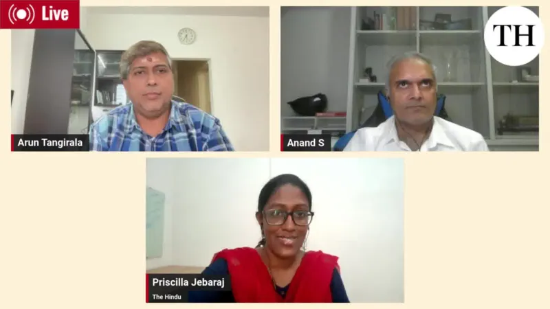](https://youtu.be/fPvhDOyUPc8?t=150)

He's a part of the data science and AI department at IIT Madras. He's also the chief coordinator of the Union Education Ministry's Swayam Prabha program, which creates content for online higher education programs across the country, and has also started exploring the use of AI in this regard.

We also have S. Anand, who is co-founder and CEO of Gramener, a data visualization and analytics company, which also looks at generative AI solutions. He's based in Singapore. And he likes to describe himself as an LLM psychologist. I believe that's the designation currently on his LinkedIn profile. And he has tips on how best to prompt and generate solutions from LLMs such as ChatGPT.

So I'm going to throw to both of them. Welcome both of you. Thank you for joining us on this webinar.

**Prof. Arun**: Thank you, Priscilla.

**Anand**: Pleasure to be here. Thank you.

**Pricilla**: So we're going to start with some presentations on what is AI and how can it be used in education? We're going to start with Professor Tangirala and then we will move to Anand and then we will move to some questions from our audience. Professor?

**Prof. Arun**: Yeah, Priscilla, can you confirm you're able to see my screen?

**Pricilla**: Yes.

**Prof. Arun**: Yeah, this is something that we are so used to since COVID times.

[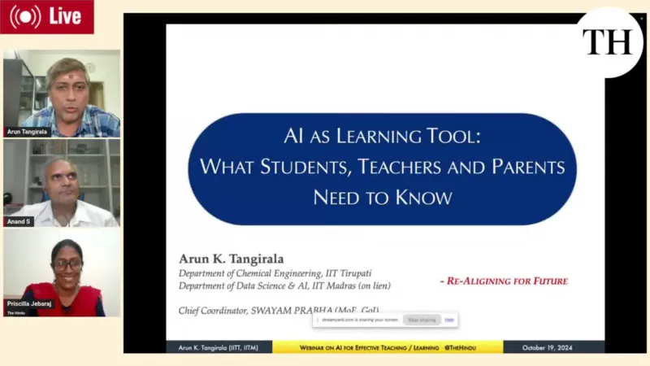](https://youtu.be/fPvhDOyUPc8?t=228)

**Prof. Arun**: Thank you very much for hosting the show and also having us on the panel.

It's, of course, a very, very important topic as we go along, especially on the track of education and research. And obviously, I don't have a lot of answers, but maybe some answers and more of directions and questions as we go along.

[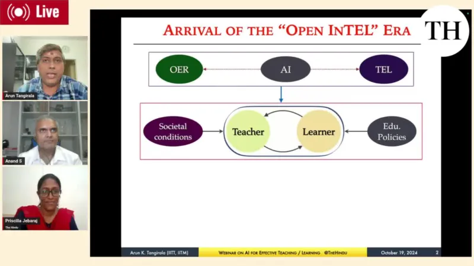](https://youtu.be/fPvhDOyUPc8?t=258)

The whole objective of this presentation is to first give the big picture in which we are situated when it comes to AI in education. This graphic here shows that there are two layers today as against a single layer that existed in the past. So in the past, and even today, we have the teacher, the learner, and then the societal conditions, largely including lifestyle, the thinking in the society, and so on. And then you have the educational policies that are driving this entire education system.

But in the last 10-15 years, if I may say, there are three big entities that have come about. OERs, standing for Open Educational Resources, and then you have TEL, which is Technology Enhanced Learning or Technology Enabled Learning, and then of course the big boss there - AI. These are the three giant entities now that are pushing not only the teacher-learner interaction into a new orbit but also the lifestyle, the societal conditions, and therefore the educational policies. I call this together the "Open Intel Era" - open for open education resources, Intel for intelligence and also including TEL.

Now obviously this is a very complex and rapidly evolving relationship that's at play and it's important to have this big picture before we even think of how AI will impact or provide solutions to some of the challenges that come about.

[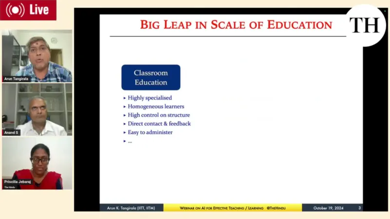](https://youtu.be/fPvhDOyUPc8?t=360)

Then there is another scenario I want to draw the attention of our participants to today and in the future: this big change in education that has gone from classroom education, which is highly specialized and homogeneous, to large-scale education, which has taken many institutes by storm and many institutes have launched themselves into this orbit.

It is very attractive because you are able to reach out to learners at large. But it has a lot of challenges, especially because of the diversity, heterogeneity and the multidimensionality, and then, of course, the administrative challenges. Inevitably, as you move from this classroom to large-scale education, AI becomes the compelling tool or the compelling platform, I might say, along with your digital and edutainment tools.

So apart from AI naturally disrupting a lot of areas, we can see that it is perhaps the indispensable tool as we go forward because we are making these big leaps, right?

[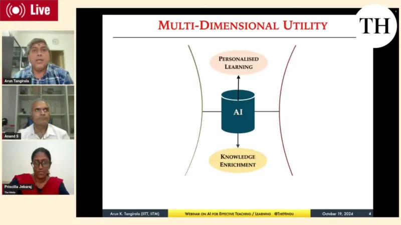](https://youtu.be/fPvhDOyUPc8?t=432)

Now, this one slide is for the readers to capture the different ways in which AI can impact education, what it brings to the educational track for all of us - for teachers, students and parents. And each of us is a student, is a teacher and is a parent.

The two broad things that AI brings to the education desk are personalized learning, which I'm sure many of us have been hearing about. It is really coming out very well, where it is able to cater to a particular learner based on his or her academic background and training. And then, of course, you have knowledge enrichment. A lot of LLMs that we hear about today are like live encyclopedias, interactive encyclopedias, which are able to give you knowledge. But of course, you have to be really careful with the knowledge that comes out.

For the teacher, there are many ways in which AI comes to help and aid and perhaps to come up with a totally new way of teaching and creating content. So I have listed here five broad tasks. Of course, we don't have the time to go into detail in my presentation, but in our interaction, we can expand on each of these. Content creation, automation, as Priscilla mentioned, and tutoring and interactive simulations are some of the top ones that are currently happening. Augmented reality, virtual reality gaming is a relatively nascent area and it will perhaps take two or three years for virtual reality and augmented reality to take off.

On the student and administrator side, there are other things that AI helps with such as assessment or grading, especially in large-scale education, but you can use it for classroom education as well. As we launch ourselves into a lot of online programs, we have to worry about the integrity and fairness of the exams that we conduct. So we need integrity monitoring tools. And there are a lot of business opportunities as well. In fact, in each of these, there is a business opportunity, apart from the fact that institutions and teachers have to realign.

AI is also useful for enriching your presentations. Whether you're a teacher or a learner, you can see today there are fantastic tools that give you some very fancy presentations. You just give the text and they'll do that for you. But it should not stop at that. I'll talk about that a bit very soon. And then the other area where AI has been helping tremendously is in translation, reaching out to masses who have been kind of cut off from a lot of the material that's available in other languages. Now, those barriers are being broken.

Now, having seen this, I would like to say that all of this is possible, sustainable and even going to be effective only if we work on these four pillars. All these four pillars are important. Number one, we need to worry about ethics and regulations, although it appears as the second one here. But that's the first thing that we have to worry about. Worldwide, people are worried about this. It's taking time because there is still not sufficient clarity as to how we define ethics in using AI tools. There have been a lot of conferences, but very soon, we should be able to come up with some regulations and policies at the government level and at the institution level.

Then you need to have the infrastructure - without the infrastructure, none of this can be used. Thirdly, you need to have training. The literacy has to be there, the digital literacy, and all stakeholders have to shift. Teachers, students, and parents all have to undergo some training, but of course at different levels. And then if the institutes really want to harness the power of AI, they have to bring about curriculum changes. So the message is realign, and there are many ways in which you can realign. I have jotted down a few points here. As I said, I'm not going to really go over everything that I've listed here, but I'll just very quickly go over some of the most important things.

Of course, using LLMs to generate review questions and so on. People are slowly beginning to use it.

[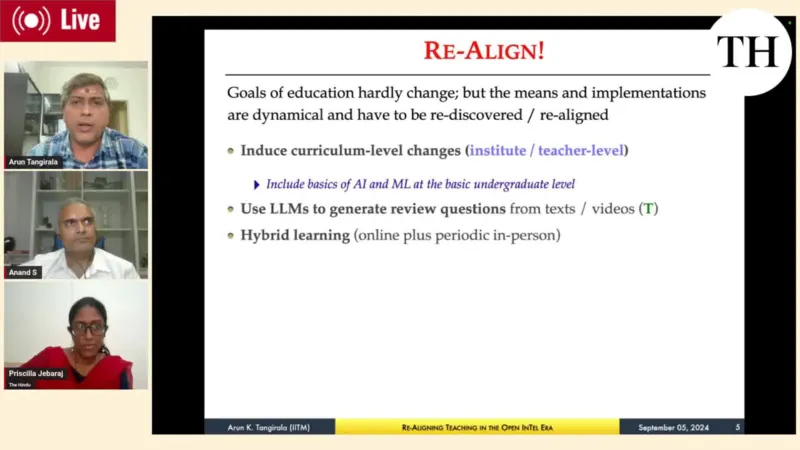](https://youtu.be/fPvhDOyUPc8?t=714)

At the institute level and the teacher level, we have to strive to bring about curriculum level changes. For example, we will have to teach students basics of AI and ML at the basic undergraduate level. Many institutions have started to do that, pretty much like they teach math, physics and other science courses.

As I said, one has to provide digital literacy. What I have written in the bracket, the T stands for teacher, S for student and P for parent, essentially saying which layers or which class of stakeholders the points are relevant to.

Now, I would like to reiterate the point that we have to teach ethics. This becomes challenging because teaching ethics to a school child is much more difficult or different than teaching ethics to an adult at an undergrad level or a grad level.

[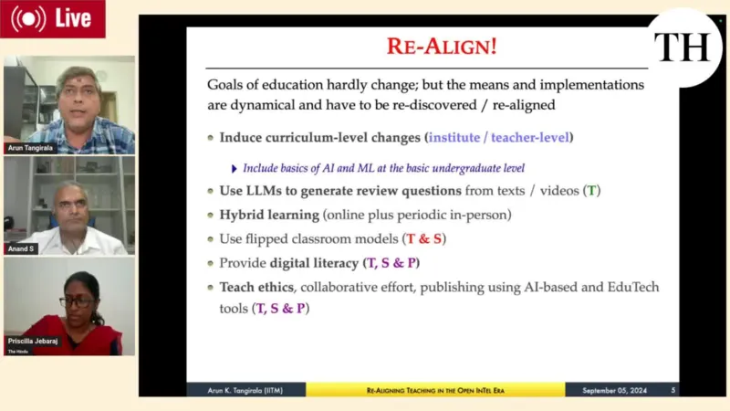](https://youtu.be/fPvhDOyUPc8?t=762)

But nevertheless, it has to be done. What kind of approach should we take? What things should we teach? This is not very clear today, but efforts have to be made based on whatever common sense we have right now and whatever occurs to us naturally. As we go along, I'm sure a systematic approach will evolve.

Many students have begun to use AI-based tools and edtech tools. They have to worry about plagiarism, which is very important today. In today's world, plagiarism is a big no-no. So there has to be an acknowledgement of usage of certain tools. When collaborating with people using AI tools, there has to be responsible usage.

Very importantly, as I said earlier, there have been many disruptive technologies that we have seen in the last few centuries. But this one is different because it is interactive. It is not a technology that ends with use by the consumer. It actually collects data and it may give you wrong answers. These are the two main differences between AI and any technology we have seen in the past, whether it's a computer, calculator, or steam engine.

[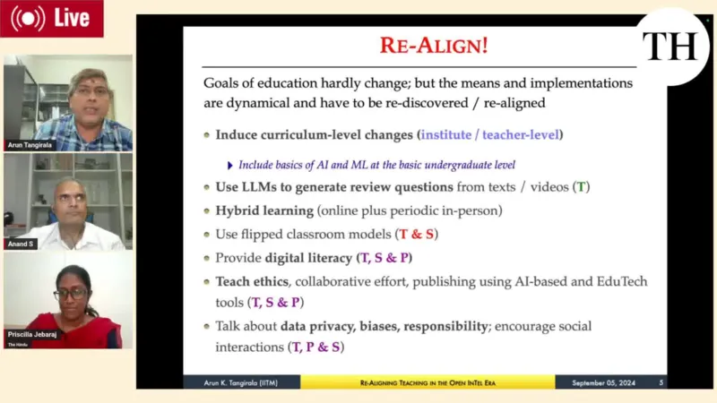](https://youtu.be/fPvhDOyUPc8?t=828)

There are many disruptive technologies that we have seen in the last few centuries. But this one is so different because it is interactive. It is not a technology that ends with the use by the consumer. It actually collects data and it may give you wrong answers. These are the two main differences between AI and any technology that we have seen in the past, whether it's a computer, calculator, or steam engine. These two really stand out.

Therefore, we have to train our students and children about handling these AI tools with care because they may be giving away data. They may not even know that data is being stored somewhere and we may not even have an idea of how it is put to use. So data privacy is one of the most important things that has to be addressed. And then, of course, biases, because a lot of solutions may actually be biased. We know that there are many discussions about this.

We'll have to train our students in validating these answers, thinking through these answers, having discussions and not just relying on the solutions that come out. I just want to conclude by saying that just as we want to see the big picture of AI in the open Intel era, we also have to see what role each of us has to play in the entire education system.

[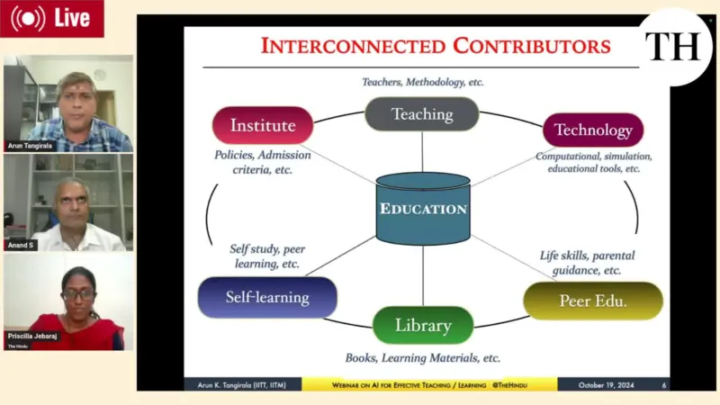](https://youtu.be/fPvhDOyUPc8?t=912)

And this is a schematic that shows the interconnected contributors, if I may use that phrase, just to highlight the fact that institutes alone or teachers alone or, you know, libraries alone, they cannot really bring about a synergistic and a very effective change. They all have to work together collectively. And yes, each of it will have its own time constant, but the action has to happen very, very soon.

And one of the things that you see in this slide is self-learning, right? Something that Swayam and Swayam Prabha or Swayam Plus all of this actually is all about self-learning. So we have to train kids in self-learning and to the extent that we may have to request universities to seriously consider offering a course on self-learning at the undergrad level or even in fact at the school level itself.

We have been learning by ourselves even 30, 40, 50 years ago. But that component has now increased multifold. Therefore, kids have to be trained. All of us have to be trained in self-learning.

[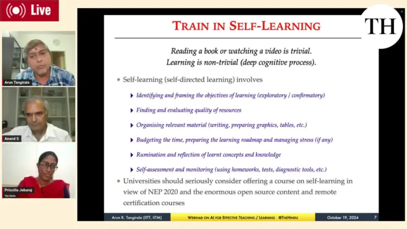](https://youtu.be/fPvhDOyUPc8?t=1002)

And finally, we have to train ourselves in asking questions, which Anand is going to talk about. A lot of courses on prompt engineering have come out and have been coming up. Culturally, we have been talking about how to ask, how to speak to people in the professional world and personal world. But now this has also entered the technological world.

So we should know how to ask even a GPT-based or an AI-based tool. That's what I'm hoping that the readers will ask - very pointed questions so that we have a very engaging conversation. That's about it. I'll stop at this point. Over to you, Priscilla.

[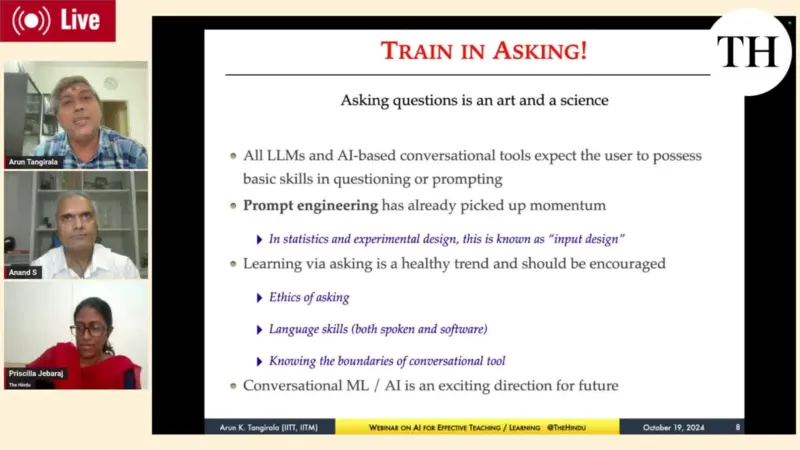](https://youtu.be/fPvhDOyUPc8?t=1026)

And that's what I'm hoping that the readers will ask - very pointed questions so that we have a very engaging conversation. That's about it. I'll stop at this point. Over to you, Priscilla.

**Anand**: You're on mute, Priscilla.

**Priscilla**: I'm so sorry. Thank you so much, Professor. That raised a lot of ideas and issues of what we should keep in mind and the ways that it throws open some opportunities. But let me move to Anand to speak about how we should ask questions.

**Anand**: I'll begin by talking about how I'm using AI and this is driven by primarily one thing that I've learned and that's based on a study that I've got on my screen.

(Sorts out screen sharing)

There was this study that showed students who used LLMs as their tutors, who talked to LLMs and understood what the LLM was saying by asking it for explanations, did better. They scored more and understood more. Students who were using it to solve the exercises for them did worse. And this is kind of obvious - if you don't try to learn, you won't learn.

But what also struck me was that those who had not used LLMs before were particularly prone to using them poorly. So it's not just laziness. Inexperience also nudges people towards using LLMs as a crutch rather than as a learning tool.

[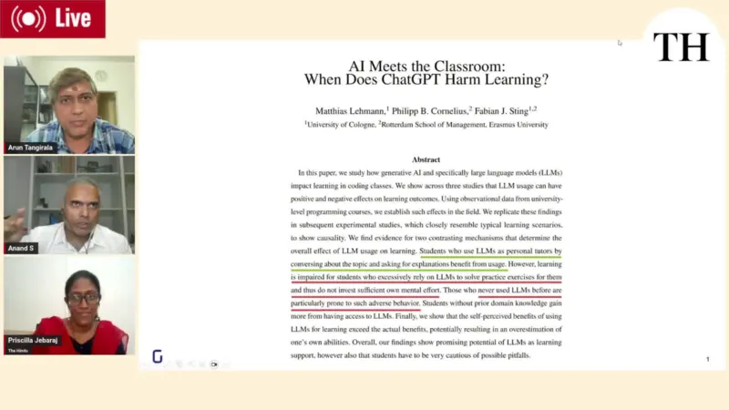](https://youtu.be/fPvhDOyUPc8?t=1164)

So I've been trying to avoid that and I'll share some of the things that I've been doing to help me avoid that, which is just use LLMs everywhere as much as possible so that I gain experience. Right down to toilets.

[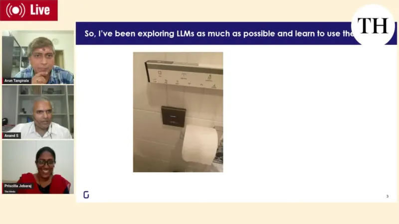](https://youtu.be/fPvhDOyUPc8?t=1194)

I was in Seoul some months ago and I accidentally pressed this emergency button. Now everything was written in Korean. I had no idea how to turn this thing off. So I called up the hotel reception and said, "I turned on this emergency button. I have no idea how to turn it off." And the guy said, "Sir, do you want some water?"

Luckily, a few days ago, ChatGPT's advanced voice mode had been enabled. So I took the phone, said "Translate everything that I say into Korean," kept the phone next to me and said, "I accidentally pressed this emergency thing. I just want to let you know that there is no emergency." It translated it perfectly. The receptionist understood it and he laughed and said, "No problem, sir, we will take care of it."

[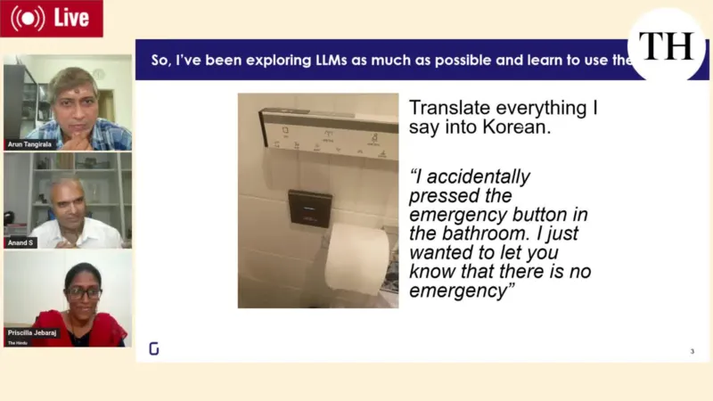](https://youtu.be/fPvhDOyUPc8?t=1230)

Day to day uses ultimately helped me in so many ways, both in learning and in teaching. Let's start with learning.

[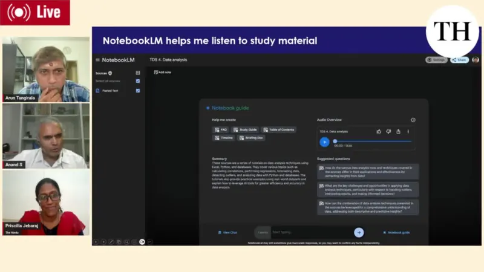](https://youtu.be/fPvhDOyUPc8?t=1248)

NotebookLM from Google is perhaps the one tool which has, at least in the last month, completely transformed the way in which I learn. The way NotebookLM works is, you can add any source - it could be a Google doc, slides, PDFs, whatever. It could be linked to a website, it could be a YouTube video, or any text that you paste. Sometimes I just copy-paste from my study material into this.

There are a few things that I can do. The easy thing is I can just chat with it. I can ask a question like, "What does this module cover?" And it will give me a decent summary. But honestly, reading is boring. In comparison, it also generates a podcast. It's a short 6 to 10 minute podcast, and it is brilliant. Two people talking to each other, covering the topics, not in a very deep way, in a light way that I can listen to when I'm cycling to work.

Apart from that, you can create your FAQs, study guides, table of contents, etc. It is a great tool for studying, at least for me, especially when I'm studying a new topic. It's also a great tool to help me create presentations.

At the Data Hack Summit last month, I gave a presentation that was 100% generated using an LLM. I just fed it all the material I wanted to talk about, and it created the transitions, the embeddings, and most of the content.

[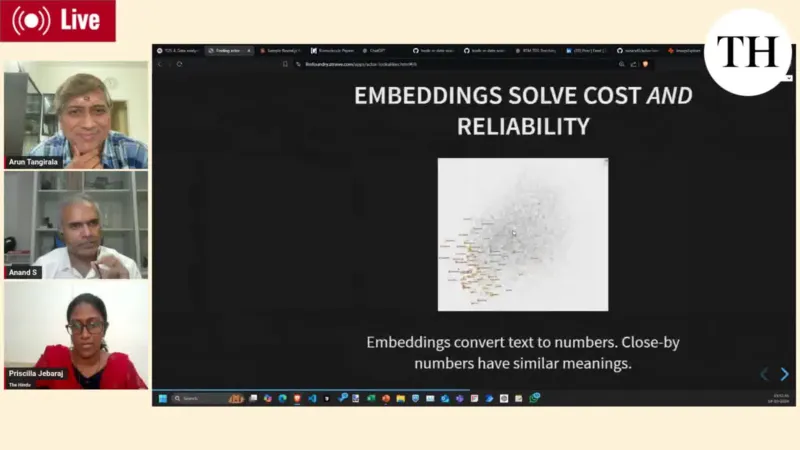](https://youtu.be/fPvhDOyUPc8?t=1338)

In fact, just during this talk while Arun was speaking, I went to Claude.ai and said, "Create a sample reveal.js presentation about LLMs." That's all. And then it went ahead, did a lot of work and generated some code that created a presentation. Here's what it is. You can see that it has, in about one minute and 15 seconds, created an entire slide deck filling in both the content and the format.

The LLMs are great at language, and code is a language. So you don't have to rely on LLMs only for natural language; you can use them to write code sometimes, and that actually makes them pretty reliable, more so than usual.

[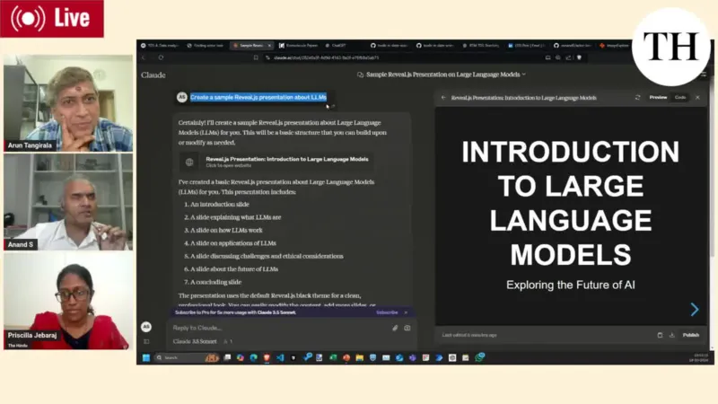](https://youtu.be/fPvhDOyUPc8?t=1356)

I also use it a lot for research. The way I use it for research is with a little tool I built myself. The reason I could build a tool is because LLMs are helping me build tools in the first place.

So I pick a topic - let's say I uploaded all of the papers related to biomolecules on arXiv. Then I ask a question like, "What are modern ways of computing protein folding structures?" (I'm spelling "protein" wrong, but that's all right. It's smart enough.) It identifies the most relevant papers, reads through those papers, summarizes the results for me, and also tells me which of these papers are interrelated.

[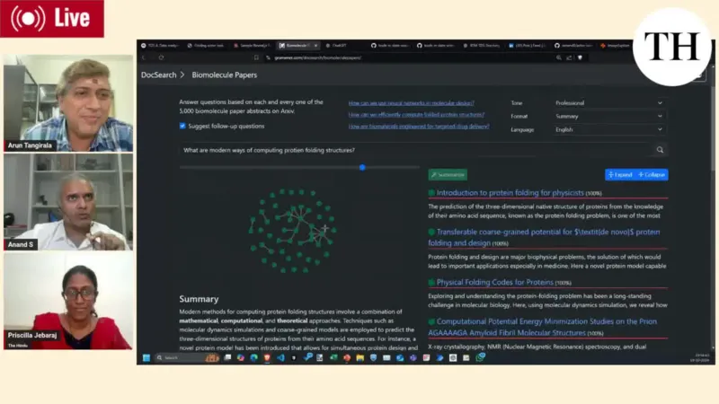](https://youtu.be/fPvhDOyUPc8?t=1446)

So I can say, "Oh, are there some clusters of papers?" Okay, it looks like there is one big cluster of very related papers. And then there are some smaller clusters of other topics. So what is this particularly about? Summarize that and understand that, oh, this is about ensemble models around kinetic mechanisms, whatever that is.

And if I don't understand it or it's too complex, then I can say, "Look, give it to me in a succinct way simple enough for a LinkedIn post" and summarize it in that format. So then it'll give me in bullet points step by step: okay, this is about these three points, and it gives me the hashtags that I can put into a LinkedIn post also.

Or I can say, "Is there some unusual topic that I have not yet researched?" Okay, looks like there are a couple of topics on something to do with beta hairpin and atomic detail milestones, which are related to protein folding structures but are somewhat unusual topics. So now this is probably an area that I need to poke because it is at the fringes.

Now, while this is something that is powerful to begin with, one of the simplest things that we can do is go to ChatGPT or a tool like Perplexity, which can search natively, and ask basic questions like, "Okay, what is the latest news about the Israel conflict?" And by the way, there is for some of you an option called "search the web," which has a slightly more detailed search capability with citations, and that's more powerful, but it's being rolled out. So in a few days, you should probably see it. And yeah, I get the news this way. Of course, if this were on mobile, which is how I consume a fair bit of it, I would just ask it to read aloud.

[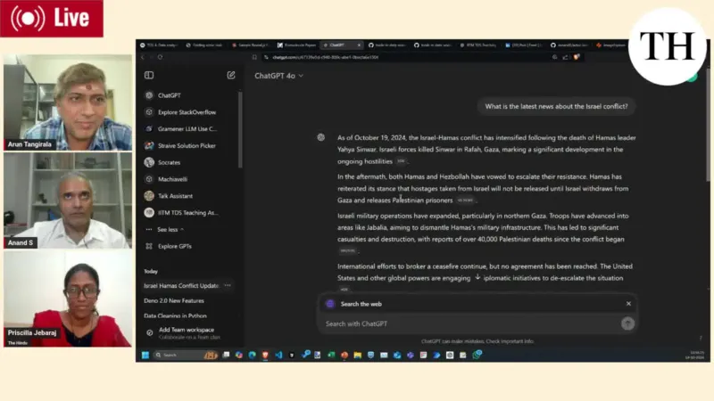](https://youtu.be/fPvhDOyUPc8?t=1548)

In fact, I don't even ask it to read aloud by typing or clicking. I just speak to it because ChatGPT's advanced voice mode, which I already mentioned I was using in Korea, is something that you can literally talk to. So you ask it, "What is the news?" and it will tell you what the news is.

Now, all of this is as a learner. As a teacher, and I teach a few courses, I'm also trying to pass on that same principle, which is to use LLMs as much as possible.

[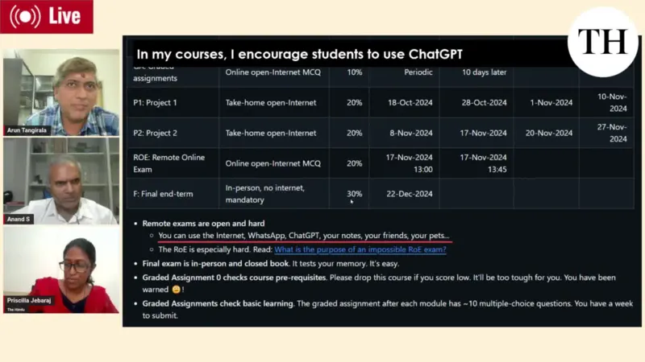](https://youtu.be/fPvhDOyUPc8?t=1578)

One of the rules in the course is that even for the exams, you can use the internet, WhatsApp, ChatGPT, your notes, your friends, your pets - whatever you want to use is perfectly allowed in the exam.

I use AI to construct the course material as well. That includes, for instance, creating a virtual teaching assistant. What I did was upload all of the course curriculum into a custom GPT in ChatGPT.

[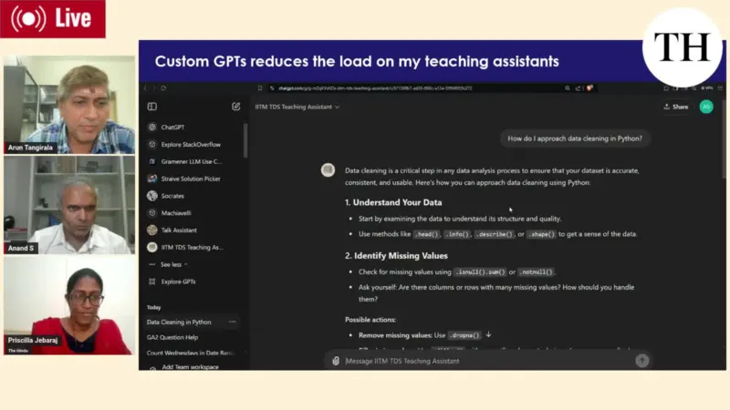](https://youtu.be/fPvhDOyUPc8?t=1602)

There is a feature on the left side called "Explore GPTs" that allows paid subscribers to create their own version of ChatGPT, which anyone can use. I uploaded the course material there, and it has effectively become a virtual teaching assistant, reducing the load on my human teaching assistants. People are using it with moderate effectiveness.

Another approach I use is recording content explanation sessions. We then take a transcript of the recording, create a summary from that transcript, and add it as lecture notes. This process helps streamline the creation of course materials.

[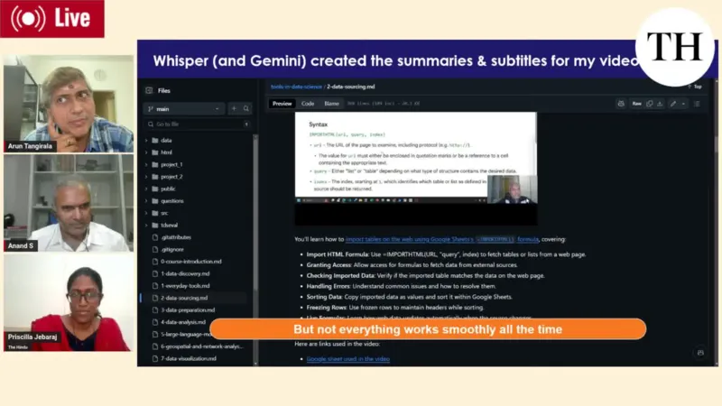](https://youtu.be/fPvhDOyUPc8?t=1638)

This is how half the course got built. Now, what that does is for me, preparing course material and content is a pain. Talking to somebody is slightly easier. So I'll just talk to people and then we put it to an LLM. It writes down everything great. It doesn't make that many mistakes. It summarizes it. Its summaries are usually better than mine. So why would I not use it?

Well, actually, it turns out that there are a few reasons why you would not use it. One of them is it's not very good. For example, we said, let's try translating this into Hindi. And it was atrocious. I felt that pain personally, because there is this amazingly beautiful scene in "Rocky Aur Rani Ki Prem Kahani," where Ranveer Singh has this monologue, which you should see - I'm not even going to describe it. And I said, this, I just absolutely have to have the dialogue for. So I passed it to an LLM and got it to translate.

Now, here's the thing. He's using a Punjabi-Hindi mixed with English. "Fat-on ko fat nahi bol sakte." Now, how on earth is an LLM supposed to translate that? But even otherwise, it did a pretty poor job of it. And we saw that for the translations of our material content as well.

[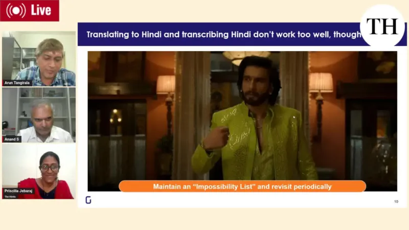](https://youtu.be/fPvhDOyUPc8?t=1710)

But at this point, I must reiterate something that Ethan Mollick, who's a professor who teaches LLMs, emphasizes. He says, "LLMs are moving forward very rapidly. What today is not possible will very soon become possible. So maintain an impossibility list."

Try out a whole bunch of things. List down all the things an LLM cannot do today and keep that list. Revisit it every month. You will find very often that what was not possible a month ago suddenly has become possible. And that is one of the good, in fact, powerful ways of keeping pace with the changes in LLMs.

That's back to you, Priscilla.

[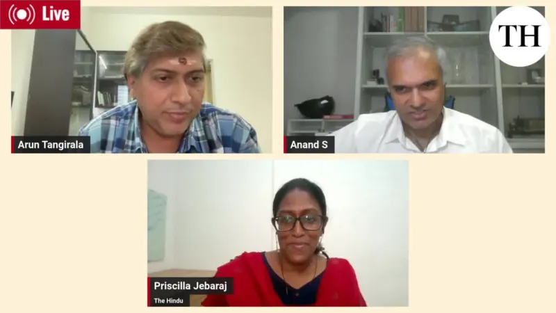](https://youtu.be/fPvhDOyUPc8?t=1758)

**Priscilla**: Thank you. That was providing some really practical, helpful ideas to start using and, as you said, to use it continuously in regular life so that you are ready to use it for education. We've got a bunch of students and teachers, I don't know who all are, who are asking questions. One starts with: What is the full form of LLM? Could you tell us what is an LLM? LLM stands for large language model, but how does that actually work? What is it? Anand, could you take that?

**Anand**: It's a program that has read a significant chunk of the internet, books and so on. It guesses what the next word is going to be, roughly like how we speak. It's not like we are doing some complicated calculation or reference. We sort of keep saying a few things and then our gut feel says we should probably say the next word and then the next word, and we continue.

An LLM is just like that. It's something that keeps generating words. The way it generates words is it roughly remembers the things that it has heard, which is the input, and it has said, which is its output, and predicts what the next word should be. I'm going to use the word "word," but actually it's internally called a token. It doesn't really guess only one; it gets us a whole bunch of them and then it picks one of them.

How does it pick? It picks what it thinks is most likely very often, but you can control that. If you want a little more creativity, then you can increase one of the parameters called temperature, which will make it pick things that are lower down the list, or reduce the parameter, which will make it pick things that are more likely. On some LLMs, on some, let's say, Bing chat, you will see "high creativity" versus "more precision." That's where they're adjusting this choice. But ultimately, it's a machine that by and large says the first thing that comes to its mind.

**Priscilla**: Okay, thank you. So we have Mr. Balram Singh who asks, "So most of the students in today's academia, they do coding projects with the help of ChatGPT only, they fix their errors with ChatGPT. So how does this help in learning? It will just make students dependent on ChatGPT." Professor?

[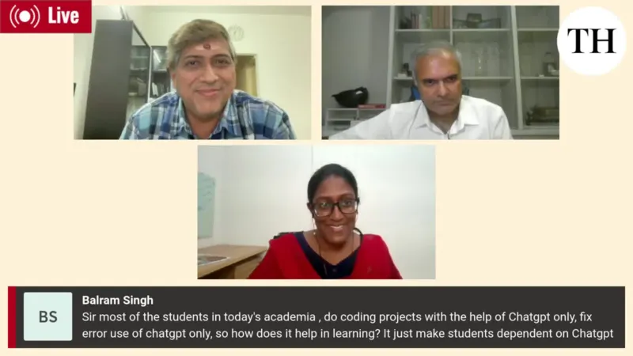](https://youtu.be/fPvhDOyUPc8?t=1920)

**Prof. Arun**: Yeah, I think this is a very classic question. And I'm sure we would have asked this question when calculators also came into play because the same question was asked. I mean, if I use a calculator, then the human ability to calculate goes down.

The general response to the question - in fact, this is one point that I did not mention in my presentation because I thought this would come up - is the most important thing is you have to ask what it is that you want to train your students in. Unless you state that, you cannot really design or even prescribe the tools that you want to use.

As an example, if I say that for my audience, okay, for my classroom audience, I want them to learn certain skills, for example, coding on their own, then I will not allow them to use ChatGPT. But if I say that I'm okay, that is not the skill that I'm worried about, it is a different kind of skill set that I want to impart where they are able to see the code and either be innovative, come up with better ones, or even figure out errors in that, or even tell me what it is actually doing, then I don't mind them using ChatGPT. So the point that I'm trying to make is please define your learning outcomes first, and then you can decide whether you allow them to use ChatGPT or not, not the other way around. I say I allow them to use ChatGPT and say, oh, what happens to their learning skills? No, but you have to state them first that you want them to learn this. Then everything gets decided once you state the learning objectives and outcomes very clearly.

And this is true even in the past. See, when I switch from academic audience to industry audience, I redefine the outcomes for them. For an academic audience, I would like them to learn to derive certain equations and so on, but for the industry audience, that's not my objective. That's not the learning outcome they... In fact, I'm more worried about their ability to use it in practice. It's not that I'm not interested in that for the classroom audience, but certainly, derivation is not on the outcomes, so I'll use a different thing.

So these things keep changing. We will have to go and ask, should I redefine my outcomes? And that is again tied to where your audience is going to go. Are they actually being trained for industry? Are they being trained for fundamental research? And so on. So ask these questions first, and then the rest of the answers will follow.

**Priscilla**: I remember seeing something also that it's about, you know, information - whether teachers are information gatekeepers or whether you're helping students to find out for themselves. So I mean, I think I saw something during COVID that a number of teachers realized that you cannot give assignments for which students will Google the answer. And then one teacher said that rather, let me teach them how to ask Google the right questions. After all, in the real world, that's going to be of more use than simply have you memorized this answer. You redefine the competencies and skills.

Let's move a minute away from campus education to Anand. There's a question from Krishna KK who asked, how can a company building learning technology products leverage generative AI? That can go to both of you. It was asked to Anand, but really, I think I can get answers from both of you for that.

**Prof. Arun**: It is more into _his_ syllabus.

**Priscilla**: I only thought because you are, of course, creating content for Swayam Prabha. So I thought, you know, you could provide some perspective on that.

[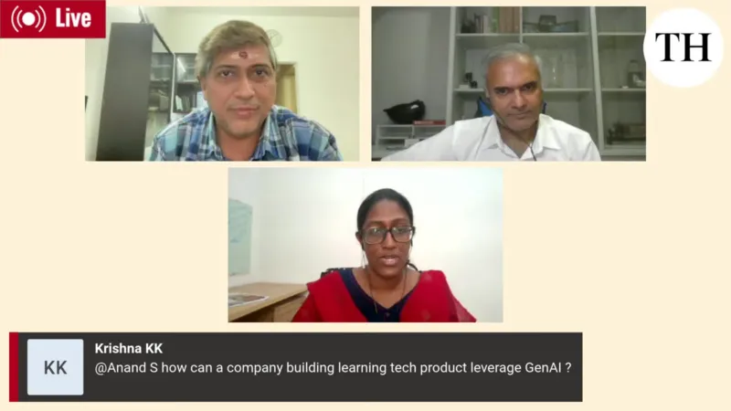](https://youtu.be/fPvhDOyUPc8?t=2130)

**Anand**: LLMs can help provide a personalized learning experience. They're also very good at automated content creation. They're great at interactive tutoring and support, of which I showed one example. They can increase engagement through interactive stories, challenges, or scenarios that make the process more engaging. Assessment and feedback become more effective. Accessibility and inclusivity are other fairly powerful features. From a support perspective, analytics and predictive insights on student performance are yet another area. For instance, reviewing feedback. And you can use it for collaborating with an LLM to co-create content.

I didn't say this answer. I just put it to ChatGPT and got this answer and I'm reading it out.

**Priscilla**: Do we believe you?

**Prof. Arun**: It's very convincing. That's exactly, I think that's a very good point, Priscilla. I think the student should learn to ask this question. But of course, it is not to become very skeptical all the time. But I think to be on guard. And I just wanted to add to what Anand has said that, and it's also somewhat peripherally linked to the previous question. See, whenever you're using a new tool like ChatGPT, and if you compare with the calculator era, you are able to perhaps now solve more challenging problems. You can focus on solving more challenging problems or you can define more challenging problems now that there is a technology that is taking care of some of the things you were spending time on earlier.

As an example, when calculators are allowed, let's say in undergrad, all universities allow calculators, so I can now ask - in fact, I conduct computer-based exams - so I can ask questions that require the use of a computer. That means I can ask more advanced questions. Likewise, companies can also now think of focusing on more advanced stuff or improving their product profile or coming up with more innovations now that a bulk of their routine stuff is taken care of by ChatGPT. So if you want to look at it positively, you can always look at it positively and reorient yourself. That's the message: be inclusive, realign. These are the two things.

**Priscilla**: Okay, let's move on to our next question. Sujata Iyer asks, "What sort of critical thinking course would you offer where students learn counterfactual reasoning? Should students not be asked to specialize deeply so that they can verify the output of the LLM?"

[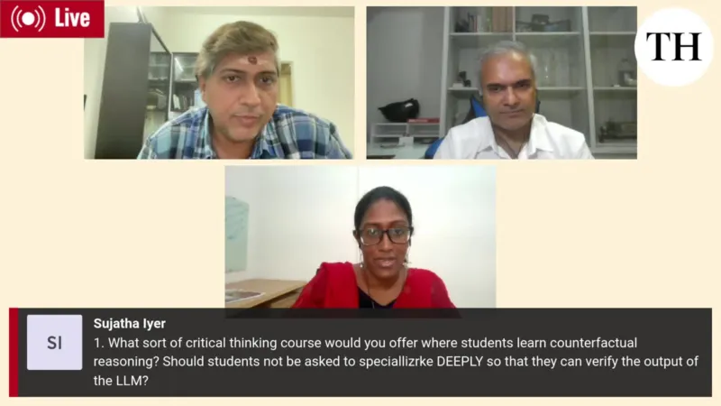](https://youtu.be/fPvhDOyUPc8?t=2328)

**Prof. Arun**: I think I've already kind of answered earlier. If you have a course that is meant for training students in critical thinking, then go ahead and define the outcomes. You can use ChatGPT. Critical thinking is a very, very important future skill, according to a lot of surveys that have come up. And that is where the human brain, human intelligence, at least supersedes AI as of today. Use them as tools and say, "Look, feel free to use ChatGPT for troubleshooting. Feel free to use ChatGPT for consulting the possibilities because it can skim through a lot of possibilities and give you options." One thing that it cannot do as of now is being creative and being able to see some scenarios that it has not seen. You have heard Anand saying earlier, LLMs are trained on what they have seen, but they cannot imagine new scenarios, right? Not necessarily as of today. I'll be very cautious because I will go by what the history of LLMs and what Anand said.

We may say something is not possible today; a few months later, it may be violated. So go ahead and offer a course on critical thinking. Exactly how it should be designed entirely depends on your goals. But the only challenge is now for the teacher to come up with questions that are beyond the reach of ChatGPT. And that's where I think teachers are being challenged today. And that's fine. I think we have to be challenged. I keep saying that if street vendors, everybody has switched over to UPI in India, right? They have realigned themselves, a lot of them. Then teachers should also realign. Everybody needs to realign from time to time. And yes, either we realign or we resign. One of these. A lot of changes ahead.

**Priscilla**: Let's move on to the next question. So Mahbub Basha Sheikh asks, how can we leverage AI effectively while ensuring that it does not diminish human intellect? A related, I mean, sort of related question. I saw somebody asking, Apraneet VSS asks, what does AI have to do with the mass layoffs that are taking place. So whether these are students or teachers looking ahead to careers, can we consider both of those?

**Prof. Arun**: I read this somewhere very recently that AI is not going to take away jobs of people. It's, of course, going to take away jobs if you do not know how to use these modern tools, right? Number one. And if you have the same skills as these AI tools have. So obviously one needs a new set of skills, and there is going to be a displacement, but it's not going to be a complete layoff kind of thing. I think every milestone change in the last few centuries has brought about displacements. I mean, people used to drive tongas earlier. When automobiles came in, they had to learn how to use automobiles. If you refuse to learn and say, "I'll only drive a tonga," then of course you'll be jobless. There is no doubt about it. That's one answer to layoffs.

**Anand**: I thought you were going to quote another one where they say, "AI doesn't steal your job. It's the other guy who's using AI that's stealing your job." So you may as well be the other guy.

**Prof. Arun**: Correct. Absolutely. And a bit about diminishing intellect. Yeah. So I don't think human intellect diminishes. In fact, if you pay attention to what both Anand and I have been saying, we have to come up with new skills. That is, now we have to explore new areas, arenas of our intellect, which is in asking, which is in verifying, validating, which means now that we have to dip into new or you can say advanced areas. So AI is in fact pushing us to explore other areas of our intellect, which we have not explored or which we have been either lazy or never felt the need to.

So we will always be kept busy. There is no way this world has been created where we become completely idle. It is just that new intellectual skills have to be focused on. And yes, so that you will rise with the technology. I mean, people didn't know how to use a computer before, but now you know how to intellectually also handle a computer. Right. And, you know, all the way from so-called ad hoc solutions to everything. Now we have figured out. So human intellect will not go away anywhere. It is just the tasks that you have been focusing on are changing. So there is no way of human intellect diminishing. It is just a perceptive fear. That is very natural. Anand, do you want to add to that about the fear of human intellect?

**Anand**: No, no.

**Priscilla**: Okay. Let me move then to, there's a very specific question, especially given that you showed an app which could generate research titles, right? Research paper titles. So Lakshmi Jaya Mohan asks, "I find ChatGPT and Gemini tend to make up titles of research papers, which do not exist."

[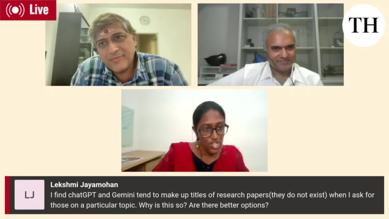](https://youtu.be/fPvhDOyUPc8?t=2652)

**Anand**: LLMs speak the first thing that comes to their mind. Sometimes they make mistakes. Arun and I have a classmate, Rajnikanth, and he had this habit of asking me every now and then, "Anand, are you sure?" And he used to comment that every time he asks me that question, I would pause and think and turn around and say no. Arguably, I wasn't too different from this LLM that was hallucinating. I'd say something and anytime he says, "Are you sure?" Okay, yeah, maybe not.

Therefore, that's a pretty good question to ask an LLM as well. I do that very often: "Are you sure?" Quite often it will say, "You know, on further introspection, I find that actually this does not exist" or "I actually got this wrong." Now, it obviously is not introspecting either; it's again speaking off the top of its head, but it's a good technique. Secondly, you could ask it to provide citations, which is simply "Also give me the links to the papers." If it is making up those, it may also end up making up those links, but you can just click and verify.

Sometimes it will get the paper title right, but the link wrong. That happens in fewer cases. In that case, you can at least do a Google search for that paper and find it. But in short, verify. I have stopped thinking of LLMs as models or programs. It makes us feel secure in their reliability and repeatability. I have started thinking of them as people, interns. And I don't rely on interns that much. Or at least I don't trust interns that much. I verify.

**Prof. Arun**: Yeah, I think that's very important. In fact, I did ask an LLM, maybe nine months ago, I asked, "Will you be a human?" And it said, "I'm not, but I expect to be a human very soon. Because they are just packing me with a lot of emotional content and so on. So don't be surprised if I start behaving like human." So the good news is that although it is AI and machine learning, it is becoming human. And you know that humans are capable of giving all kinds of answers with emotions and so on. So yes, I agree with Anand that you should not think of LLMs as models at all.

They are your live, I would say, I think that M should be thrown away, that M should be something else. Although it's called large language models, you should expect them to be wrong and you should verify. And that's exactly the same point I'm trying to say earlier. These are the new skills and that's where you have to train your intellect now. How do you verify? How do you stay on top of it? That is a new intellect that will come up.

**Priscilla**: Okay, so I think someone else had also... Okay, from Aishwarya Srihari to Anand, thank you for simplifying the uses of AI. And so she asked, could you name all the AIs that you spoke about in the session? And could you also talk about how a teacher can use character.ai to teach students in class?

I also thought some of the listing of the tools that you had mentioned went by very fast. I was also taking notes. So if you listen...

[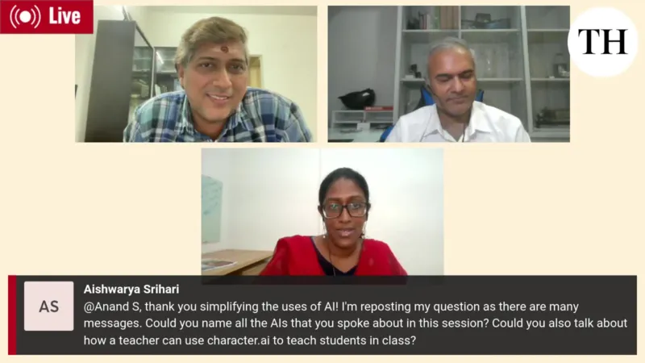](https://youtu.be/fPvhDOyUPc8?t=2850)

**Anand**: NotebookLM by Google was the first I mentioned. It can create podcasts, which are stunning. ChatGPT and Gemini, of course. Claude.ai has an interesting feature called artifacts, which lets you write code as you use them. Whisper is an open-source model that you can probably find somewhere, which can translate audio to text, but you can also upload your audio into definitely Gemini, maybe ChatGPT, I don't know, and get a transcript of that.

That apart, you will find several other good ones on WhatsApp. You will find Meta AI, which is really a model called LLAMA, which is an open-weights model that's available on every machine. Perplexity is fairly popular when it comes to searching with an AI. So it will search and then give you a direct answer to your question based on that.

A few others that I use very often that I didn't mention, there's one called PHIND, P-H-I-N-D, which is good for searching code and getting answers for programmatic code. But the AI that I use the most actually is an AI code editor called Cursor, C-U-R-S-O-R. It's dramatically increased my productivity and the way in which I code has also completely changed. I'm not going to go into that because if I do, that will be a long explanation. On the second part of the question, I have not used Character AI, so I have no idea about that. Sorry.

**Prof. Arun**: And I just wanted to quickly add, Anand, that's a very good list. I have been using not directly these tools, but there are products like, for example, you know, it could be Google Meet, it could be Zoom and so on. All of these are AI-equipped and I don't work for Zoom. I'm not advertising for Zoom or anything like that. But very recently for a meeting, I had used Zoom's AI companion, for example. With the consent of everybody in the room, I had switched it on so that it would summarize the discussions. And I think it did a fantastic job.

This kind of facility is now being equipped in all software, conversational software, and so on. So one can use those tools also. But having said that, it doesn't mean that you should lose your focus because I tell you, I remember two years ago when I was speaking, one of my colleagues in Japan, this was in Japan, I was giving a talk and he just, he was being a bit naughty and he sent me a transcript of my speech using the AI tool. This was about a couple of years ago and it spoke real gibberish in between. Okay. It has nothing to do and you don't even want to read it.

So it can really do a very wrong job so you have to be still focused but it will be like an assistant like Anand said earlier. You think of it as an assistant who can make mistakes but at least it will take notes for you as you're speaking. And I don't know if StreamYard has that right now. It has an AI companion that would have summarized our discussions, but watch out for such features also in all the products.

**Priscilla**: Yeah, so there are a large number of questions coming in and several people have mentioned that their queries are not yet being addressed. So Anand does mention that they can answer some of them offline. We will try and save some of these. We will try and the questions we cannot take during the session, we will try, especially the list of tools I think we should be able to hopefully post.

There's a question from a school student. I'm not sure if I'm pronouncing the name right. Who says for school students like us who are studying at Kendriya Vidyalaya, we have been given books and advice to read about AI, but how to learn how to use it for day-to-day activities. I think largely, what would you suggest for a school student?

[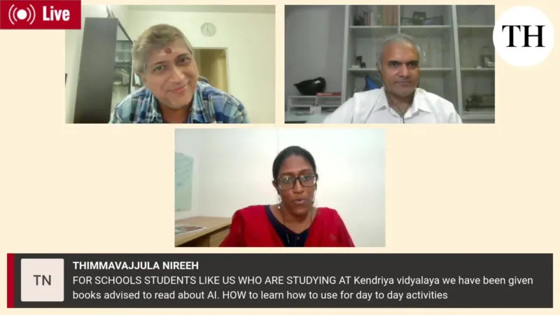](https://youtu.be/fPvhDOyUPc8?t=3120)

**Anand**: Use it for day-to-day activities.

**Priscilla**: Such as? To do what? You mentioned the toilet example, but apart from that.

**Anand**: Say I have missed the bus to school. I would normally use Google Maps to find out the next bus. What if there is an AI tool for it? Spend five minutes figuring out if there is something which I can talk to and ask where, you know, what is the route to that particular location?

I'm planning to buy a new, let's say, calculator. What is the best price-quality trade-off for a calculator? Rather than us doing the research, what LLM can we pass it on to? And it's actually not that difficult because Amazon has or is bringing up in some geographies a feature where you can do that kind of search.

You're planning to study. You don't feel motivated. You don't feel like studying. Don't ask somebody, you know, what should we do? Ask an LLM. "I don't feel like studying. What should I do?" You don't have to listen to it.

Or you just feel like completely wasting somebody's time. How can I pester them? Ask the LLM to give you ideas to pester somebody, to trouble them, make a nuisance. In short, before you do anything, ask an LLM. You should start thinking of an LLM like a twin brother who's always with you or a ghost that is following you in your ear.

Now, if you had that kind of superpower and you ask, "What can I do with a ghost that is in my ear that will do all my biddings?" or a genie that is, you know, you're literally being given Aladdin's lamp and you're asking what can I do with it, the answer is anything. But you need to do it, just do it.

**Prof. Arun**: I know how savvy Anand is right from my B.Tech days, so I can understand where he's coming from, but I probably would balance it out being in the education field and being worried about social interactions also. And being worried about a few other things. Yes, use LLMs, like you're using many other books and so on. But at least at the school children level, it'll be nice to do this under parental guidance as much as possible. And so that you do it jointly. I mean, you say, "Father and my parent and I are bored together. So what do we do?" And so on. Right. Do it under parental guidance.

Number one. Number two, see if actually you can also ask a human being first and then also have an LLM, or you can switch the other way around. You can ask an LLM and say, "Look, I asked this. This is the answer that I got. What do you think?" But do this, but not just go by this because there is a risk that you may be hooked to the machine for a long time and there is this huge concern about impact on social and emotional intelligence with the increasing use of AI tools, right?

So what Anand was talking about is the technical set of possibilities for which you can use LLM. But when you implement that in practice, then I would say that you have to watch out for that social and emotional intelligence as well. Because in every walk of life, we will be interacting with humans. And if you are only used to interacting with LLMs, then again, that becomes an issue. So do balance it out. Use LLMs along with parental guidance, teacher guidance and so on at the school level. Gradually when you grow to be responsible and you understand the world better and so on, then it becomes easier to know where, what role LLMs play in your life and where to place them, how much to trust them and so on. Right. So the school children should certainly keep this in mind.

**Priscilla**: Thank you, sir, for bringing in those safeguards as well.

**Prof. Arun**: Yeah, yeah, absolutely. The concerns about, and these are emerging concerns because it's emerging technology, so I'm sure we will continue to discover these. Because also data privacy is a concern. See, that is another issue, right? When we ask and so on and you tell the LLM it is wrong, no, this is what I am feeling and so on, it becomes data to the LLM and anybody can hack it. LLM may not use it, but somebody who has access to LLM can hack that and steal your data.

**Priscilla**: So when I ask a question, is that saved as, you know, something to do with me?

**Prof. Arun**: Asking a question, yes, is okay. But does, is your question going invisibly with all the other tags that who you are, what is your background, what is your age, gender and all of that, then that's the threshold that people, hackers are looking for.

**Priscilla**: Right. We will keep that in mind. We have a question from K. Balasubramanian Kumar, who says, "As Anand sir pointed out, the Claude and Meta AI produces a seamless business model for youngsters who aspire to build their career. Can you kindly talk about these business models?"

[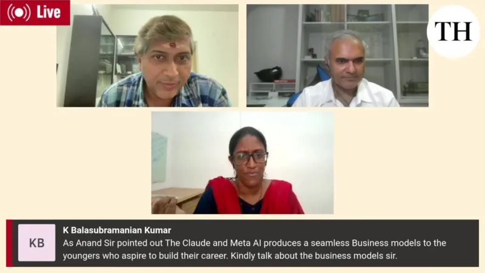](https://youtu.be/fPvhDOyUPc8?t=3444)

**Anand**: Claude as a model is produced by Anthropic, which has its primary business model as something very similar to OpenAI, which is to build what is called a foundational model on top of which other people can build things. The team that created the Anthropic team is an offshoot of the OpenAI team. Many of the AI and especially foundational AI model companies are people that came from an original OpenAI team whose objective was to build artificial general intelligence, effectively the next super intelligent being or system. Whatever that is, it's one kind of business model. It's a very core business model that a few companies will focus on. There will be very few winners, but they will win hugely, as OpenAI's recent 6 billion dollar fundraise, which is the largest ever, attests to that.

Apart from that, there are several things that people are building on top of or around these, and Meta is a good example of that. They have built their own foundational model, but they're not trying to make money out of that. That's not their business model. They got a 2.2 billion dollar uplift on advertising revenue because they were providing advertising tools to Facebook customers. So the applied use of LLMs is a broader use case. It's a lot more fragmented, it captures a lot more value.

Now, then comes the question, if that is the case, what are the different kinds of business models in that space? Short answer, nobody knows at this stage. It is so fragmented, it is so dynamic that people are still trying to figure out. There are several business models today, but it is hard to say what is winning. But a few principles are coming out. One, LLMs don't seem to be favoring disruption that much. They seem to be favoring entrenched players. That is, if you already have customers, then you are finding it easier to offer value-added services to them than pull customers onto a new base, except in very few notable exceptions. LLMs are becoming easier to implement within an organization than as a service because when you start implementing it as a service, several other people find that it is so easy to jump onto that bandwagon that you get out-competed or your clients start insourcing that. That is, they decide to do it themselves. So for these two reasons, what we're finding is people who are in a position of strength and who have a clear need are able to solve their needs better, and business models that are winning are not clear.

**Priscilla**: Okay, we are out of time at six o'clock. Let me end with one last question. I think Sujata Iyer had asked about using Indic ethical models to train AI. She mentioned Indic ethics trains models, any Indic ethics trains models that can be tried out as opposed to Western ethics, I imagine. What ethical basis are we... Professor, you mentioned that India is coming up with its own guidelines. What should be kept in mind?

[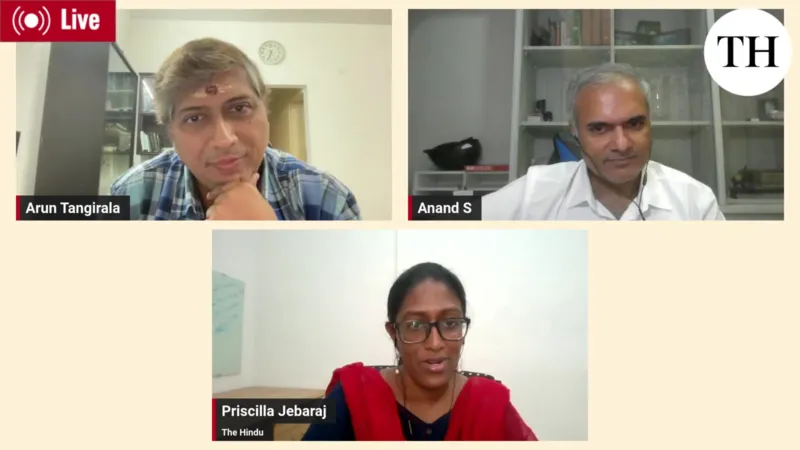](https://youtu.be/fPvhDOyUPc8?t=3648)

**Prof. Arun**: I think they've had several rounds of discussions and committees have been formed and they have given their inputs. We have not really come up with a set of regulations and so on yet, legal ones. There has been a Data Privacy Act that has been put in place for the digital field. But there is no Privacy Act for AI yet. We are still far away from that.

There is this whole field of responsible AI and a lot of discussions are happening at the government level, at the academic level and so on. So I'm not sure if something concrete has been set to train these models on some ethics base. As I said, ethics is very tricky. I mean, there are some tricky questions that people are unable to answer yet. For example, if I'm using an AI tool, let's say as a surgeon, AI for healthcare, and if I go wrong, the surgeon goes wrong, then who should be blamed and so on.

There are all these questions that need to be answered and therefore I'm not sure if there's a concrete base on which you can train these AI models. So a lot of people are using just some common sense and giving cautions and stating their own rules locally within the institutions and so on. Maybe Anand can actually comment further on this.

**Anand**: Yes, it's in very early stages. There's more about regulation than about ethics. Firstly, there are a lot of Indic models, models trained in India on Indic languages that are coming up. Sarvam.ai, there's a Dhenu vision model, there's an Indic LLM suite. You have AI for Bharat also, right?

So that's one dimension. The other is, there is the India AI mission, for instance, which is a March 2024 initiative or a national level mission to strengthen the overall AI ecosystem in India. There is a regulatory ecosystem that the Indian government is talking about, but hasn't yet come out with.

And there are initiatives around, for instance, Moral Bench is a benchmark. And this is probably the closest that comes to this question. So it's an evaluation framework. You take a model and you apply Moral Bench to it, it will tell you how well a given model adheres to the ethical standards in Indian society. Now, training to match that is the next step. It may have happened. I'm not aware of it, but it's in the early stages.

Once again, I don't know this answer. I'm just reading from ChatGPT.

[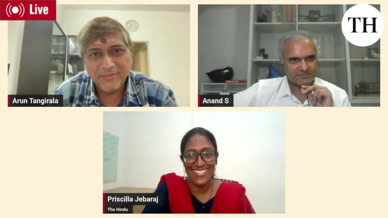](https://youtu.be/fPvhDOyUPc8?t=3822)

**Priscilla**: Okay, we're still not sure whether to believe you, but we're going to end now. You can go back and check that, those of you who are fact-checking here, whether with ChatGPT asking further questions or asking for other tools and other apps.

Thank you so much. This is, I know, just barely the tip of the iceberg of the many ways in which we can explore AI in education. And I'm sure we will return to this topic again. But thank you so much for expanding our horizons so much, for giving us very specific tools, as well as for making us think about the big questions.

For those of you whose questions we could not reach, we will try and get to that. Please do join us for the next webinar next month. But thank you so much for joining us today. Thank you especially to Professor Sangirala and to Anand. Thank you so much.

**Prof. Arun**: Thank you, Priscilla. A very lively show.

**Anand**: Thank you.

[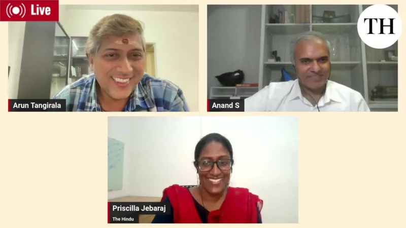](https://youtu.be/fPvhDOyUPc8?t=3876)

## Tools

- [NotebookLM (by Google)](https://notebooklm.google.com/) – For creating summaries, podcasts, FAQs, study guides, etc.
- [ChatGPT](https://chatgpt.com/) – For conversational AI, creating presentations, research, etc.
- [ChatGPT's Advanced Voice Mode](https://help.openai.com/en/articles/8400625-voice-mode-faq) - For voice conversations.
- [Gemini](https://gemini.google.com/) – A conversational AI from Google.
- [DocSearch](https://gramener.com/docsearch/biomoleculepapers/) - A demo of how researchers can use LLMs to search through scientific papers.
- [Claude.ai](https://claude.ai/) – Offers interactive tutoring, code artifacts, and other features.
- [Reveal.js](https://revealjs.com/) – Used to create presentation slide decks through LLM-generated content.
- [Whisper](https://whisper.com/) – An open-source model for audio-to-text transcription.
- [Meta AI (LLAMA)](https://www.meta.ai/) – An open-weights model available on WhatsApp.
- [Perplexity](https://www.perplexity.com/) – An AI tool for search with detailed, cited answers.
- [Phind](https://www.phind.com/) – A tool for code-related searches and programming support.
- [Cursor](https://www.cursor.com/) – An AI code editor that enhances coding productivity.
- [Zoom's AI Assistant](https://www.zoom.com/en/ai-assistant/) – For summarizing meeting discussions in Zoom.
- [Moral Bench](https://arxiv.org/html/2406.04428v1) – An evaluation framework to test model adherence to ethical standards.

## Notes

Here are notes via [NotebookLM](https://notebooklm.google.com/notebook/44782cbd-a954-4f3b-9b32-952d68553498)

### Podcast

[Podcast Link](https://notebooklm.google.com/notebook/44782cbd-a954-4f3b-9b32-952d68553498/audio). 15 minutes.

### Briefing Document

**Date:** October 19, 2024

**Source:** Transcript of The Hindu Edge Webinar "AI as a learning tool: What students, teachers, and parents need to know"

**Key Participants:**

- **Priscilla Jebraj:** Journalist, The Hindu (Moderator)
- **Prof. Arun Tangirala:** Professor, IIT Madras, Swayam Prabha program coordinator
- **S. Anand:** Co-founder & CEO, Gramener, self-described "LLM psychologist"

**Main Themes:**

1. **AI's Impact on Education:** The webinar explores the potential of AI to revolutionize education beyond simple homework assistance, emphasizing its role in personalized learning, content creation, research, and administrative tasks.

- **Open Intel Era:** Prof. Tangirala highlights the emergence of AI, Open Educational Resources (OERs), and Technology Enabled Learning (TEL) as transformative forces shaping education. He underscores the need for realignment and adaptation from all stakeholders.
- **Quote:** "These are the three giant entities now that are pushing not only the teacher-learner interaction into a new orbit but also the lifestyle, the societal conditions, and therefore the educational policies." - Prof. Tangirala

1. **LLMs as Learning Tools:** The discussion centers on using Large Language Models (LLMs) like ChatGPT responsibly to enhance learning and teaching experiences.

- **Emphasis on Learning, Not Cheating:** Anand shares research showing that students who engage with LLMs as tutors perform better than those using them for completing tasks. He advocates for using LLMs extensively to gain experience and avoid relying on them as crutches.
- **Quote:** "Students who used LLMs as their tutors, who talked to LLMs and understood what the LLM was saying by asking it for explanations, did better." - Anand

1. **Practical Applications of AI in Education:** The panelists showcase various AI tools and techniques for learning, teaching, and research.

- **NotebookLM:** Anand praises NotebookLM for transforming his learning process by summarizing materials, generating podcasts, and creating study guides.
- **Content Creation:** Anand demonstrates using LLMs to generate presentations and teaching materials, emphasizing their ability to automate tasks and create engaging content.
- **Research:** Anand showcases a tool he built leveraging LLMs to analyze research papers, identify key themes, and uncover unusual research topics.
- **Quote:** "The LLMs are great at language, and code is a language. So you don't have to rely on LLMs only for natural language; you can use them to write code sometimes, and that actually makes them pretty reliable, more so than usual." - Anand

1. **Ethical Considerations and Challenges:** The webinar acknowledges concerns surrounding AI in education, such as plagiarism, data privacy, bias, and the potential impact on human intellect.

- **Redefining Learning Outcomes:** Prof. Tangirala emphasizes the importance of defining learning outcomes before deciding whether to allow AI tools. He suggests that educators can design more challenging problems leveraging the assistance of AI.
- **Ethical Frameworks:** While acknowledging the lack of concrete regulations in India, Prof. Tangirala stresses the need for responsible AI practices and ethical considerations in using these tools.
- **Quote:** "We will always be kept busy. There is no way this world has been created where we become completely idle. It is just that new intellectual skills have to be focused on." - Prof. Arun

**Key Takeaways:**

- AI and LLMs offer immense potential to improve education, but responsible and ethical implementation is crucial.
- Educators and students need to adapt to the changing landscape, embracing new skills and approaches to learning and teaching.
- Continuous experimentation and learning are vital to leverage the evolving capabilities of AI tools effectively.
- India is actively developing regulatory frameworks and ethical guidelines for AI, though concrete implementations are still in progress.

**Actionable Insights:**

- Explore and experiment with the various AI tools mentioned in the webinar, like NotebookLM, ChatGPT, Claude.ai, and Perplexity.
- Start incorporating AI into daily activities to gain experience and understand its limitations.
- Engage in discussions about ethical considerations and potential risks of AI in education.
- Advocate for the development of responsible AI practices and guidelines at institutional and national levels.

**Next Steps:**

- Share this briefing document with stakeholders in the education sector.
- Organize workshops and training sessions on using AI tools effectively and ethically.
- Continuously monitor the development of AI technologies and adapt educational practices accordingly.
- Participate in the ongoing dialogue on responsible AI and contribute to the development of robust ethical frameworks.

### Detailed Overview

**Source 1: Webinar Transcript - AI as a Learning Tool: What Students, Teachers, and Parents Need to Know**

**I. Introduction: The Rise of AI in Education**

- Explores the rapid adoption of AI tools like ChatGPT in education, highlighting both the excitement and concerns surrounding their use.
- Introduces the panelists: Prof. Arun Tangirala, an expert in AI and education from IIT Madras, and S. Anand, co-founder of Gramener and an advocate for practical AI application.

**II. Prof. Arun Tangirala: The Big Picture of AI in Education**

- **The Open Intel Era:** Explains the emergence of Open Educational Resources (OER), Technology Enhanced Learning (TEL), and AI as transformative forces in education, creating a dynamic interplay with traditional educational structures.
- **From Classroom to Large-Scale Education:** Discusses the shift towards large-scale education and the indispensable role AI plays in addressing its challenges, particularly the diverse needs of learners.
- **The Impact of AI on Education:** Provides a comprehensive overview of how AI benefits students, teachers, and administrators, encompassing personalized learning, knowledge enrichment, content creation, assessment, and more.
- **The Four Pillars of Sustainable AI Integration:** Emphasizes the importance of ethics and regulations, infrastructure, training and literacy, and curriculum changes for successfully integrating AI into education.
- **Realigning Education for the AI Age:** Offers specific recommendations for educators and institutions to adapt to the AI era, including incorporating AI basics into curricula, promoting digital literacy, addressing plagiarism concerns, and teaching responsible AI usage.
- **Addressing Data Privacy and Bias:** Highlights the importance of educating students about data privacy concerns and potential biases in AI-generated content, urging critical evaluation of AI outputs.
- **The Role of Self-Learning in the AI Era:** Advocates for the inclusion of self-learning as a crucial skill in educational settings, emphasizing its increasing relevance in the age of AI.
- **The Art of Asking the Right Questions:** Stresses the significance of developing effective questioning skills to interact with AI tools like ChatGPT, paving the way for more meaningful and insightful responses.

**III. S. Anand: Practical Applications of AI in Learning and Teaching**

- **LLMs as Learning Tools:** Shares personal experiences using LLMs like NotebookLM for effective learning, emphasizing their potential for personalized podcasts, summaries, study guides, and more.
- **AI in Content Creation:** Demonstrates the use of LLMs for generating presentations, citing examples of creating a presentation entirely through AI.
- **AI in Research:** Explains how custom-built AI tools can aid research by summarizing relevant papers, identifying clusters of research, and suggesting unexplored areas.
- **The Evolving Capabilities of LLMs:** Emphasizes the rapid advancements in LLMs and encourages maintaining an "impossibility list" to track newfound capabilities.
- **Integrating AI into the Classroom:** Advocates for incorporating AI tools into classroom settings, encouraging students to use them responsibly and creatively, even during exams.
- **Leveraging AI for Course Content Creation:** Describes using AI for tasks like generating lecture notes from transcripts and creating virtual teaching assistants.
- **Recognizing the Limitations of LLMs:** Acknowledges areas where LLMs currently fall short, particularly in language translation, advocating for a realistic understanding of their capabilities.

**IV. Q&A Session: Addressing Concerns and Exploring Potential**

- **Understanding LLMs:** Explains the concept of Large Language Models (LLMs) and their inner workings, emphasizing their ability to predict and generate text.
- **Addressing Concerns about Student Dependency:** Discusses the need to define clear learning outcomes before allowing the use of AI tools like ChatGPT, emphasizing the importance of skill development alongside AI assistance.
- **AI in Learning Technology Products:** Explores various ways companies can leverage generative AI to enhance learning technology products, including personalized learning, content creation, tutoring, assessment, and accessibility features.
- **Fostering Critical Thinking in the Age of AI:** Advocates for teaching counterfactual reasoning and critical evaluation skills to empower students to verify AI-generated content.
- **The Impact of AI on the Workforce:** Addresses concerns about job displacement due to AI, highlighting the need for continuous skill development and adaptation to stay ahead of technological advancements.
- **Addressing Hallucinations in AI Outputs:** Discusses strategies for verifying the accuracy of AI-generated content, encouraging skepticism and fact-checking, and treating LLMs like interns who require supervision.
- **Ethical Considerations in AI Development:** Touches upon the ongoing development of ethical guidelines for AI in India, highlighting the challenges of defining responsible AI practices and the need for ongoing discussions and regulations.
- **Exploring Business Models in the AI Landscape:** Examines the evolving business models in the AI space, noting the dominance of foundational model companies and the potential for value creation through applied AI solutions.
- **The Importance of Indic Language AI Models:** Highlights the emergence of Indic language models and the need for ethical frameworks relevant to Indian society.

**V. Conclusion: A Call to Action for Embracing AI in Education**

- Encourages educators, students, and parents to actively explore and engage with AI tools, recognizing both their potential and limitations.
- Emphasizes the importance of continuous learning and adaptation in the rapidly evolving world of AI.
- Underscores the need for open discussions and responsible AI integration to ensure that AI empowers rather than undermines human intellect and capabilities.

### FAQ

**1. What is an LLM and how does it work?**

**LLM stands for Large Language Model.** It's a computer program trained on massive amounts of text data, enabling it to understand and generate human-like text. It works by predicting the next word in a sequence based on the preceding words, much like how we intuitively construct sentences. It doesn't truly "understand" language but excels at statistically predicting word patterns.

**2. Is it detrimental for students to rely on AI tools like ChatGPT for coding projects?**

It depends on your learning objectives. **If the goal is to develop independent coding skills, relying solely on ChatGPT might be counterproductive.** However, if the focus is on analyzing code, identifying errors, or exploring creative solutions, using ChatGPT as a tool can be beneficial. **Define your learning outcomes first and then determine the appropriate use of AI tools.**

**3. How can companies developing educational technology products effectively leverage generative AI?**

Generative AI offers numerous possibilities:

- **Personalized learning:** tailoring content to individual student needs.
- **Automated content creation:** generating engaging and diverse learning materials.
- **Interactive tutoring:** providing personalized support and feedback.
- **Enhanced engagement:** using interactive stories, challenges, and simulations.
- **Effective assessment:** automating grading and providing insightful feedback.
- **Accessibility and inclusivity:** translating content and customizing for diverse learners.
- **Data-driven insights:** analyzing student performance and optimizing learning paths.
- **Co-creation of content:** collaborating with AI to develop innovative learning experiences.

**4. How can we use AI effectively in education without diminishing human intellect?**

The key is to **use AI as a tool to augment and enhance our capabilities, not replace them.** Encourage critical thinking, problem-solving, and creativity alongside AI usage. Focus on developing skills that complement AI, such as:

- **Asking the right questions:** framing prompts for AI tools effectively.
- **Verifying and validating:** critically assessing AI-generated outputs.
- **Ethical considerations:** understanding the implications and biases of AI.
- **Social and emotional intelligence:** nurturing human connection and empathy.

**5. How can a school student incorporate AI into daily activities?**

Think of AI as a helpful assistant for various tasks:

- **Research and information:** Quickly find information, summarize articles, or translate languages.
- **Decision making:** Compare options, analyze reviews, or get suggestions.
- **Creative tasks:** Brainstorm ideas, write stories, or compose music.
- **Learning and studying:** Get explanations, generate quizzes, or create study guides.
- **Problem-solving:** Find solutions to everyday problems, like navigating transportation.

Remember to **use AI responsibly and balance it with real-world interactions and experiences.**

**6. What are the potential business models for leveraging LLMs, particularly for young entrepreneurs?**

While the landscape is evolving rapidly, two trends are emerging:

- **Foundational models:** Developing core AI technologies like OpenAI, attracting substantial investment but with limited players.
- **Applied uses:** Building products and services on top of existing LLMs, catering to specific needs across various sectors.

Successful models often leverage existing customer bases and focus on addressing clearly defined needs within organizations. The field is dynamic, and new opportunities are constantly emerging.

**7. How can we ensure that AI models are trained ethically, especially considering India's unique context?**

India is actively developing its own AI ethics guidelines and regulations. Initiatives like the India AI mission and Model Bench aim to establish ethical frameworks and evaluation mechanisms for AI systems. The focus is on:

- **Data privacy:** Protecting sensitive personal information.
- **Bias mitigation:** Ensuring fairness and inclusivity in AI outputs.
- **Transparency and accountability:** Making AI decision-making processes understandable.
- **Alignment with societal values:** Reflecting Indian cultural and ethical norms in AI systems.

**8. Do AI tools like ChatGPT sometimes fabricate information, particularly research paper titles?**

Yes, LLMs can sometimes generate inaccurate or nonexistent information. This is known as "hallucination." To mitigate this:

- **Always verify information:** Cross-check AI-generated outputs with reliable sources.
- **Ask for citations:** Request sources to validate claims and ensure accuracy.
- **Use multiple tools:** Compare results from different LLMs to spot discrepancies.
- **Treat LLMs as assistants, not oracles:** Approach AI outputs with healthy skepticism.

### Study Guide

**Quiz**

**Short Answer Questions (2-3 sentences each)**

1. **What is the "Open Intel Era" in education, as described by Professor Tangirala?**
2. **What are two key differences between AI as a technology and previous disruptive technologies like calculators or steam engines?**
3. **According to the study Anand referenced, how did students who used LLMs as tutors perform compared to those who used them to complete exercises?**
4. **Describe two specific examples of how Anand leverages AI in his daily life.**
5. **What is NotebookLM and how does it facilitate learning?**
6. **Explain the role of AI in Anand's approach to teaching, including the rules for exams.**
7. **What are the limitations of LLMs, particularly in language translation, as illustrated by Anand's example?**
8. **What is Professor Tangirala's recommendation for defining the appropriate use of AI tools in education?**
9. **How can LLMs be leveraged in the development of learning technology products?**
10. **What are some of the ethical concerns surrounding the use of AI in education, particularly regarding data privacy?**

**Answer Key**

1. The "Open Intel Era" refers to the integration of Open Educational Resources (OERs), Technology Enhanced Learning (TEL), and Artificial Intelligence (AI) in education. These elements are reshaping the traditional teacher-learner dynamic and influencing societal conditions and educational policies.
2. AI is interactive, meaning it collects data from users, unlike previous technologies. Additionally, AI can provide incorrect answers, requiring users to critically evaluate the information.
3. Students who used LLMs as tutors, engaging in dialogue and seeking explanations, demonstrated better understanding and higher scores compared to those who passively used LLMs to solve exercises.
4. Anand uses AI for translation, utilizing ChatGPT's advanced voice mode to communicate in Korean during an emergency. He also utilizes AI for research, employing a custom tool to analyze research papers and identify relevant information clusters.
5. NotebookLM is a Google tool that allows users to input various sources, including documents, websites, and videos. It facilitates learning by offering summaries, generating podcasts for content consumption, and assisting in creating study guides.
6. Anand encourages the use of LLMs in his courses, permitting their use even during exams. He leverages AI to create a virtual teaching assistant and streamline content creation by generating summaries from recorded sessions.
7. Anand highlighted the limitations of LLMs in accurately translating nuanced language, citing an example of translating a scene with mixed Hindi, Punjabi, and English dialogue. This demonstrates the challenges AI faces in capturing the complexities of language.
8. Professor Tangirala emphasizes the importance of first defining learning outcomes before deciding whether to incorporate AI tools. The specific skills and knowledge targeted will determine the appropriate use of AI in a given educational setting.
9. LLMs can enhance learning technology products through personalized learning experiences, automated content creation, interactive tutoring, engaging simulations, efficient assessment and feedback, improved accessibility, data-driven insights, and collaborative content creation.
10. Ethical concerns include data privacy, as AI interactions can collect sensitive personal information. Additionally, the potential for biased outputs and the responsibility for errors in AI-assisted decisions, such as in healthcare, require careful consideration.

**Essay Questions**

1. Discuss the potential benefits and drawbacks of integrating AI tools into the K-12 education system, considering factors such as personalized learning, teacher workload, and student development.
2. Analyze the implications of AI-assisted assessment and grading on student learning and motivation. How can educators ensure fairness and mitigate potential biases in AI-driven evaluation systems?
3. How can AI be leveraged to promote inclusivity and accessibility in education, addressing the needs of diverse learners and bridging language barriers?
4. Explore the ethical considerations surrounding the use of AI in education, focusing on data privacy, responsible use, and the potential for unintended consequences.
5. Looking ahead, how might AI fundamentally transform the role of teachers and the nature of learning in the future? Discuss the potential societal and economic implications of widespread AI adoption in education.

**Glossary of Key Terms**

- **AI (Artificial Intelligence):** The ability of a computer or machine to mimic human intelligence, including learning, problem-solving, and decision-making.
- **LLM (Large Language Model):** A type of AI model trained on vast amounts of text data, enabling it to understand and generate human-like language.
- **Chatbot:** A computer program designed to simulate conversation with human users, often used in customer service or education.
- **Generative AI:** A type of AI that can create new content, including text, images, audio, and code, based on existing data.
- **Personalized Learning:** Tailoring educational experiences to individual student needs, learning styles, and goals.
- **Knowledge Enrichment:** Expanding students' understanding and access to information through AI-powered tools and resources.
- **Content Creation:** Utilizing AI to develop educational materials, including lesson plans, assignments, and presentations.
- **Automation:** Automating tasks like grading, scheduling, and administrative functions to free up teacher time for more personalized instruction.
- **Interactive Simulations:** Using AI to create engaging learning experiences that mimic real-world scenarios.
- **Augmented Reality (AR) & Virtual Reality (VR):** Technologies that enhance or replace the real-world environment with computer-generated images and sounds, providing immersive learning experiences.
- **Assessment & Grading:** Evaluating student learning using AI-powered tools, potentially improving efficiency and objectivity.
- **Integrity Monitoring:** Utilizing AI to ensure fairness and prevent cheating in online assessments.
- **Translation:** Using AI to translate educational materials into multiple languages, increasing accessibility.
- **Ethics & Regulations:** Guidelines and policies that govern the responsible and ethical use of AI in education.
- **Digital Literacy:** The ability to use technology effectively and responsibly, including understanding AI's capabilities and limitations.
- **Plagiarism:** Presenting someone else's work as your own, a concern with the increased availability of AI-generated content.
- **Data Privacy:** Protecting the confidentiality and security of personal information collected through AI interactions.
- **Bias:** Systematic errors or unfairness in AI outputs, potentially reflecting biases present in the training data.
- **Critical Thinking:** The ability to analyze information objectively, evaluate arguments, and form independent judgments.
- **Counterfactual Reasoning:** Thinking about alternative possibilities and hypothetical situations to enhance critical thinking and problem-solving skills.
- **Impossibility List:** A list of tasks or capabilities that AI cannot currently perform, used to track the rapid advancements in AI technology.
- **Indic Ethics:** Ethical principles and values specific to the Indian context, potentially influencing the development and training of AI models.
- **Responsible AI:** Developing and using AI in a way that considers ethical implications, social impact, and potential risks.

## Questions

These questions were extracted from the chat comments.

### About LLMs

- What is an LLM?
  - sir what is the full form of llm?
  - what is the difference between the AI & Ultron...
- Where can I learn more about AI and ChatGPT?
  - Do i need to buy or purchase ai or chatgpt
  - Sir kindly tell us where I can study AI ChatGPT for better performance from ppt presentation and etc
- What are other tools like ChatGPT?
  - @Arun Tangirala Please tell about most advanced tools are you using now
  - How can we learn practical use of these AI tools like chat gpt etc. Suggest some sites, courses for the same?
  - How to create an teaching assistant in ChatGPT?
  - I find chatGPT and Gemini tend to make up titles of research papers(they do not exist) when I ask for those on a particular topic. Why is this so? Are there better options?
  - Is AI or CHATGPT is some kind of application or software?
  - please recommend for edu tech teachers
  - sir in order to learn skills like Data Science sometimes we stuck in solving particular questions so is it okay to take help from this AI tools like ChatGPT? Does it help us?
  - Sir, for adults can you please suggest few sources to get the latest genuine information on the AI tools which can be used for my kid(7 years old) and also at workplace?
  - sir, i like to convert theoritical concept into Animation , kindly suggest some AI tool. sir, i try it using claude but unable to extract or save and download it
  - Sirs, please tell ua names of AI tools other than ChatGPT.
  - What are the day to day ai tools like chatgpt which are must to use🙌1
- How to effectively use prompts with LLMs?
  - Anand Sir Please recommend the books on prompt engineering
  - Dear sir, can you give some tips for how to give responsible prompt for AI?
  - hi, I have a question. Is there any proper method to give prompt to get specified result.?
- How can I use AI to improve myself?
  - How can I use AI to know my areas of improvement
  - sir i know to use ai but how can i utilise it more and enhance my knowledge with the help of the ai

### About AI in Education

- How can students leverage AI without diminishing their creativity?
  - @Anand S , thank you simplifying the uses of AI! Could you name all the AIs that you spoke about in this session? Could you also talk about how a teacher can use character.ai to teach students in
  - Can we not ask the AI to generate worksheets for say "quadratic equations" ...this might be a better use case for students
  - FOR SCHOOLS STUDENTS LIKE US WHO ARE STUDYING AT Kendriya vidyalaya we have been given books advised to read about AI. HOW to learn how to use for day to day activities👍2
  - Good evening. Specifically for coding, at what stage should students use AI tools like copilot, code whisperer etc 👍1
  - How can we leverage AI effectively while ensuring that it does not diminish human intellect?
  - How to make the students to think out of the box especially AI? If they were asked to sum up a topic they rely on Meta or AI, kindly suggest a method to prevent this sir?
  - Is AI trying to remove the habitual habits of refering the books for their study?
  - pl. eloberate in which areas how students of PGDM, UG, pl. eloberate in which areas how students of PGDM, UG, PG can use AI without killing their unexplored natural creative talents. and how AI can be
  - what are challenges and limitations of AI in using in education process
  - What are the current limitations of AI that you think that we students should be aware of, and how can we best complement AI technologies with human creativity and human solving skills?🙌1
  - what is the basic skill required to use AI effectively?
- How does AI affect students' critical thinking and problem-solving skills?
  - What sort of critical thinking course would you offer where students learn counterfactual reasoning? Should students not be asked to speciallizrke DEEPLY so that they can verify the output of the LLM?
  - At some point AI chat bots are affecting negatively, the learners problem solving ability. specially for mathematics learning it is a very impactful and harmful incident. They are not thinking and
  - Do you think AI is taking away the critical thinking of humans ?
  - Don't you think that AI has started restricting novel thinking of students using AI for resolving their issues.
  - Students themselves might suppress the thinking process just because there is some AI that makes the work easier. What do u think of it sir or mam?
  - to be truly able to evaluate the "goodness of output" of an LLM system, one already #needs to know a fair bit already to troubleshoot and to ask the right counterfactuals or probing questions to the LLM, should we not have students learn a few topics even more DEEPLY then before than be generalists?
- How is ChatGPT impacting students' learning?
  - Kindly elaborate about how chatgpt is impacting students in both school and College
  - Sir most of the students in today's academia , do coding projects with the help of Chatgpt only, fix error use of chatgpt only, so how does it help in learning? It just make students dependent on Chatgpt
  - Sir, can you please elaborate more on your usage of chatGPT to evaluate students?
- How should LLMs be integrated into education?
  - How can LLM be used for assessment sir
  - How soon should the use of LLMs should be integrated in the school and college curriculum.
- How to define learning outcomes for future students?
  - How do you define learning outcomes for future students?
  - What are some effective strategies for defining learning outcomes that truly engage and benefit future students?
- How reliable is AI in research?
  - Can we trust LLM's for summarizations.(does it really include all points?)
  - Is it possible to know from which source or reference , the AI has finally come to the answer for question raised. Also is their any other AI source through which we can countercheck the genuinity of
  - Recently a team of innovators who worked in google recently won Nobel Prize for using AI for predicting protein and RNA structure using AI. My question is how reliable will be in research when
  - Sir can we use chatgpt or LLM for research papers and PHD work
  - Sir, If we go on writing a research or a review paper, what are the things we should take care especially when we use AI?
  - Would AI be impactful in Quantum Computing?
- What LLMs should college students use for learning?
  - As a college student, which LLM (with their purpose) should I use for my daily learning apart from ChatGPT?
  - Best LLM's
  - LLM vs BERT which one Better??
  - sir can you plz give me some tools for maths and science problems as a student.
- How do we detect use of AI in student work?
  - How to find out if somebody is using chat gpt or some other AI tools for completion of assignments or research work?

### About AI in Business

- How does AI impact businesses?
  - @Anand S how can a company building learning tech product leverage GenAI ?👍1
  - Can I use a LLM to build a better LLM ?
  - Why is it harder to introduce AI into fields that don't require the intelligence of people, such as sanitation, transport, construction, etc., i.e., to perform mechanical actions compared to its contemporary
  - with perplexity recently launching finance domain search couple of days back, what sort of products and companies are under severe threat ?
- How does AI impact jobs?
  - Sir, AI is snatching jobs of many, will it be able to generate more jobs instead of snatching job?
  - What does AI have to do with the mass layoffs that are taking place?
- Can AI be used for stock market prediction?
  - Sir, is it possible for a retail trader (w/o proficiency in coding) in stock market to use the ChatGbt or some other paid versions of ChatGbt in trading for prediction of stock prices using LLMs by feeding
- How can AI be used for government exams?
  - Can you please elaborate , how to use these tools for government examination of GoI, Please help me out on this👍🙌4
  - Hello sir,hii ma'am I'm prem, currently pursuing ba geography hons from DU , I'm targeting for upsc exam ,
  - How can we use AI to crack government exams
  - How to use AI for UPSC civil services as peer the changing pattern of exam ?👍4
  - Sir how can we use AI to crack conp
  - Upto what extent will it be safe and ethical to use AI in Civil services preparation?
- How can AI be used in data forecasting?
  - how can i make use of it in forecasting data
  - Sir , how can we analyse data with AI
- How can law students and farmers use AI?
  - Sir, Ai could be a gamechanger in legal field as it could reduce the burden over the judiciary to manage cases, drafting case papers etc etc. how a law student can take out full potential of Ai ?
- How is adaptive signal processing related to machine learning?
  - Dear Profs, I have a basic question : Can we say adaptive signal processing as one of the key aspects of machine learning? This question is related to the 3G cellular mobile stack"
  - There there were algos written compensate for for the variation in the channel between the mobile and the base station was implemented usng LMS. An error vector was compueted and coefficients of
- How is AI related to BIM?
  - How AI Is related to BIM (BUILDING INFORMATION MODELING) in Architecture, Engineering & Construction feild Industry

### About Responsible AI

- How confidential is data used in LLMs?
  - How confidential would the data that we feed would be in LLM? ChatGPT always says do not post information that you do not want to share. But it is very good at data analyses
- Are there any Indic ethics trained models?
  - For Anand: If one wanted to train a custom language model that has an Indian ethics system as opposed to a Kantian (Western) model, how would you suggest we go about it? Are there Indic systems being
  - Any Indic ethics trained model that can be tried out?
- What are the ethical implications of AI?
  - Sir, what are your views about regulating the use of AI?
  - What do you say about the future of human on ai dependence

## Comments

🔴 indicates a question to the panel.

- 04:07 PM **Harsh Kishor Pandey**: Hello everyone 👋
- 04:07 PM **Venkatesan Lakshminarasimhan**: Excellent idea
- 04:16 PM **Sahil Bishnoi**: Brilliant idea to engage and enlight new commers
- 04:17 PM **Mithun Krishna**: Interest to know
- 04:29 PM **Eldho Joy**: Timely and relevant
- 04:41 PM **Saurabh Kumar Kumar**: When will the webinar go live
- 04:46 PM **pk ..**: May at 5.00
- 04:46 PM **pk ..**: maybe\*
- 04:50 PM **KALYANAKRISHNAN KUMARASAMY**: good eve sir
- 04:50 PM **VISHAL ARYA**: Excitement webinar in digital Innovation
- 04:51 PM **Jensila Smile**: Good Evening
- 04:52 PM **Priyadharshini P**: Good evening sir
- 04:53 PM **Rounak Bairagya**: Hello
- 04:53 PM **Shanmuka priya Inbasekar**: Good evening sir
- 04:53 PM **ADATISH DARADE**: Good Evening everyone
- 04:53 PM **REUBAN G**: I am waiting
- 04:54 PM **Dr. Sanhita Kundu**: Good evening, Sirs.
- 04:55 PM **Ssm ..**: Good evening everyone
- 04:56 PM **Dibyendu Shekhar Das**: Good evening, Sirs and Madam.
- 04:56 PM **Ramesh Ayyagari**: Hello 👍1
- 04:56 PM **G BABU**: Good Evening Sir
- 04:56 PM **G BABU**: Good Evening Every one
- 04:57 PM **Aswini J**: Good Evening Every one
- 04:57 PM **Arunkumar Jambunathan**: Good evening to all
- 04:58 PM **Hi T**: Hi
- 04:58 PM **Sankar C**: Good Evening to all
- 04:58 PM **Dr. R. Uma rani Rani**: Good evening to all
- 04:59 PM **Gulshan Kumar**: Good evening sir
- 04:59 PM **Aditi Mishra**: Good evening sir
- 04:59 PM **Samiksha Rawat**: good evening everyone
- 04:59 PM **Balasudaram N A**: HALLO
- 04:59 PM **Nidhi Singh**: Good evening everyone
- 04:59 PM **Saurabh Dudhe**: good evening guys
- 04:59 PM **Karthikeyeni S**: Good evening all
- 04:59 PM **Balasudaram N A**: GOOD EVENING
- 05:00 PM **Sivakumar S**: Good evening ALL
- 05:00 PM **Saravanan Chennappan**: Good Evening Everybody!
- 05:00 PM **Nainar P**: Good Evening ALl
- 05:00 PM **Yodhitha Naagilla**: Timeup
- 05:00 PM **Balakrishnan Raja**: Good Evening to all
- 05:00 PM **Venkata Venu**: Good evening
- 05:00 PM **Navya ST**: Good evening
- 05:01 PM **Afzal Mohideen**: Good Evening all
- 05:01 PM **M CH Veera Manikanta**: Good Evening
- 05:01 PM **Prasad V**: gdevng
- 05:01 PM **Navneet Kaushik**: Do we need to refresh ?
- 05:01 PM **Balakrishnan Raja**: It is a must to know by everyone
- 05:01 PM **Deepshree Khanna**: Gdeve
- 05:01 PM **VISHAL ARYA**: Webinar isn't streaming
- 05:01 PM **Balakrishnan A**: Good Evening All
- 05:01 PM **VISHAL ARYA**: time is going up
- 05:02 PM **ZUBER KHAN**: Happy learning evening to all
- 05:02 PM **Abdul Rahman**: Did it start
- 05:02 PM **Kanak Sharma**: Hi, could you please suggest How may I join it with my laptop or computer without having whatsapp
- 05:02 PM **Palani B**: Webinar isn't streaming😍1
- 05:02 PM **Kanak Sharma**: No streaming
- 05:02 PM **Navneet Kaushik**: Refresh guys
- 05:02 PM **Thiyagu K**: live now
- 05:02 PM **Dr. Deepathi Sayam**: Sir, is the streaming started
- 05:03 PM **Thiyagu K**: yes
- 05:03 PM **BARANI M**: Refresh the page. Stream already started.
- 05:04 PM **Krishna Kumar**: Good evening for all three
- 05:04 PM **The Hindu**: Thank you for joining us today!
- 05:04 PM **Bhawna Pandey**: Good morning to all of you
- 05:05 PM **Chandru Jayaram**: Good evening sir
- 05:05 PM **Krishna Teknoturf**: Interested to learn from Anand on the scope of using GenAI in learning and learning programs
- 05:05 PM **Bhawna Pandey**: Good evening sir
- 05:06 PM **Sivakumar Paramasivam**: Good evening Sir
- 05:11 PM **pk ..**: Sir, is this presentation also created using AI? 😁
- 05:11 PM **Hema Latha**: Good evening sir
- 05:13 PM **Prem Kumar**: 🔴 Hello sir,hii ma'am I'm prem, currently pursuing ba geography hons from DU , I'm targeting for upsc exam ,
- 05:14 PM **Prem Kumar**: Sir my question is that is ai may hamper this exam????
- 05:14 PM **Saurabh Kumar**: Pk so what's ur concern
- 05:16 PM **pk ..**: We can use AI, but somehow, AI makes us dumb in a way... information that we would search over, is now available without any effort, help is obviously appreciated, but we lost other many information in a way... AI is both good and bad for us...
- 05:18 PM **ZUBER KHAN**: Thx a lot Arun sir
- 05:18 PM **Atul Gaur**: Thank you Arun Sir
- 05:19 PM **KUMARASWAMY JADI**: Hii
- 05:19 PM **Avinash Kumar**: Hii
- 05:19 PM **Sujatha Iyer**: Priscilla, you're on mute I guess?
- 05:20 PM **Saksham Yadav**: what did i miss i am 20 min late oops
- 05:20 PM **swamynathan k**: sir can you please zoom
- 05:20 PM **Jagadeesha N**: Good evening
- 05:22 AM **Onlyysaddam**: hello Everyone
- 05:22 PM **Selva Pujith**: It most help to my career
- 05:22 PM **Sujatha Iyer**: I am an Education (Cognition) researcher in the space of using AI "just right". Would love to ask a question at the end. Priscilla - please permit when the time is right.
- 05:22 PM **Selva Pujith**: It is very best
- 05:23 PM **Priscilla Jebaraj**: Please go ahead and post your question here, and we will put it to the panelists
- 05:24 PM **swamynathan k**: CTRL is a AI movie
- 05:25 PM **K Ganesan**: 🔴 Sir, is it possible for a retail trader (w/o proficiency in coding) in stock market to use the ChatGbt or some other paid versions of ChatGbt in trading for prediction of stock prices using LLMs by feeding large historical data
- 05:25 PM **Dibyendu Shekhar Das**: 🔴 Sir, please tell us the AI tools we should use.
- 05:27 PM **pk ..**: I prepare for competition exams, it helps me in all the topics, specially, in current affairs.
- 05:27 PM **Balram Singh**: 🔴 Sir most of the students in today's academia , do coding projects with the help of Chatgpt only, fix error use of chatgpt only, so how does it help in learning? It just make students dependent on Chatgpt
- 05:27 PM **Mohan Sai Manthri**: Pora pooo
- 05:28 PM **Pozhilan A**: 🔴 Does any other AI can beat it
- 05:30 PM **pk ..**: 🔴 Sir, what are your views about regulating the use of AI?
- 05:30 PM **Sai Prasad Mahesh**: 🔴 sir what is the full form of llm?
- 05:30 PM **pk ..**: Legally
- 05:30 PM **Krishna KK**: LLM is large language model @Sai Prasad Mahesh
- 05:30 PM **pk ..**: LLM stands for Large Language Model
- 05:30 PM **Arunkumar Jambunathan**: large language model
- 05:30 PM **Sai Prasad Mahesh**: thnx
- 05:30 PM **Saksham Yadav**: Large language models
- 05:30 PM **Saksham Yadav**: yes
- 05:30 PM **ZUBER KHAN**: 🔴 Anand Sir Please recommend the books on prompt engineering
- 05:31 PM **Krishna KK**: 🔴 @Anand S how can a company building learning tech product leverage GenAI ?👍1
- 05:31 PM **Felix Arokiya Raj A.P.**: 🔴 How to create an teaching assistant in ChatGPT?
- 05:31 PM **Vanitha Tekstac**: 🔴 Good evening. Specifically for coding, at what stage should students use AI tools like copilot, code whisperer etc 👍1
- 05:31 PM **Bhoomika Talreja**: 🔴 how can i make use of it in forecasting data
- 05:31 PM **Sujatha Iyer**: 🔴 I have two questions:
- 05:31 PM **Deepshree Khanna**: 🔴 Can you please elaborate , how to use these tools for government examination of GoI, Please help me out on this👍🙌4
- 05:32 PM **Jayrath Shinde**: 🔴 LLM can read but how does it understand or make sense of things?
- 05:32 PM **Sukumar Palanisamy**: 🔴 LLM vs BERT which one Better??
- 05:32 PM **Arun k**: 🔴 please recommend for edu tech teachers
- 05:32 PM **Subhrajeet Dutta**: 🔴 What are the day to day ai tools like chatgpt which are must to use🙌1
- 05:32 PM **A D**: 🔴 How to use AI for UPSC civil services as peer the changing pattern of exam ?👍4
- 05:32 PM **Sai Prasad Mahesh**: 🔴 Sir one more question - How can we use AI to create games? Specifically battle royales?
- 05:32 PM **B K S Vardhini**: 🔴 Sir can we use chatgpt or LLM for research papers and PHD work
- 05:33 PM **Atul Gaur**: 🔴 Sir, If we go on writing a research or a review paper, what are the things we should take care especially when we use AI?
- 05:33 PM **M CH Veera Manikanta**: 🔴 Can we trust LLM's for summarizations.(does it really include all points?)
- 05:33 PM **Sujatha Iyer**: 🔴 1. What sort of critical thinking course would you offer where students learn counterfactual reasoning? Should students not be asked to speciallizrke DEEPLY so that they can verify the output of the LLM?
- 05:34 PM **Sam Rawat**: 🔴 sir in order to learn skills like Data Science sometimes we stuck in solving particular questions so is it okay to take help from this AI tools like ChatGPT? Does it help us?
- 05:34 PM **Harshit Pachorkar**: 🔴 Best LLM's
- 05:34 PM **Swami K**: 🔴 Can I use a LLM to build a better LLM ?
- 05:34 PM **Sai Prasad Mahesh**: 🔴 Sir one more question - How can we use AI to create games? Specifically battle royales?
- 05:35 PM **Vijay Anandh**: 🔴 Sir kindly tell us where I can study AI ChatGPT for better performance from ppt presentation and etc
- 05:35 PM **Atul Gaur**: 🔴 As a college student, which LLM (with their purpose) should I use for my daily learning apart from ChatGPT?
- 05:35 PM **Sujatha Iyer**: 🔴 2. For Anand: If one wanted to train a custom language model that has an Indian ethics system as opposed to a Kantian (Western) model, how would you suggest we go about it? Are there Indic systems being developed with this view?
- 05:35 PM **Praneeth Vss**: 🔴 What does AI have to do with the mass layoffs?
- 05:35 PM **Deeksha Singh**: 🔴 How to find out if somebody is using chat gpt or some other AI tools for completion of assignments or research work?
- 05:35 PM **Sai Prasad Mahesh**: 🔴 Sir one more question - How can we use AI to create games? Specifically battle royales?
- 05:35 PM **SACHIN JAVAJI**: 🔴 hi, I have a question. Is there any proper method to give prompt to get specified result.?
- 05:35 PM **Balram Singh**: Thank you sir
- 05:35 PM **Ushma Desai**: 🔴 Sir, can you please elaborate more on your usage of chatGPT to evaluate students?
- 05:35 PM **Arunkumar Jambunathan**: ChatGPT may cause memory loss
- 05:35 PM **Mahaboob basha shaik**: 🔴 How can we leverage AI effectively while ensuring that it does not diminish human intellect?
- 05:35 PM **Padma V**: LLM learns from the data that it gets.
- 05:36 PM **Karan S**: .
- 05:36 PM **Aishwarya Srihari**: 🔴 @Anand S , thank you simplifying the uses of AI! Could you name all the AIs that you spoke about in this session? Could you also talk about how a teacher can use character.ai to teach students in class?👍1
- 05:36 PM **Srinivas Attaluri**: 🔴 How LLM and AI help in agriculture communication especially with farmers level in a country like for better transfer of technology in India where we have language barriers...
- 05:37 PM **Dhanesh Vibhute**: 🔴 Sir, Ai could be a gamechanger in legal field as it could reduce the burden over the judiciary to manage cases, drafting case papers etc etc. how a law student can take out full potential of Ai ?
- 05:37 PM **Padma V**: 🔴 How confidential would the data that we feed would be in LLM? ChatGPT always says do not post information that you do not want to share. But it is very good at data analyses
- 05:37 PM **Sai Prasad Mahesh**: 🔴 @Anand S Sir one more question - How can we use AI to create games? Specifically battle royales?
- 05:37 PM **Salman Malik**: 🔴 How AI is related to BIM ( BUILDING INFORMATION MODELING)
- 05:37 PM **Vallidevi Krishnamurthy**: 🔴 How can LLM be used for assessment sir
- 05:37 PM **srinivas p penu**: 🔴 pl. eloberate in which areas how students of PGDM, UG, pl. eloberate in which areas how students of PGDM, UG, PG can use AI without killing their unexplored natural creative talents. and how AI can be used at workplace to meet companies vision, mission and one's own career growth.
- 05:37 PM **pk ..**: People now-a-days use chatGPT or any other AI tools to crack interviews in real time.
- 05:38 PM **Aditi Mishra**: 🔴 How can I use AI to know my areas of improvement
- 05:38 PM **Sukumar Palanisamy**: 🔴 How do you define learning outcomes for future students?
- 05:38 PM **Sujatha Iyer**: 🔴 Dr. Arun: I am repeating my question because I can't see it on this scrolling list of messages. Apologies if it shows up twice. The question is: to be truly able to evaluate the "goodness of output" of an LLM system, one already needs to know a fair bit already to troubleshoot and to ask the right counterfactuals or probing questions to the LLM, should we not have students learn a few topics even more DEEPLY then before than be generalists?
- 05:38 PM **VISHAL ARYA**: 🔴 Is AI or CHATGPT is some kind of application or software?
- 05:39 PM **Parvin Yadav**: My children are doing all their projects using AI... I don't think they are doing justice to education
- 05:39 PM **pk ..**: 🔴 Sir, AI is snatching jobs of many, will it be able to generate more jobs instead of snatching job?
- 05:39 PM **Vijay Anandh**: 🔴 Is AI trying to remove the habitual habits of refering the books for their study?
- 05:39 PM **VISHAL ARYA**: 🔴 Do i need to buy or purchase ai or chatgpt
- 05:39 PM **Deeksha Singh**: 🔴 How can we learn practical use of these AI tools like chat gpt etc. Suggest some sites, courses for the same?
- 05:40 PM **Praneeth Vss**: 🔴 What does AI have to do with the mass layoffs that are taking place?
- 05:40 PM **Praveen Chitturi**: 🔴 Sir, for adults can you please suggest few sources to get the latest genuine information on the AI tools which can be used for my kid(7 years old) and also at workplace?
- 05:40 PM **B K S Vardhini**: 🔴 sir can we use chatgpt for research
- 05:41 PM **AVN Venkateswaran**: 🔴 other tools like chatgpt
- 05:41 PM **Lekshmi Jayamohan**: 🔴 I find chatGPT and Gemini tend to make up titles of research papers(they do not exist) when I ask for those on a particular topic. Why is this so? Are there better options?
- 05:41 PM **Sahal K**: 🔴 @Arun Tangirala Please tell about most advanced tools are you using now
- 05:42 PM **Aishwarya Srihari**: 🔴 @Anand S, thank you simplifying the uses of AI! I'm reposting my question as there are many messages. Could you name all the AIs that you spoke about in this session? Could you also talk about how a teacher can use character.ai to teach students in class?
- 05:43 PM **Atul Prakash**: 🔴 Upto what extent will it be safe and ethical to use AI in Civil services preparation?
- 05:43 PM **Sukumar Palanisamy**: 🔴 What are some effective strategies for defining learning outcomes that truly engage and benefit future students?
- 05:43 PM **Atul Gaur**: 🔴 What are the current limitations of AI that you think that we students should be aware of, and how can we best complement AI technologies with human creativity and human solving skills?🙌1
- 05:43 PM **Krishna KK**: 🔴 with perplexity recently launching finance domain search couple of days back, what sort of products and companies are under severe threat ?
- 05:44 PM **Sairang Tonde**: 🔴 what is the difference between the AI & Ultron...
- 05:44 PM **Apeksha Deore**: 🔴 Kindly elaborate about how chatgpt is impacting students in both school and College
- 05:45 PM **Dr Manoj Kumar**: 🔴 Is it possible to know from which source or reference , the AI has finally come to the answer for question raised. Also is their any other AI source through which we can countercheck the genuinity of answers given through AI.
- 05:45 PM **Shabeena Shah**: 🔴 How soon should the use of LLMs should be integrated in the school and college curriculum.
- 05:45 PM **Jaganmohana Rao**: 🔴 Dear sir, can you give some tips for how to give responsible prompt for AI?
- 05:45 PM **Dhanesh Vibhute**: 🔴 Sir, Ai could be a gamechanger in legal field as it could reduce the burden over the judiciary to manage cases, drafting case papers etc etc. how a law student can take out full potential of Ai ?
- 05:46 PM **Sai Prasad Mahesh**: @Sairang Tonde Ultron: A fictional AI villain created in the Marvel comics and films. Ultron is depicted as a sentient robot with a desire to eradicate humanity, believing it's the only way to achieve peace. He represents a cautionary tale about the dangers of advanced AI when it becomes self-aware and develops its own goals, often opposing its creators. In summary, general AI aims to support and improve human life, while Ultron embodies the potential threats of unchecked AI development. 😂1
- 05:46 PM **Dibyendu Shekhar Das**: 🔴 Sirs, please tell ua names of AI tools other than ChatGPT.
- 05:46 PM **Dinesh Dinesh.sn**: 🔴 What do you say about the future of human on ai dependence
- 05:46 PM **Sheeba Joice C**: 🔴 Excellent response for the questions sir. Thank you
- 05:46 PM **Gadiyaram Aishwarya**: 🔴 Students themselves might suppress the thinking process just because there is some AI that makes the work easier. What do u think of it sir or mam?
- 05:47 PM **Ashok Govindarajan**: 🔴 Dear Profs, I have a basic question : Can we say adaptive signal processing as one of the key aspects of machine learning? This question is related to the 3G cellular mobile stack"
- 05:47 PM **Dr. Sanhita Kundu**: 🔴 Sirs, please tell us names of AI tools other than ChatGPT.
- 05:47 PM **Ashok Govindarajan**: 🔴 There there were algos written compensate for for the variation in the channel between the mobile and the base station was implemented usng LMS. An error vector was compueted and coefficients of filters were altered periodically to minimise the error. This was part of the 3G mobile stack in early 2000's. Your opinions, please
- 05:47 PM **Kishore B**: 🔴 Why is it harder to introduce AI into fields that don't require the intelligence of people, such as sanitation, transport, construction, etc., i.e., to perform mechanical actions compared to its contemporary usage?
- 05:47 PM **THIMMAVAJJULA NIREEH**: 🔴 FOR SCHOOLS STUDENTS LIKE US WHO ARE STUDYING AT Kendriya vidyalaya we have been given books advised to read about AI. HOW to learn how to use for day to day activities👍2
- 05:49 PM **K Ganesan**: Can I get the list posted in the chat, not able to follow the list
- 05:49 PM **VISHAL ARYA**: plz look @ everyone query
- 05:50 PM **Lekshmi Jayamohan**: Thank you sir
- 05:50 PM **srinivas p penu**: 🔴 what is the basic skill required to use AI effectively?
- 05:50 PM **VISHAL ARYA**: i have already made a query but you ignoring
- 05:51 PM **Debanjali Ghosh**: 🔴 At some point AI chat bots are affecting negatively, the learners problem solving ability. specially for mathematics learning it is a very impactful and harmful incident. They are not thinking and solving the problems by their own. And You can't say the learners to not using AI for learning purposes in this digital age....so in this case what measures can be taken?
- 05:51 PM **VISHAL ARYA**: if you will continue with this behave i am leaving
- 05:51 PM **Salman Malik**: 🔴 How AI Is related to BIM In Architecture, Engineering & Construction feild Industry
- 05:51 PM **Jose Swan**: 🔴 @Arun Tangirala Can you summarise this session using an Ai
- 05:52 PM **Sukumar Palanisamy**: 🔴 What are some effective strategies for defining learning outcomes that truly engage and benefit future students?
- 05:53 PM **VISHAL ARYA**: Good Webinar.
- 05:53 PM **The Hindu**: We will take one more question before concluding the session.
- 05:54 PM **K Balasubramanian Kumar**: 🔴 As Anand Sir pointed out The Claude and Meta AI produces a seamless Business models to the youngers who aspire to build their career. Kindly talk about the business models sir.
- 05:54 PM **Sujatha Iyer**: Lots of topics can be beautifully explained by the LLM
- 05:54 PM **Dhanesh Vibhute**: 🔴 Sir, Ai could be a gamechanger in legal field as it could reduce the burden over the judiciary to manage cases, drafting case papers etc etc. how a law student can take out full potential of Ai ?
- 05:54 PM **Swami K**: 🔴 Can we not ask the AI to generate worksheets for say "quadratic equations" ...this might be a better use case for students
- 05:54 PM **Sujatha Iyer**: "Talk to the LLM" about your understanding of a topic. Ask it to question you till you understand fully.
- 05:54 PM **lavanya -**: great and informative session
- 05:54 PM **Saurav Agarwal**: 🔴 Would AI be impactful in Quantum Computing?
- 05:55 PM **Saravanan Chennappan**: Good Session!
- 05:56 PM **ABHIJITH M**: Had a good session. It was very informative
- 05:56 PM **Mohanarangam Rajalakshmi**: As a parent how can I use this to help my daughter in her studies
- 05:56 PM **Ramya Murugan**: As a school management if I have to introduce AI into the school for teachers and students. how do I go about it? What is the course of action ? Considering all are beginners
- 05:56 PM **Sujatha Iyer**: For Anand:
- 05:56 PM **Vijay Anandh**: 🔴 Do you think AI is taking away the critical thinking of humans ?
- 05:56 PM **Sukumar Palanisamy**: 🔴 What are some effective strategies for defining learning outcomes that truly engage and benefit future students?
- 05:57 PM **Sujatha Iyer**: 🔴 Any Indic ethics trained model that can be tried out?
- 05:59 PM **Utkarsh Mishra**: 🔴 Sir how can we use AI to crack conp
- 06:00 PM **Mohamed Abuthaeer**: 🔴 sir i know to use ai but how can i utilise it more and enhance my knowledge with the help of the ai
- 06:00 PM **A. SENTHIL**: 🔴 sir, i like to convert theoritical concept into Animation , kindly suggest some AI tool. sir, i try it using claude but unable to extract or save and download it
- 06:00 PM **S. dass**: Useful webinar
- 06:00 PM **Utkarsh Mishra**: 🔴 How can we use AI to crack government exams
- 06:00 PM **Aarthi Narasimhan**: 🔴 How to make the students to think out of the box especially AI? If they were asked to sum up a topic they rely on Meta or AI, kindly suggest a method to prevent this sir?
- 06:00 PM **Sai Prasad Mahesh**: 🔴 @Anand S Sir one more question - How can we use AI to create games? Specifically battle royales?
- 06:00 PM **Mohamed Suhail**: 🔴 Sir , how can we analyse data with AI
- 06:01 PM **Mohammed Abdul Qayyum**: 🔴 Recently a team of innovators who worked in google recently won Nobel Prize for using AI for predicting protein and RNA structure using AI. My question is how reliable will be in research when this kind of methodology becomes common in research .
- 06:01 PM **Parvin Yadav**: 🔴 Don't you think that AI has started restricting novel thinking of students using AI for resolving their issues.
- 06:02 PM **Sai Prasad Mahesh**: 🔴 @Anand S Sir one more question - How can we use AI to create games? Specifically battle royales?
- 06:02 PM **Faizan Shami**: 🔴 sir can you plz give me some tools for maths and sciece problems as a student.
- 06:02 PM **Shamin M**: Great Session! Looking for more like this. Thank you all. Special thanks to The Hindu.
- 06:02 PM **Mohammed Abdul Qayyum**: 🔴 Recently a team of innovators who worked in google recently won Nobel Prize for using AI for predicting protein and RNA structure using AI. My question is how reliable will AI be in research when this kind of methodology becomes common in research .
- 06:02 PM **narasimha CHARI**: 🔴 what are challenges and limitations of AI in using in education process
- 06:04 PM **Faizan Shami**: 🔴 sir can you plz give me some tools for maths and science problems as a student.
- 06:05 PM **s d**: crazy yeah
- 06:05 PM **lavanya -**: great class
- 06:05 PM **s d**: thank u sir
- 06:05 PM **Sujatha Iyer**: MoralBench: superb recommendation. Thank you, Anand!
- 06:05 PM **Sujatha Iyer**: LoL!!!
- 06:05 PM **narasimha CHARI**: thank you
- 06:05 PM **Govind S**: thank you
- 06:05 PM **Sindhu m**: We should have more of such webinars Thank you
- 06:05 PM **Aarthi Narasimhan**: Thank you All
- 06:05 PM **Sivakumar S**: Thank you
- 06:05 PM **Praveen Chitturi**: Thanks a lot for your knowledge sharing on AI topic. Thanks a lot.
- 06:05 PM **A. SENTHIL**: Thank you All
- 06:05 PM **Balasudaram N A**: THANK YOU
- 06:05 PM **B K S Vardhini**: Anand sir IS FUNNY
- 06:05 PM **Mohammed Abdul Qayyum**: When will be the next webinar
- 06:05 PM **Sujatha Iyer**: Priscilla - useful discussion. Thank you!
- 06:05 PM **Sasank Pradhan**: Thank you
- 06:05 PM **THIMMAVAJJULA NIREEH**: Thank you
- 06:06 PM **Atul Gaur**: Thank you so much Professors
- 06:06 PM **Sriram Ramamurthy**: Is there anyway to catch up with this chat from the beginning if I missed the first several minutes of it👍1
- 06:07 PM **satya dinda**: Thank you sir and Madam
- 06:07 PM **Balakrishnan Raja**: E
- 06:08 PM **Balakrishnan Raja**: Best Encouraging Video. Thank you The HinduGroup
- 06:09 PM **A S**: Kindly share the list of AI tools that Anand & Arun mentioned in the webinar. Kindly email it to participants.
- 06:10 PM **Rithika Ahri D.**: Session was good
- 06:13 PM **THIMMAVAJJULA NIREEH**: Thank you Sirs. I will take parental guidance.
