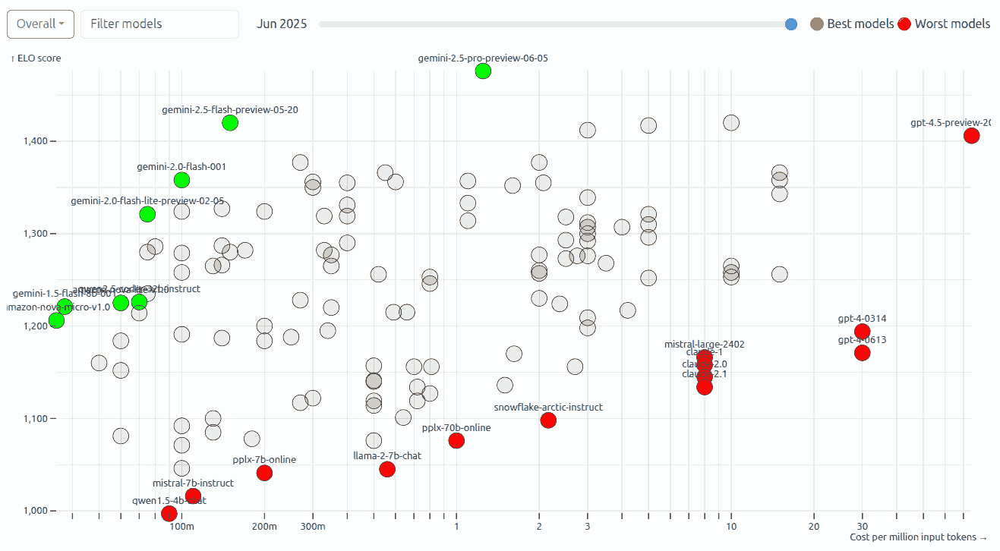
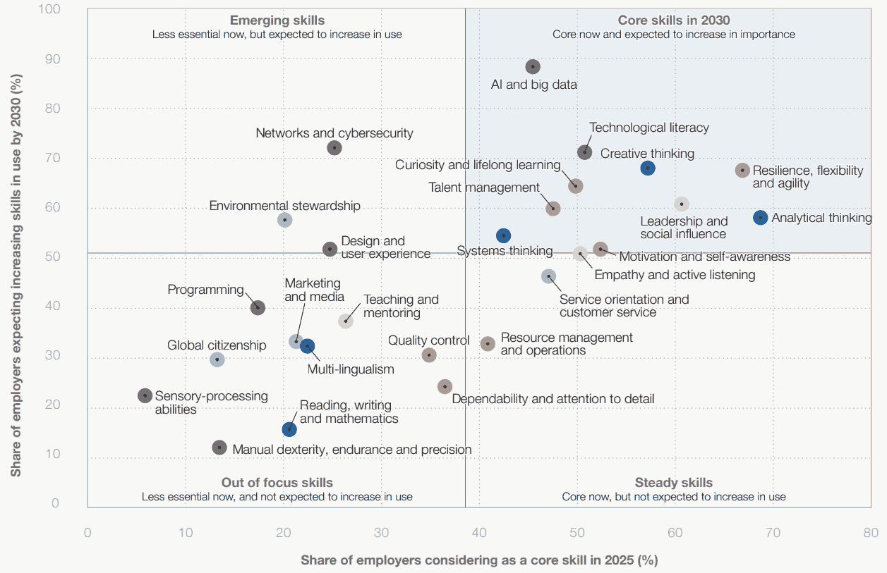

<!-- _class: lead -->

# Goodbye MBA, Hello AI?

[DoMS, IITM](https://doms.iitm.ac.in/) · MBA Commencement
[Anand S](https://s-anand.net/) · [LLM Psychologist](https://www.linkedin.com/in/sanand0/) · [Straive](https://straive.com/)
14 July 2025, 10:30 am IST

---

## It's an interesting time to start your MBA

**LLMs** are _the_ biggest tech shift since PCs / Internet / Electricity.

AI is changing _every_ domain in your curriculum.

And _this_ is the time you've chosen to begin your MBA.

---

## [LLMs fail in surprising ways](https://sanand0.github.io/llmmath/)

There's a _jagged edge_ of capability. See how they multiply integers:

| Model            |   % | 2d  | 3d  | 4d  | 5d  | 6d  | 7d  | 9d  |
| ---------------- | --: | --- | --- | --- | --- | --- | --- | --- |
| OpenAI O3        | 86% | ✅  | ✅  | ✅  | ✅  | ✅  | ✅  | ❌  |
| Deepseek v3      | 71% | ✅  | ✅  | ✅  | ✅  | ✅  | ❌  | ❌  |
| Gemini 2.0 Flash | 57% | ✅  | ✅  | ✅  | ✅  | ❌  | ❌  | ❌  |
| Llama 3.3 70b    | 43% | ✅  | ✅  | ❌  | ✅  | ❌  | ❌  | ❌  |
| GPT 3.5 Turbo    | 29% | ✅  | ✅  | ❌  | ❌  | ❌  | ❌  | ❌  |
| Llama 3 70b      | 14% | ✅  | ❌  | ❌  | ❌  | ❌  | ❌  | ❌  |

---

## But LLM errors are a manageable problem

---

## LLMs are getting smarter _rapidly_

---

## They'll soon replace (some) employees

---

#### <u>Survey</u>: What skills will AI make less / more important?

Multiple skills, one per line.

https://forms.gle/UJhw4wig9h1npPdy8

---

## _Every_ subject you learn is already disrupted

- **Finance & Accounting**: [financial analysis](https://gramener.com/docsearch/creditresearch/), [news scans](https://dealnews.straivedemo.com/), [contract risk](https://contractanalysis.straivedemo.com/)
- **Marketing**: [Content generation](https://postergen.straivedemo.com/), [personalization](https://videohighlights.straivedemo.com/), [survey analysis](https://llmfoundry.straive.com/classify)
- **Operations**: [Trends & forecasts](https://sanand0.github.io/datastories/employment-trends/), [customer support](https://gramener.com/callemotion2/) & [evaluation](https://voicetranscripts.straivedemo.com/)
- **Analytics & MIS**: [Analysis](https://datachat.straivedemo.com/), [imaging](https://imageexplore.straivedemo.com/), [coding](https://llmfoundry.straive.com/apps)
- **HR & OB**: [Interviewing](https://llmfoundry.straive.com/apps#?template=InterView_questions_V.1), JD creation, Preliminary evaluations
- **Strategy**: [Hypothesis generation](https://sanand0.github.io/hypoforge/), research

---

## Double-down on skills likely to grow

**Skip low-level skills**. If ChatGPT can do it, skip it.

---

#### <u>Survey</u>: How could LLMs help you study better in your MBA?

Multiple ideas, one per line.

https://forms.gle/vha4c6fjidLzBycT8

---

## Use LLMs to make _you_ smarter

- **Sparring partner**. Create Custom GPTs per course with lectures + case PDFs. Have it to quiz you Socratically every week.
- **Sprint**. Create LLM drafts. Have LLMs critique, surface assumptions. Rewrite yourself.
- Update a personal **prompt-library** every time an LLM _wows_ you
- **Rehearse**. Have ChatGPT quiz you like a CFO, COO, regulator, ... for your job interview / case presentation... and give **feedback**.
- **Don't** memorize or do the grunt work. Delegate that to LLMs.

---

<!-- _class: lead -->

# What will your CV look like in 2027?

---

## Faculty: Use LLMs to Teach

- [Create course content](https://sanand0.github.io/llms-in-education/#5) and [assessments](https://exam.sanand.workers.dev/tds-2025-05-ga6)
- [Automate personalized feedback](https://sanand0.github.io/llms-in-education/#6)
- [Evaluate long-form responses](https://sanand0.github.io/llms-in-education/#7)
- [Create virtual instructors](https://sanand0.github.io/llms-in-education/#10)
- Teach use of LLMs. Use them in the classroom

---

<!-- _class: lead -->

# Goodbye MBA, Hello AI?

[DoMS, IITM](https://doms.iitm.ac.in/) · MBA Commencement
[Anand S](https://s-anand.net/) · [LLM Psychologist](https://www.linkedin.com/in/sanand0/) · [Straive](https://straive.com/)
14 July 2025, 10:30 am IST

