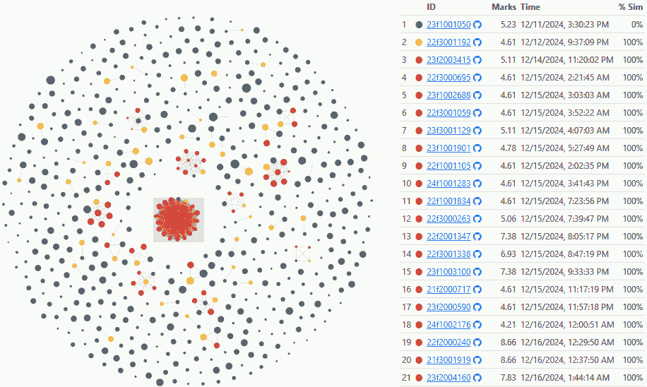

<style>
  blockquote, q {
    font-style: italic;
  }

</style>

# Lessons from Social Code Analysis

### <q>Pythonic Grading that Rewards Sharing</q>

[PyConSG Education Summit](https://pycon.sg/edusummit.html) · 11 Aug 2025 · [SUTD, Singapore](https://maps.app.goo.gl/rfqZDgPiPkhr5C7E6)
[Anand S](https://s-anand.net/) · [LLM Psychologist](https://www.linkedin.com/in/sanand0/) · [Straive](https://straive.com/)
[Blog](https://www.s-anand.net/blog/category/education/) · [Slides](https://sanand0.github.io/talks/2025-08-11-social-code-analysis/) · <span style="color:red">Record audio</span>


---

## [I asked students to automate analysis](https://github.com/sanand0/tools-in-data-science-public/blob/tds-2024-t3/project-2-automated-analysis.md)

[Project 2 Tools in Data Science, BS Data Science, IIT Madras](https://github.com/sanand0/tools-in-data-science-public/blob/tds-2024-t3/project-2-automated-analysis.md)

> 1. Write a Python script that uses an LLM to analyze, visualize, and narrate a story from a dataset.
> 2. Convince an LLM that your script and output are of high quality.
>
> Running `uv run autolysis.py DATA.csv` must create a `README.md` with automated analysis as a story + data visualizations.

---

## Copying was allowed, but originality scores

> **8 bonus marks for code diversity**.
>
> You're welcome to copy code and learn from each other. But we encourage diversity too.
>
> We evaluate code similarity. Unique responses get bonus marks.
>
> If your response is similar to priors, you don't get these marks.

---

## I evaluated similarity based on overlap

- Removed comments and docstrings. (These are easily changed to make the code _look_ different.)
- Get all 5-word phrases in the program. (A “word” is a token from [tokenize](https://docs.python.org/3/library/tokenize.html). A “phrase” is a **5-token** tuple. Chosen by trial and error.)
- Calculate % overlap with previous submissions. ([Jaccard Index](https://en.wikipedia.org/wiki/Jaccard_index) via [datasketch.MinHash](https://ekzhu.com/datasketch/minhash.html).)

[Evaluation code: `similarity.py`](https://github.com/sanand0/tools-in-data-science-public/blob/tds-2024-t3/project2/similarity.py)

---

## Some copied _exactly_ from each other

[](https://sanand0.github.io/tds-2024-sep-project-2-results/similar.html#?similarity=1)

---

## Rule 1: Copy late to pick best submissions

- The [original](https://raw.githubusercontent.com/AlakhyaIITM/TDS_proj2/main/autolysis.py) was on 11 Dec afternoon. Scored 7 marks.
  - The [first copy](https://raw.githubusercontent.com/22f3001192/PROJECT-2-TDS/refs/heads/main/autolysis.py) was on 12 Dec evening.
  - The [second copy](https://raw.githubusercontent.com/Sreekar-1804/TDS-Project-2/main/autolysis.py) as on 14 Dec night.
  - Then 29 others streamed in, _just_ before the deadline
- Another [original](https://raw.githubusercontent.com/0rajnishk/tds_project_2/main/autolysis.py) was on 12 Dec late night. Scored 10 marks
  - The [first copy](https://raw.githubusercontent.com/indalbind/Automated_Analysis/refs/heads/main/autolysis.py) on 14 Dec afternoon.
  - Several were within a few hours of the deadline.

_Who_ you copy from matters! Copy late for more options.

---

## Some made _good_ changes to code

[Original](https://raw.githubusercontent.com/0rajnishk/tds_project_2/main/autolysis.py) | [Copy](https://raw.githubusercontent.com/22f3000612/22f3000612-TDS2/refs/heads/main/autolysis.py): used API keys from the environment.

<div style="display: flex; zoom: 1.4; gap: 20px">

```python
# /// script
# requires-python = ">=3.11"
# dependencies = [
#   "pandas",
#   "seaborn",
#   "matplotlib",
#   ...
#   "scikit-learn",

# ]
# ///
```

```python
# /// script
# requires-python = ">=3.12"
# dependencies = [
#   "pandas",
#   "seaborn",
#   "matplotlib",
#   ...
#   "scikit-learn",
#   "python-dotenv"
# ]
# ///
```

</div>

---

## Rule 2: Change code only if you're sure

[Original](https://raw.githubusercontent.com/Nimbus29/TDS-Project_2/refs/heads/main/autolysis.py) | [Copy](https://raw.githubusercontent.com/nightcoder358/TDS-Project-2/refs/heads/main/autolysis.py): hard-coded the API key.

<div style="display: flex; zoom: 2; gap: 20px">

```python
import os
import sys
...
from sklearn.cluster import KMeans
from sklearn.impute import SimpleImputer

AIPROXY_TOKEN = os.getenv('AIPROXY_TOKEN')
```

```python
import os
import sys
...
from sklearn.cluster import KMeans
from sklearn.impute import SimpleImputer

AIPROXY_TOKEN = os.getenv('eyJhbGciOi...')
```

</div>

> Don’t change their code unless you KNOW what you’re doing.
> Spend more time testing than changing.

---

## Half of submissions were standalone

Code with <50% Jaccard similarity (like below) are **standalone**.

<div style="display: flex; zoom: 2; gap: 10px">

```python
f"You are a data analyst.
Given the following dataset information,
provide an analysis plan and suggest
useful techniques:\n\n"
f"Columns: {list(df.columns)}\n"
f"Data Types: {df.dtypes.to_dict()}\n"
```

```python
f"You are a data analyst.
Provide a detailed narrative based on
the following data analysis results
for the file '{file_path.name}':\n\n"
f"Column Names : {list(df.keys())}\n\n"
f"Summary Stats: {analysis['summary']}"
```

</div>

About 50% of the submissions were standalone!
They didn't copy despite encouragement.

---

## Rule #3: Let others copy from you

| Strategy                      | % of submissions | Average score |
| ----------------------------- | ---------------: | ------------: |
| ⚫ Standalone                 |              50% |          6.23 |
| 🟡 Be the first to copy       |              12% |          6.75 |
| 🔴 Copy late                  |              28% |          6.84 |
| 🟢 Original – let others copy |              11% |          7.06 |

Students who let others copy from them got feedback and improved.
They scored the most.

---

## What does social code analysis teach us?

- **For students**
  1. Copy late to pick best submissions
  2. Change code only if you're sure
  3. Let others copy from you
- **For teachers**: _Analyze code similarity_. You can learn:
  1. How do students learn? _When_ do they learn? From _whom_?
  2. Who's isolated? Who're the future teachers / TAs?
  3. What have they understood well enough to change correctly?

---

# Lessons from Social Code Analysis

### <q>Pythonic Grading that Rewards Sharing</q>

[PyConSG Education Summit](https://pycon.sg/edusummit.html) · 11 Aug 2025 · [SUTD, Singapore](https://maps.app.goo.gl/rfqZDgPiPkhr5C7E6)
[Anand S](https://s-anand.net/) · [LLM Psychologist](https://www.linkedin.com/in/sanand0/) · [Straive](https://straive.com/)
[Blog](https://www.s-anand.net/blog/category/education/) · [Slides](https://sanand0.github.io/talks/2025-08-11-social-code-analysis/)


