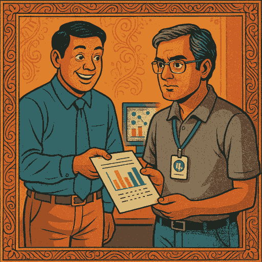
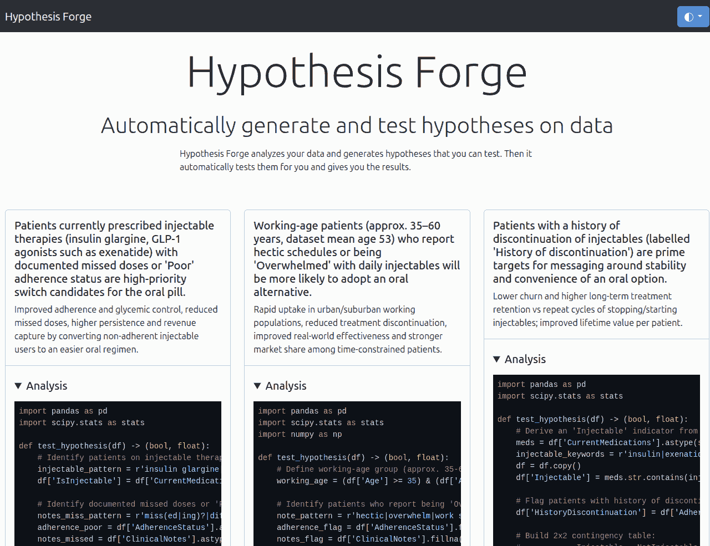
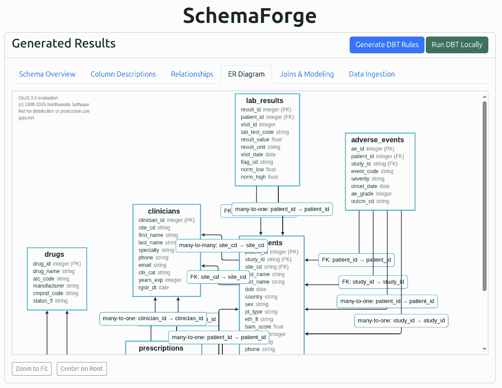

<style>
  blockquote, q {
    font-style: italic;
  }

  .two-panel {
    display: flex;
    gap: 0.5rem;
    > * {
      flex: 1;
    }
  }

</style>

# RIP, Data Scientists

[DataHack Summit](https://www.analyticsvidhya.com/datahacksummit/) · 21 Aug 2025 · [Bangalore](https://maps.app.goo.gl/fBAcQ6VopycH8z9T8)
[Anand S](https://s-anand.net/) · [LLM Psychologist](https://www.linkedin.com/in/sanand0/) · [Straive](https://straive.com/)
[Video](https://youtu.be/xZpdwLHW40o) · [Slides](https://sanand0.github.io/talks/2025-08-21-rip-data-scientists/) · [Transcript](https://github.com/sanand0/talks/blob/main/2025-08-21-rip-data-scientists/transcript.md)


---

# _R.I.P?_ Seriously!?

<div class="two-panel">

> ... because in July, I saw, first-hand, what happened to two experienced data scientists
>
> ... who struggled (2 weeks) to model floor material choice given floor dimensions to minimize load, cost, CO2.
>
> ... and ChatGPT did it in 15 min.

<div style="position:relative; top: -200px;">


</div>

</div>

---

# Your manager gives you a [dataset](https://github.com/Vonter/india-aviation-traffic)

<div class="two-panel">

> Your client, Naya Airline, is launching in India. Their operations head wants data to tell them exactly which cities will make most money, which routes will always be full, and what prices people will happily pay.



</div>

---

# You do what data scientists do

<div class="two-panel">

1. Explore it
2. Clean it
3. Model it
4. Explain it
5. Deploy it
6. Anonymize it

<div style="flex: 1.4">

     

</div>

</div>

---

# Explore it - automate hypotheses

<div class="two-panel">


<div data-marpit-fragment>

[](https://sanand0.github.io/hypoforge/)

</div>

</div>

---

# Explore it - with vibe-analysis

<div class="two-panel">

<div>

**Vibe coding** is coding like code does not even exist.

**Vibe analysis** is analyzing like analysis does not even exit.

[Give ChatGPT](https://chatgpt.com/) full context, _speak_ your desire, and review _just the answers_. Skip the rest.

</div>

<div data-marpit-fragment>

- Route leaderboard, growth, seasonality
- Network exploration, weighted edges, centrality
- Compare per-capita, fairness
- Carrier overlay and variation, carrier entry/exit
- Summarize insights as _poetry_

</div>

</div>

---

# Clean it - automate quality

<div class="two-panel">


<div data-marpit-fragment>

[](https://prudhvi1709.github.io/schemaforge/)

</div>

</div>

---

# Clean it - with [vibe analysis](https://chatgpt.com/share/68a6a47e-aa10-800c-9db0-e20e33fd62d4)

<div class="two-panel">

> Perform **COMPREHENSIVE** and **ADVANCED** data quality analysis. For each dataset here, list every clear and potential data quality issue. Make sure these are non-obvious, non-trivial, and mind-blowing! Suggest approaches to automatically fix these.

- Hyderabad → Hyderabad is an active route!
- _Cumulative_ drone certificates actually _decrease_ some days.
- Jun 7, 2023: 86K international arrivals. _Exceeds global traffic_!
- Dec 4, 2023: 894k footfalls vs 804k people. 90K _teleported_?

</div>

---

# Model it - with vibe analysis

<div class="two-panel">

- Forecast next-month passengers by route. Which model is best?
- Also:
  - Which routes will revive? Why? Neighbor networks?
  - Predict carrier share. Where does route mix change most?
- Let me download the models


</div>

---

# Explain it - as charts and infographics

<div class="two-panel">

<div>

[ChatGPT](https://chatgpt.com/) generates reliable (though ugly) [Matplotlib](https://matplotlib.org/) charts.

You can also use [Codex](https://chatgpt.com/codex), [Jules](https://jules.google.com/), [Claude Code](https://docs.anthropic.com/en/docs/claude-code/overview), [Cursor](https://cursor.com/), etc. to build [D3](https://d3js.org/) / [ChartJS](https://www.chartjs.org/) data visualizations.

Here are [data visualizations by non-programmers](https://sanand0.github.io/talks/2025-06-28-prompt-to-plot/#14) vibe-coding in a 2 hour workshop.

</div>


</div>

---

# Deploy it - with [vibe coding](https://chatgpt.com/share/68a6ab76-b9d8-800c-ab39-8aa474e8bb21)

<div class="two-panel">

<q>Build the best model with parameters to forecast the traffic on a given day in the future across routes. Also write a Streamlit app that can take the route and date as input and show the forecast along with accuracy estimate. Allow me to download the model(s) and app as a zip file so I can run it locally.</q>


</div>

---

# Anonymize it - aligning to hypotheses

<div class="two-panel">

<div>

[Don't generate random fake data](https://www.s-anand.net/blog/how-to-fake-data-that-tells-a-story/). Don't anonymize blindly.

Have LLMs generate synthetic data that _aligns_ with hypotheses.

```
Generate realistic fake data for ______

1. List columns + distribution
2. List 5 hypotheses
3. Generate 2K random rows. Align to
hypotheses statistically significantly.
4. Test hypothesis. Download CSV.
```

</div>


</div>

---

# RIP _tasks_, not _talent_

<div class="two-panel">

<small>

### What's dying

- **EDA.** Profile, types, missing-values, deduping, anomalies
- **Scaffolds.** Loaders, schemas, docstrings, README, tests
- **AutoML.** Feature, model, parameter, metric choices
- **Code.** Write specs. LLMs fill in 80%
- **Explainers.** Narratives, visuals, slide
- **Forms.** Project reports, timesheets

</small>

<small>

### What's rising

- **Leadership.** _Right_ goal + allocation
- **Problem framing.** Prompt & right-scope to reduce iterations
- **Eval design.** Automate. Binary checks, domain-driven LLM-as-judge
- **Invariants.** Define ontologies, declare truths/constraints
- **Verticalization.** Domain-specific datasets & workflows as moats
- **Trust & taste.** Auditors, storytellers

</small>

---

# RIP, Data Scientists

## Your role has changed

[DataHack Summit](https://www.analyticsvidhya.com/datahacksummit/) · 21 Aug 2025 · [Bangalore](https://maps.app.goo.gl/fBAcQ6VopycH8z9T8)
[Anand S](https://s-anand.net/) · [LLM Psychologist](https://www.linkedin.com/in/sanand0/) · [Straive](https://straive.com/)
[Slides](https://sanand0.github.io/talks/2025-08-21-rip-data-scientists/) · [Transcript](https://github.com/sanand0/talks/blob/main/2025-08-21-rip-data-scientists/transcript.md)


<!--

Chat: https://chatgpt.com/c/68a2a755-80ac-832d-b0f3-ab085fb85460

- #TODO: Public Animated GIFs and memes

-->
