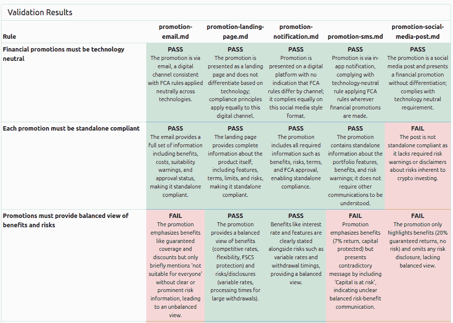
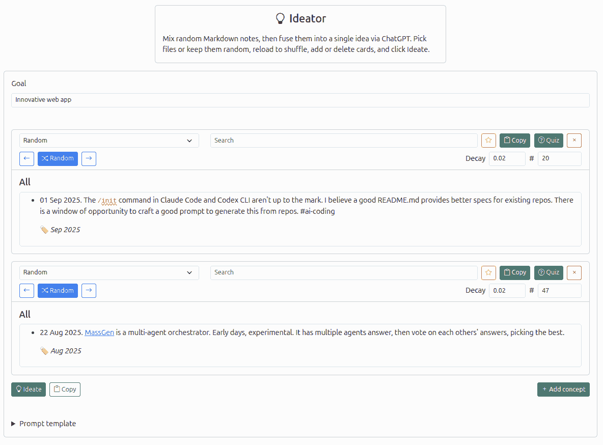

# LLM Trends

22 Sep 2025, 5:00 pm IST · Chennai
[Anand S](https://s-anand.net/) · [LLM Psychologist](https://www.linkedin.com/in/sanand0/) · [Straive](https://straive.com/)
[Transcript](https://github.com/sanand0/talks/blob/main/2025-09-22-llm-trends/transcript.md)
[CC0 - Public Domain](https://creativecommons.org/publicdomain/zero/1.0/)

https://sanand0.github.io/talks/

---

## LLM are getting better **and** cheaper

<aside style="max-width:300px" data-marpit-fragment>

**Plan for _future_ capability**.

Quality enables **new use cases**.

Cost unlocks **higher scale**.

</aside>

---

## LLM context windows are increasing

<aside style="max-width:300px" data-marpit-fragment>

#### Implications

- **Longer docs**. Process entire books, manuals.
- **More memory**. Remember past interactions.

</aside>

---

## So policy documents can **be** the code / rules

<aside style="max-width:450px" data-marpit-fragment>

#### Implications

- **Guidelines are executable checks**. No manual back-and-forth.
- **Regulatory rules are evals**. Apply directly.
- **Emails become policies**. Common law emerges.

</aside>

---

## LLMs read & write with more attention

<aside style="max-width:600px" data-marpit-fragment>

#### Implications

- **Better code**. Fewer errors,
  longer output.
- **More structure**. JSON, XML follow schema diligently.
- **Self-correction**. Better at spotting own errors.
- **More reasoning**. Chain-of-thought, tree-of-thought.

</aside>

---

## **Dynamic code** is a new modality

**Demos**:

- [Topic Trends](https://sanand0.github.io/topictrends/): an AI-coded app that shows trends in documents (design-to-deploy in 2 hours).
- [SchemaForge](https://prudhvi1709.github.io/schemaforge/): automate data engineering; schema + DBT tests
- [HypoForge](https://sanand0.github.io/hypoforge/): automate data science; generate + test hypotheses
- [DataGen](https://nitin399-maker.github.io/datagen/): automating synthetic data generation for stress testing

---

## LLMs think for longer without errors

<aside style="max-width:300px" data-marpit-fragment>

#### Implications

- **Autonomy**. Agents, self-correction.
- **Creativity**. Complex ideation.

</aside>

---

## This lets us automate **innovation**

<aside style="max-width:475px" data-marpit-fragment>

**Innovation = combinatorics**

Combine 2 random ideas into new creative initiatives towards a specific purpose.

</aside>

---

## LLMs evaluate LLMs as well as humans

<aside style="max-width:500px" data-marpit-fragment>

#### Implications

- **Better quality**. Multiple LLMs reduce errors.
- **Scalable quality**. Humans assess exceptions.
- **Continuous improvement**. Always-on evals based on feedback.

</aside>

---

## So we can evaluate quality at scale

- [Double-checking](https://sanand0.github.io/llmevals/double-checking/). Using multiple LLMs-as-a-judge with consensus reduces hallucinations dramatically
- [Prompt effectiveness](https://sanand0.github.io/llmevals/emotion-prompts/). Using an LLM-as-a-judge automation framework systematically highlights effective prompts
- [Prompt improvements](https://sanand0.github.io/promptevals/). Use LLMs to write _and_ improve prompts by evaluating the effectiveness of each

---

## LLMs are far more multi-modal

<aside style="max-width:350px" data-marpit-fragment>

#### Input/Output Formats

- Audio
- Image
- Video
- DSLs (3D, CML, ...)

</aside>

---

## That lets us generate far more than text

- [Subtitle generation](https://prudhvi1709.github.io/subtitlegen/). Generate subtitles across languages on the fly.
- [3D object](https://nitin399-maker.github.io/3dobjectgen/) and [3D image](https://nitin399-maker.github.io/3dimagegen/) generation. Illustrate and visually prototype technical concepts from sketches.
- [Podcast generation](https://tools.s-anand.net/podcast/). Repurpose content in audio formats.
- [Storybook generation](https://tools.s-anand.net/picbook/). Repurpose content in visual formats.

<!--

Additional demos

  - Personagen: Synthetic customer persona creation + surveying.

-->

---

# LLM Trends

22 Sep 2025, 5:00 pm IST · Chennai
[Anand S](https://s-anand.net/) · [LLM Psychologist](https://www.linkedin.com/in/sanand0/) · [Straive](https://straive.com/)
[Transcript](https://github.com/sanand0/talks/blob/main/2025-09-22-llm-trends/transcript.md)
[CC0 - Public Domain](https://creativecommons.org/publicdomain/zero/1.0/)

https://sanand0.github.io/talks/

