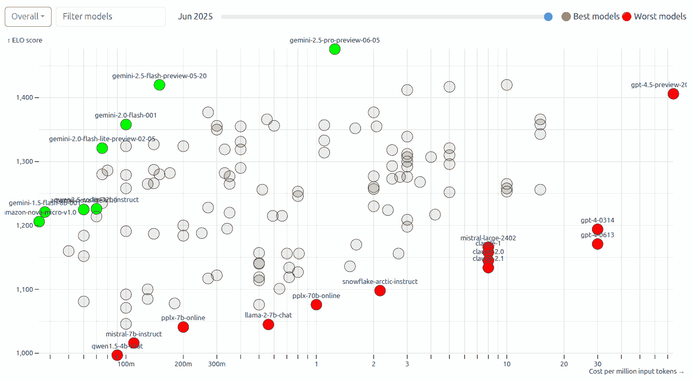

# LLM Trends

22 Sep 2025, 5:00 pm IST · Chennai
[Anand S](https://s-anand.net/) · [LLM Psychologist](https://www.linkedin.com/in/sanand0/) · [Straive](https://straive.com/)
[Transcript](https://github.com/sanand0/talks/blob/main/2025-09-22-llm-trends/transcript.md) · [CC0 - Public Domain](https://creativecommons.org/publicdomain/zero/1.0/)

https://sanand0.github.io/talks/

---

## LLM are getting better **and** cheaper

<aside style="max-width:300px" data-marpit-fragment>

**Plan for _future_ capability**.

Quality enables **new use cases**.

Cost unlocks **higher scale**.

</aside>

---

## LLM context windows are increasing

<aside style="max-width:300px" data-marpit-fragment>

#### Implications

- **Longer docs**. Process entire books, manuals.
- **More memory**. Remember past interactions.

</aside>

---

## So policy documents can **be** the code / rules

<aside style="max-width:450px" data-marpit-fragment>

#### Implications

- **Guidelines are executable checks**. No manual back-and-forth.
- **Regulatory rules are evals**. Apply directly.
- **Emails become policies**. Common law emerges.

</aside>

---

## LLMs read & write with more attention

<aside style="max-width:600px" data-marpit-fragment>

#### Implications

- **Better code**. Fewer errors,
  longer output.
- **More structure**. JSON, XML follow schema diligently.
- **Self-correction**. Better at spotting own errors.
- **More reasoning**. Chain-of-thought, tree-of-thought.

</aside>

---

## **Dynamic code** is a new modality

**Demos**:

- [Topic Trends](https://sanand0.github.io/topictrends/): an AI-coded app that shows trends in documents (design-to-deploy in 2 hours).
- [SchemaForge](https://prudhvi1709.github.io/schemaforge/): automate data engineering; schema + DBT tests
- [HypoForge](https://sanand0.github.io/hypoforge/): automate data science; generate + test hypotheses
- [DataGen](https://nitin399-maker.github.io/datagen/): automating synthetic data generation for stress testing

---

## LLMs think for longer without errors

<aside style="max-width:300px" data-marpit-fragment>

#### Implications

- **Autonomy**. Agents, self-correction.
- **Creativity**. Complex ideation.

</aside>

---

## This lets us automate **innovation**

<aside style="max-width:475px" data-marpit-fragment>

**Innovation = combinatorics**

Combine 2 random ideas into new creative initiatives towards a specific purpose.

</aside>

---

## LLMs evaluate LLMs as well as humans

<aside style="max-width:500px" data-marpit-fragment>

#### Implications

- **Better quality**. Multiple LLMs reduce errors.
- **Scalable quality**. Humans assess exceptions.
- **Continuous improvement**. Always-on evals based on feedback.

</aside>

---

## So we can evaluate quality at scale

- [Double-checking](https://sanand0.github.io/llmevals/double-checking/). Using multiple LLMs-as-a-judge with consensus reduces hallucinations dramatically
- [Prompt effectiveness](https://sanand0.github.io/llmevals/emotion-prompts/). Using an LLM-as-a-judge automation framework systematically highlights effective prompts
- [Prompt improvements](https://sanand0.github.io/promptevals/). Use LLMs to write _and_ improve prompts by evaluating the effectiveness of each

---

## LLMs are far more multi-modal

<aside style="max-width:350px" data-marpit-fragment>

#### Input/Output Formats

- Audio
- Image
- Video
- DSLs (3D, CML, ...)

</aside>

---

## That lets us generate far more than text

- [Subtitle generation](https://prudhvi1709.github.io/subtitlegen/). Generate subtitles across languages on the fly.
- [3D object](https://nitin399-maker.github.io/3dobjectgen/) and [3D image](https://nitin399-maker.github.io/3dimagegen/) generation. Illustrate and visually prototype technical concepts from sketches.
- [Podcast generation](https://tools.s-anand.net/podcast/). Repurpose content in audio formats.
- [Storybook generation](https://tools.s-anand.net/picbook/). Repurpose content in visual formats.

---

## Additional trends

<small>

- **On-device AI surges**: NPUs in phones/laptops (Apple Intelligence PCC; Copilot+ PCs) make private, low-latency inference mainstream. ([arXiv][x1])
- **Open-weight models** are catching closed models on key benchmarks; costs per task are falling fast (AI Index 2025). ([Stanford HAI][x2])
- **Inference throughput jumps via open stacks (vLLM, TensorRT-LLM/SGLang)**: paged-KV caching, continuous batching, and quantization. ([VLLM][x3])
- **Data licensing + provenance mature**: major publisher deals (e.g., News Corp) and C2PA Content Credentials rollout. ([OpenAI][x4])
- **Regulation + power reshape roadmaps**: EU AI Act GPAI duties from 2 Aug 2025; data-centre electricity demand set to \~double by 2030. ([Digital Strategy][x5])

</small>

---

## Potential trends

<small>

- “OpenAI-compatible” APIs become a de-facto portability layer across clouds/runtimes; tooling lock-in still varies. ([SemiAnalysis][x6])
- Synthetic data’s share in training rises; benefits vs. model-collapse risks remain debated. ([WIRED][x7])
- Graph-RAG/hybrid retrieval outperforms naive vector search; early wins, but long-context advances may narrow the gap. ([Google Research][x8])
- Browser-native LLMs via WebGPU (WebLLM/Transformers.js) enable private/offline features; fragmented support and bugs slow scale-up. ([blog.mlc.ai][x9])
- Non-NVIDIA accelerators (AMD MI300, Gaudi 3) gain inference share; CUDA ecosystem advantage clouds outlook.

</small>

---

# LLM Trends

22 Sep 2025, 5:00 pm IST · Chennai
[Anand S](https://s-anand.net/) · [LLM Psychologist](https://www.linkedin.com/in/sanand0/) · [Straive](https://straive.com/)
[Transcript](https://github.com/sanand0/talks/blob/main/2025-09-22-llm-trends/transcript.md) · [CC0 - Public Domain](https://creativecommons.org/publicdomain/zero/1.0/)

https://sanand0.github.io/talks/

---

## Quiz

1. What’s the _key_ difference between prompt caching and normal caching in LLM APIs?
2. Why can long context windows still miss relevant info (“lost in the middle”) and how would you mitigate it?
3. In this workflow, where should analysis run on _full_ data and where is sampling OK?
4. When is “LLM-as-judge” reliable, and what biases should you watch for?
5. Name two reasons code sandboxes avoid direct internet access and how to work around it.

---

## Errata

<small>

- **Prompt caching ≠ a “tiny copy of the model.”** It stores/charges cached _prompt segments_ to speed/cheaply reuse, without changing the model. ([Medium][1])
- **Advanced Data Analysis (code interpreter) has no open internet.** Browsing is a _separate_ tool; the sandbox itself blocks external calls. ([OpenAI][2])
- **“LLMs evaluate LLMs as well as humans” — nuanced.** LLM judges correlate with humans but show biases; human calibration still needed. ([16x Prompt][3])
- **Context window ≠ long-term memory.** Bigger windows allow longer _inputs_, but retrieval can _drop_ for middle content. App “memory” is separate. ([ar5iv][4])
- **“Gemini is free & good at photos/video/audio.”** There is a free web app; advanced multimodal features are via Gemini 1.5/API tiers. ([OpenAI][5])
- **“Whisper is behind ChatGPT voice.”** OpenAI documents Whisper as its speech-to-text used in ChatGPT voice features. ([OpenAI][6])
- **“LLMs are getting cheaper” — evidence.** Example prices (per 1M tokens): GPT-4o \$5 in/\$15 out (May 2024); vendors have introduced price cuts/cheaper tiers. ([arXiv][7])
- **Model capabilities & windows.** Current public windows: Gemini 1.5 up to 1M; Claude 3.7 Sonnet 200k; OpenAI o-series context sizes are model-specific. ([Claude Docs][8])

</small>

---

## Counterpoints

<small>

- **“LLM context windows are increasing” → But…** Longer windows can _hurt_ recall; retrieval/RAG or windowing often beats naive full-context dumps. Consider chunk-and-vote or salient-first prompts. ([ar5iv][4])
- **“LLM-as-judge scales quality” → But…** Judges show systematic biases (position, verbosity, self-enhancement). Use blinded, shuffled, multi-judge panels + human spot-checks and gold standards. ([16x Prompt][3])
- **“More structure (JSON/XML) now” → But…** Plain “JSON mode” is not bullet-proof. Prefer _structured outputs/function calling_ with schemas for reliability. ([OpenAI][9])
- **“Far more multimodal” → But…** Vision-language models still hallucinate objects and captions. Keep human-in-the-loop for safety-critical use. ([ACL Anthology][10])
- **“Policy docs can be the code/rules” → But…** Governance needs documented controls. Follow NIST AI RMF (Govern/Map/Measure/Manage) when automating compliance. ([NIST AI Resource Center][11])
- **“LLMs think for longer without errors” → But…** Long-horizon agency is far from solved; MAUD/METR find persistent failures on multi-step tasks. Use decomposition & verifiable subgoals. ([Vals AI][12])

</small>

---

## Feedback

<small>

1. **Label claims vs. opinions.** Add “Claim/Why/Limitations” badges on slides with bold assertions (e.g., LLM-as-judge, policy-as-code).
2. **Show the _why_ behind choices.** One slide comparing _ChatGPT/Claude/Gemini/Jules/Codex_ by task (EDA, front-end, agents, cost), with 1-line rationale each.
3. **Make failure modes visible.** Add a “Bugs I expect” checklist (net-blocked sandbox, path issues, file limits) and the quickest CLI/browser fixes.
4. **Quantify effects.** When stating “longer books rate higher,” show effect sizes + CI, then the same chart _after_ outlier clipping.
5. **Tighten the demo loop.** Pre-bake a tiny dataset and a repo branch that always builds; live-switch to bigger data only if time permits.

</small>

[1]: https://medium.com/data-science/4-ways-you-cant-use-the-chatgpt-code-interpreter-that-will-disrupt-your-analytics-c31d29034b69 "4 Ways You Can't Use the ChatGPT Code Interpreter That ..."
[2]: https://openai.com/index/chatgpt-plugins/ "ChatGPT plugins"
[3]: https://prompt.16x.engineer/blog/claude-sonnet-gpt4-context-window-token-limit "Claude 3.5 Sonnet vs GPT-4o: Context Window and Token Limit"
[4]: https://ar5iv.labs.arxiv.org/html/2307.03172 "Lost in the Middle: How Language Models Use Long Contexts"
[5]: https://openai.com/index/hello-gpt-4o/ "Hello GPT-4o"
[6]: https://openai.com/chatgpt/pricing/ "Pricing - ChatGPT - OpenAI"
[7]: https://arxiv.org/html/2406.18403v3 "LLMs instead of Human Judges? A Large Scale Empirical ..."
[8]: https://docs.anthropic.com/en/docs/build-with-claude/context-windows "Context windows - Anthropic API"
[9]: https://openai.com/index/introducing-structured-outputs-in-the-api/ "Introducing Structured Outputs in the API"
[10]: https://aclanthology.org/2024.findings-acl.414.pdf "Logical Closed Loop: Uncovering Object Hallucinations in ..."
[11]: https://airc.nist.gov/airmf-resources/playbook/ "Playbook - AIRC - NIST AI Resource Center"
[12]: https://www.vals.ai/models/anthropic_claude-3-5-sonnet-20241022 "Claude 3.5 Sonnet Latest"
[x1]: https://arxiv.org/abs/2307.03172 "Lost in the Middle: How Language Models Use Long Contexts"
[x2]: https://hai.stanford.edu/assets/files/hai_ai_index_report_2025.pdf "Artificial Intelligence Index Report 2025 | Stanford HAI"
[x3]: https://docs.vllm.ai/en/latest/serving/openai_compatible_server.html "OpenAI-Compatible Server - vLLM"
[x4]: https://openai.com/index/understanding-the-source-of-what-we-see-and-hear-online/ "Understanding the source of what we see and hear online"
[x5]: https://digital-strategy.ec.europa.eu/en/policies/regulatory-framework-ai "AI Act | Shaping Europe's digital future - European Union"
[x6]: https://semianalysis.com/2025/09/03/amazons-ai-resurgence-aws-anthropics-multi-gigawatt-trainium-expansion/ "Amazon's AI Resurgence: AWS & Anthropic's Multi ..."
[x7]: https://www.wired.com/story/stanford-study-global-artificial-intelligence-index "The AI Race Has Gotten Crowded-and China Is Closing In on the US"
[x8]: https://research.google/blog/looking-back-at-speculative-decoding/ "Looking back at speculative decoding"
[x9]: https://blog.mlc.ai/2024/06/13/webllm-a-high-performance-in-browser-llm-inference-engine "WebLLM: A High-Performance In-Browser LLM Inference ..."
