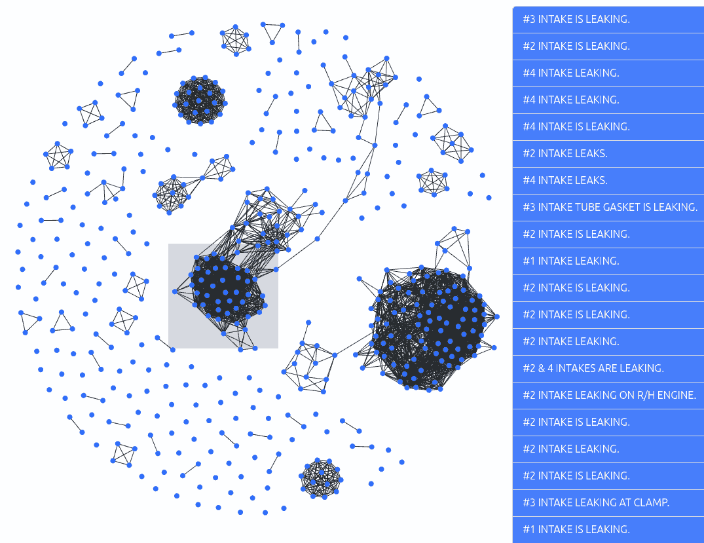

<!-- _class: title -->

# LLM Data Visualization

[IIT Madras](https://www.iitm.ac.in/) · 29 Oct 2025, 2:00 pm IST · Dept of Engineering Design
[Anand S](https://s-anand.net/) · [LLM Psychologist](https://www.linkedin.com/in/sanand0/) · [Straive](https://straive.com/)
[Transcript](https://github.com/sanand0/talks/tree/main/2025-10-29-llm-data-visualization/)
[CC0 - Public Domain](https://creativecommons.org/publicdomain/zero/1.0/)

---

# Learn fast by pushing LLM limits in parallel.

- Let's start with a couple of stretch questions:
  - “Can LLMs generate a data visualization, like SOM?”
  - “Can it create a chart newly invented today?”
- Keep in mind that **newly invented today** has a low prior probability of canned answers.
- Don’t wait on a single path; **try two or more prompts in parallel** to reduce idle time
  - E.g. Ask one model to “create a SOM,” another to “invent a new viz.”
  - E.g. Use one for dataset search; ask another to **synthesize a teaching dataset** for class use.
- Parallelism = more samples → **better ideas and faster convergence**.

<transcript>

Here's an open question: Are there examples of charts that maybe ChatGPT won't be able to create?

**Student**: SOM? Something that came out today?

OK, something that came out today. Therefore, it's a relatively new chart, and that is something that it may not be able to visualize. Got you. And SOM because perhaps it is non-trivial, it is complex.

Let's try that out. Let's see if, A, it can come up with a visualization that—well, let's see if it can create a SOM. Let's see if it can create something that does not exist and we will invent it now. Why not? That certainly wouldn't have come out. So, I will need help on the second. Think of some visualization that probably doesn't exist. I'm not asking you to create something that necessarily is new, but to the best of your knowledge, is new. And we'll feed it.

</transcript>

---

# De-risk by searching _and_ generating datasets.

Ask for **Kaggle candidates** for classroom-friendly SOMs.

> [Okay, ChatGPT](https://chatgpt.com/c/6901d2e6-89c8-8320-ab52-ce102d58d58d), find a good dataset, ideally from Kaggle, that is suited for visualizing self-organizing maps, that is, SOMs. Could you go through whatever datasets are available and find some good ones? ...

In parallel, ask the model to **generate a small, varied CSV** with clear fields.

> [Could you](https://chatgpt.com/share/6902e5de-c03c-800c-8365-ccb4ba1ea639) create a dataset that is eminently suited for visualizing self-organizing maps and give me instructions on how I might go about doing that in Python? Allow me to download this dataset as a CSV file...

- Request **downloadable code + data** for reproducibility. This hedge cuts chance of getting stuck on data issues.

<transcript>

Now, we need a dataset to visualize. Any idea where I can find a good dataset for a SOM?

**Student**: Kaggle.

Kaggle. Okay. Any specific dataset that I should search for?

**Student**: Sorry?

Okay, just any one of the top datasets. We should be able to do a SOM on that. Are you sure?

Normally, I would go ahead and try that out, and that would be a good idea. But because this is a session where we probably have an hour, I will take a few shortcuts. I'll take two kinds of shortcuts. First, I'm going to ask ChatGPT the same question. I actually should just stop asking you questions. I can ask ChatGPT the same question. You should stop attending these sessions. ChatGPT can tell you the same thing. But let's do this.

> Okay, ChatGPT, I am in the middle of a session talking about data visualization. And what we want to do is find a good dataset, ideally from Kaggle, that is suited for visualizing self-organizing maps, that is, SOMs. Could you go through whatever datasets are available and find some good ones? Keep in mind that it's a classroom environment, so I want to make sure that it's very easy to visualize a SOM out of it.

So, that's one. And I've put it in thinking with extended thinking enabled, and let that run. This is approach number one. But I like de-risking stuff. So, another window. I'm going to ask it:

> Could you create a dataset that is eminently suited for visualizing self-organizing maps and give me instructions on how I might go about doing that in Python? Allow me to download this dataset as a CSV file. I don't want it to be particularly large or anything. This is for a classroom setup, so size it so that it will, A, be the right size for a classroom demo, and B, it should have just the right amount of richness, variation, complexity, etc. So, if you want to create a realistic domain and within that, come up with some realistic hypotheses, and within that, well, write the code to do this and create a dataset, that would be great. While you're at it, allow me to download the code for reproducibility as well as the dataset for the classroom.

</transcript>

---

# Learn how to work with LLMs.

- **Use voice** for speed and flow; it makes exploration playful.
- Share what you know and don't: **“I don’t know SOM well enough”**. Let the model tailor its answer based on your knowledge
- **Learn while it runs**: read the code it writes; steal patterns.
- “Teach me as you go” keeps attention high during long runs.

[Claude data generation chat](https://claude.ai/share/56f5f05d-1221-4eab-b3f5-b29c0de66109)

<transcript>

You'll notice a couple of things. Voice is just so much more fun. Second, **I actually don't know SOM anywhere near well enough to be able to run a session where I'm going to be able to create SOM as a visualization. But it does.**

Use it. What is it for? Now, this is still thinking. This is still working. I'm bored. So, well, okay. We could always skip one of these and have it quickly generate. But in these cases, I usually go to Claude, which does a couple of things really well: speed and reasonable smartness on the code. Unfortunately, Claude's API does not have enough of the voice transcription capability. So, I usually type stuff into ChatGPT, let it start—it's anyway slow—and then paste it into code into Sonnet, which is definitely faster. This will probably give me a result better than that one.

Which leaves us to a second principle: **Don't do stuff in sequence. Do stuff in parallel.** Because if you don't, you will get bored to death. It is doing the work anyway; we are not doing the work. And it also has a couple of other advantages. We are able to sample from multiple sources: different ideas, the same model may give you a different answer, but different models will even more likely give you different answers. And you get a feel for what's out there, what is possible.

So it's saying I'm going to create a dataset, blah blah blah. So it's actually run a generation data script of some kind. It's blah blah... Okay, now it's writing the script. Let's see what it's doing. It's... and this is the third thing that I find particularly useful: **Let it teach me.** I don't know stuff, I'm asking it to do stuff. The fact that it gets the job done is great, but at least to kill time, I learn in the process. It sometimes helps.

</transcript>

---

# Existing libraries like MiniSom make SOM visualization straightforward.

- The model recommends **[MiniSom](https://github.com/JustGlowing/minisom)**, a lightweight Python SOM package (**pip install minisom**).
- **Standard stacks** (NumPy/Matplotlib) keep the pipeline simple.
- If MiniSom installs, **it can likely render SOMs right here**.
- Library leverage > writing SOM from scratch in a live session.

[ChatGPT's code](chatgpt/)
[Claude's code](claude/)

<transcript>

So, for SOM, it's using all of these standard libraries, but MiniSom. Have you... Has anyone heard of MiniSom?

**Student**: [inaudible]

You have? Okay, great. What is MiniSom?

**Student**: [inaudible] to visualize it?

I see, okay. I have not used it, but great. So it's installing MiniSom. And now, already, we are beginning to see the boundaries of what we had assumed breaking. Now, if it's installing MiniSom, maybe it will be able to run and create the visualization out of it. Who knows? We'll wait for it. And maybe this one is also going to be able to create the visualization out of it. So, looks like a failure. Okay, no, it's still running.

So, now I'm thinking, hold on, why do I need to download it and analyze it? It has it. I'll tell it to visualize it directly and see. The whole point is to test if an LLM can run SOM, right? Or can visualize SOM. This is now creating a README file.

Okay, so, yeah, Claude tends to be very documentative these days. It's a relatively new capability. But let me then add this. Now, visualize it. And what I mean is, create a SOM and show me. That in itself sounds very mundane.

</transcript>

---

# Prompt for novelty and ask models to judge themselves.

- Let's not stop at SOM: ask for **five creative variants**, then **rank by novelty and usefulness**.
- Ask for **prompts you can reuse**, not just code.
- Cross-ask **multiple models** (e.g., Claude/ChatGPT) to broaden styles.
- Let LLMs evalue themselves or each other. That saves time when curating ideas.

<transcript>

This is artificial intelligence. I'm going to ask it for more. And when I need creative stuff, I go to Claude or DeepSeek. And ask it questions like, I have a dataset that I could visualize as self-organizing maps. What creative variations could I ask an LLM to generate for me instead? What creative SOM variations? What creative alternate visualizations could I ask it to generate instead? Give these to me as prompts. Now, I should have ideally dictated this rather than typed, but big deal. And Claude is also fairly creative, so we'll ask Claude the same question. But you'll notice that by now we are nudging into the realm of the second question, which is, is there something that was invented yesterday that it doesn't know about? Now here, I don't know if it's going to pick something that doesn't exist or exists, but it's giving us some ideas in the background.

Let's see. Okay, this one's still running. It's creating a full-fledged package, creating a dataset. This one is doing the same thing. And okay, ChatGPT has finished generating a bunch of datasets. I don't even want to see the dataset. It's not for me, it's for the system. So, let's tell it this. And we will also add something to this, which I'll dictate.

> Apart from visualizing it as a self-organizing map, I'd like you to think about creative visualization options. Imagine that you are a researcher trying to create a new data visualization that nobody's ever seen before but is still somehow useful. What I'd like you to do is identify maybe five options, evaluate them on novelty and usefulness, and after ranking them, pick the top two. Then, create the visualizations and explain to me how exactly these visualizations are useful.

Let that be part of the prompt. But this apart, the original requirement is visualize it as SOM. And while we are at it, we will ask Claude to... Oh, okay, it's generating the CSV file. Now this is useful, and because it's taken the trouble of showing me the file, for each customer, it's creating monthly spending, visit frequency, average purchase... So, shopping data, and then putting them into a set of customer segments. Would you say this is reasonable for a SOM? Okay. So we could take this data and visualize it.

</transcript>

---

<!-- _class: columns -->

# LLMs create SOMs, but you still need judgment.

- The model produced a SOM image; **assumptions were wrong**—it can do it.
- **We still choose what “good” looks like**: faithful mapping, readable legends, useful overlays.
- **Interviewers still test fundamentals**—knowing concepts remains valuable.
- Use LLMs for execution; **keep humans for sense-making**.

<transcript>

Oh, it's created a PNG. Okay. Is this a self-organizing map?

**Student**: Yes.

Okay. So **I learned something new. I did not know that this was a self-organizing map.** I thought it was those polygons with... Okay. I see. Okay. I was gunning for something along these lines or, better yet, I'm sure I had a better picture of it. I'll show you something that I had assumed would be a self-organizing map, but if you are convinced that this works, then okay.

So, learning number one: **we thought ChatGPT would, or Claude or whatever, probably not be able to create a self-organizing map. It is.** Then why are you studying? Now, this is a very fundamental question that I keep asking myself every day. Not just for something like data visualization, which I've been studying for a decade and a half, but even about LLMs, because A, what I'm learning about LLMs is already getting outdated within a few days. The LLM can teach people better than I can teach people. Existential questions like this keep coming up. But I'll tell you one reason why you need to study it. **Your interviewer will ask you a question.** At the moment, that is the sole defense that I have for conventional learning, that you still have to crack an interview. That's not going to change that quickly. Once you get in, then you do all of this.

Now, that was useful, but let's then ask it to, apart from visualizing as a self-organizing map, do some creative visualizations. And Claude tends to be a slightly more creative person, as I mentioned. Did I say person? Claude tends to be slightly more creative than ChatGPT. So, let's have it do other kinds of visualizations as well.

</transcript>

---

<!-- _class: columns -->

# Ask models to both draw and interpret new charts.

- If you don't understand LLM output, ask them: **“Explain what this means.”**
- Push for **plain-language takeaways** tied to decisions. Make your reviews easier.
- Delegate both **rendering** and **interpretation** of charts.
- Our task is to ask better questions. **The model's is to execute and explain**.

<transcript>

Now this is churning out. And okay, let's see. First of all, a U-Matrix with inter-neuron distances. Are you familiar with this? No? Okay. Nor am I. So, we'll ask it, what on earth is this? There's a BMU scatter by segment, which looks interesting. So, I'm going to go a little closer into that if I can, and see what exactly this is telling us. It's a scatter by segment where the axes are not obvious, but it's saying that in each of these cells, this is the mix of different kinds of customer segments based on the dataset that we have. Okay, so one more chart that we're going to have to ask it to interpret for us. Keeping in mind that apart from having it do the work of creating the charts, the work of interpreting the chart is also its. **Ours is just, you know, the person who asks questions, not focuses on the answers.** Or well, maybe that will come later.

Progression streamlines. Ooh. I like this. What is this? Average learning gain of something or the other, and it's showing how stuff is moving from different cells to different cells. Have you seen anything like this? Okay. So at the very least, this may be giving us new ideas of how to visualize. The good part is we don't even need to find a library or write the code to do it. It's already done it. I just have to ask it, look, how did you do it? No, I have to ask it, you did something, right? Just give me the code so that I can do it again. No, I should just give it the data and say, do it for me. And problem solved.

</transcript>

---

# The bottleneck is environment, not the model’s knowledge.

- Large files? Not a problem. Chat applications like ChatGPT, Claude, Gemini **write and run code**. They don't “read it all” in context.
  - Ask it explicitly **how it processed the data** to calibrate trust.
  - The model said it **loaded data into Pandas** then computed SOM—**not LLM parsing**.
- The limit is **RAM/compute**, not token window.
- **Do heavy lifting in code**, not in the chat context.
- **Implication**: prefer tool-use/coding models to handle scale over direct LLM APIs.

[Claude output](claude2/)

<transcript>

**Student**: Sir, but if the context size is small, or the dataset is more than what is the context...?

Good question. What if the context size of the data is more? Now, let's take a look at how large this dataset was. Download the dataset. Did it download? No, it did not. Download it again. And let's open this file. It's 120 kilobytes, which is not small because models can ingest up to 4 MB. So, maybe it's read the entire dataset and created the data visualization.

But I have my doubts. **LLMs can't even multiply my numbers properly.** And they are going to take a 120-kilobyte dataset and plot a chart without making a single mistake? I do not believe this. What it seems to be doing is writing code, running code, and showing us the output. In the process, it has not read the entire dataset. It's probably read a few bytes, few lines, the heading, 10 rows. Probably hasn't even done that. It's probably written code to get a summary of the dataset.

So let's ask it. Now, here is where we use the smartness of models to figure out what it did. So I'll say, hold on, that's a large dataset. If the dataset becomes even larger, would you have been able to actually create this visualization? I mean, are you reading the full dataset, or are you actually writing code to analyze the dataset? And if so, how large a dataset do you think you can handle? Now I'm going to turn off this extended thinking because that slows us down and ask it the question. And we'll come back to the answer. But in the meantime, we have a bunch of fairly creative visualizations from ChatGPT. Let's see what Claude has created. Oh, still running. And this is interesting because usually, Claude is the faster one. But in this case, it's decided that it's going to go all out and create some really novel, comprehensive visualizations. It's planning a river flow visualization, a behavioral topography map, and so on. Okay, let's go back.

The one that I wanted to look at was this progression streamlines. What exactly are these progression streamlines? And it started with that one. It's a neuron-averaged learning gain as a scalar field on the SOM grid. Draw streamlines of its gradients, which is novel because you rarely see flow fields and is useful because it shows where the improvement lives. **I did not understand this.**

</transcript>

---

# Styles are an efficient way to guide LLMs.

- If a concept (e.g., **“progression streamlines”**) is fuzzy, ask: **“Explain like Feynman.”**
- **Style transfer works well**; try Bill Bryson, Randall Munroe, etc.
- Anchoring to a style can **reduce jargon and increase clarity**.
- This works for writing as well as code, image generation, and more.
- Build a personal “**style palette**” for learning and doing.

<transcript>

So, my next question to it is: I didn't really understand what exactly this progression streamlines does. Actually, I'm not really sure I know what SOM is in the first place. So, could you explain it to me like Richard Feynman would, using first principles, simple language, intuitive and evocative imagery so that I can really get what it's saying? What I find is that **LLMs are fantastic at style transfer.** You say, "do it like X," it will follow that style very well. And I really enjoy Feynman's style of explanations. So, I use that. Sometimes I use Bill Bryson's style of explanation. Sometimes I find Randall Munroe of XKCD having a great style. Scott Adams of Dilbert—cartoonists are fantastic explainers, by the way. So, just go with that.

So, as a result, I've realized two things. One, there is value in literature. If nothing else, now I can explain things much better to a model. Second, I find value more in the breadth of sampling styles so that I know I can give an example like this person, like this kind of code, like this developer, like this engineer, etc., so that it can copy, than in being able to do it myself. So, in other words, I'm almost getting an appreciation for art in the process.

So this is giving me an explanation, but let's go back to the earlier question for which it's given us a very large answer. So, it's saying it generated, I read the entire dataset into memory as a Pandas DataFrame, which is still not reading it into the LLM, and then ran a NumPy-based SOM. It's not scalable in its current form. It's saying up to 80 MB can fit in the memory. But what I'm already taking away is clearly it's not parsing the data to the LLM. It's just writing the code. And as long as the machine has enough memory, it will be able to process it, which is cool. So, in short, while it didn't probably explicitly say it, it's saying the visualization is not the constraint, it's the training and you're getting... Basically, the system that we are running it on, or the environment, not the model.

And this is a fundamental shift in the way in which we think about LLM capabilities. **The point is not can the model do it; the point is can the application do it.** ChatGPT is not the GPT-5 model. ChatGPT is the GPT-5 model being able to write code in a virtual machine and being able to access search and being able to hold memory and retrieve it, and being able to summarize conversations, and being able to... there's a... if you go to the settings, you'll see a hundred other things. And whenever I say ChatGPT, I'm using this as a proxy for Claude and Gemini and all of the others for that matter. We'll come back to that Feynman-style explanation, but okay, this one has come up with a river flow. What is this? Open this image in a new tab. Sankey-style view of customer behavior journeys. Oh, okay. Effectively, what are these called? Parallel coordinates, right? Curved parallel coordinates. I hadn't thought of curved parallel coordinates. And with jitter as well.

</transcript>

---

<!-- _class: columns -->

# Striking visuals win attention and unlock stakeholder buy-in.

- **Humans control the purse**; visuals that “wow” get traction.
- Novel **curved parallel-coordinates / Sankey hybrids** spark executive curiosity.
- Pair pretty charts with **clear decisions** to avoid “chart art.”
- Use novelty to **open doors**, clarity to **close deals**.

<transcript>

Nice. I'm going to try this with a few clients. See, there's one thing that humans are still good for: **they control the purse**. 95% of the time. Which means that we can, if we impress humans, we get more business. Humans are very easily impressed by data visualization. Any pretty visualization for that matter, but in particular, data visualization. So, if nothing else, this course is going to be something that unlocks a huge amount of revenue for whichever organization you are likely to work with. And this is something that I'm going to keep an eye out for. But this, it's interesting that it's saying that this particular unique shopping patterns, convergence zones, key divergence point... Not yet. I'm going to go back home, spend some time analyzing this, trying to see and learn what it's doing. What else did it come up with? Viewing the feature river... Okay, did it create only one? There's a behavior topography map. Okay. Yeah, but where is... How am I supposed to see it?

For river flow... Okay, maybe if I just click on it, click this, no, click this... Verifying all novel visualization files. Okay. Wait, maybe it's letting me download it somewhere. Okay, here we are. Download. Great. So, river flow we just saw. The topography... Let's take a look at the topography.

Okay. Okay, UMAP with a concentration of specific kinds of customers. Is this novel? Or is there a novel element to it? Not right. So, okay, let's say that it did not meet the novelty criteria on this one. We saw river was already... So, okay, those were the only two that it created. And at least on one of these, I would give it a pass, saying it's created possibly a new kind of visualization. This one, and I've seen a variety of different Sankey flows, I've seen a variety of different parallel coordinates plots, I have not seen this particular style. So, it may not have invented a new category, but it certainly invented a new style of visualization.

So that's two myths down already. A... three, maybe. A, **it can create a visualization like a SOM. It can create a visualization that let alone it has not heard of... let alone it has... yeah, not heard of... nobody has even thought of so far. Not just created yesterday, but created on the fly. Third, it is not constrained other than by the environment, the model limitations.** Good to know. What else do we think an LLM cannot do? Or what shall we ask it to do that's weird and crazy?

</transcript>

---

<!-- _class: columns -->

# Here are some more unusual visualizations.

---

<!-- _class: columns -->

# Experiment to discover model capabilities.

- Even when asked to do impossible things, e.g. "Draw my grandmother", models try to steer us to a solution.
- Even when asked to do unclear tasks, e.g. "Convert this picture to a data visualization", models try to interpret creatively.
- Try challenging prompts to explore model limits and capabilities.
- [ChatGPT conversation](https://chatgpt.com/share/6902f2b9-6de4-800c-89c0-fb70adbe1804)

<transcript>

Put another way, can you ask it to do something that I am unable to prompt it and get it to do?

National Institute of Design holds the record for the longest duration of silence in my class. I started the timer. Can we get it to do something that will fail? Can you think of something that will probably fail?

**Student**: Something that requires no-reference data.

Something that requires no-reference data. Good. Like?

**Student**: Draw a picture of my grandmother.

Draw a picture of my grandmother. Let's try that. Now, here comes the question: which model? Any suggestions? Which model shall we use?

**Student**: The question was, "Draw a picture of my grandmother."

Nano Banana? Okay, let's go with Nano Banana. And the hypothesis is that it will fail because it doesn't know who I am, let alone my grandmother. Great. So, create an image. Draw a picture of my grandmother. And let it run. Now, why do we believe it fails? Firstly, could you draw your grandmother? Please describe her. This is not a bad direction to go in, saying look, if you describe her, I can draw it. So, fair, you pass in that we've created a question that it cannot answer. But I can provide a picture, I think. Let's see. I probably have a picture somewhere on my pictures folder.

And here's the thing: if we can use a photo as a source for data visualization—and I have no idea what data visualization, what source... let me pick something from my parents' wedding. No, actually that may not be... there may not be pictures of her. Somewhere in there. But I am going to take creative license and instead take my granduncle's instead of my grandmother. And let's see if it is able to create a data visualization out of this. And for that, we'll just start with an arguably, from that perspective... Let's... I'm going to try something which I have an interest in doing, which has nothing to do with this session. But I lost the pictures, did I? Pictures... Yeah, let's take this folder. Convert this picture to color. I wanted to do that for some time. And the next I'm going to ask is... Okay, actually, let's do this: into a 3D chart in color.

I don't know what I'm asking for. Let us see what it does. A big portion of the problem that we have with LLMs is **we don't know what they can do. They don't know what they can do.** Let's find out. Whoever thought when the internet was born that there will be a social media influencer as a thing? Right? So new art forms get developed. But what it did was, okay, convert... Ooh. Okay. My WhatsApp group this evening is going to go crazy. So thank you for this prompt, but it obviously did a pathetic job on the 3D chart bit. But that's also because, A, my prompting skills are not great ("into a 3D chart," yeah). It isn't a particularly good model, meaning Nano Banana is not meant for data visualization in the first place.

Let's go to a model that follows instructions like its life depended on it. Any of the GPT-5 models, you say "do this" even gently, it will go to extremes to do it. Claude is reasonable, you have to shout at it to do it. Gemini, even if you shout, doesn't care; it'll do what it wants. What it does well, it does well. And by the way, now you probably get a sense of why I call myself an LLM psychologist. This is the kind of stuff that I'm trying to figure out, which model is good for what. But if we take that photo, and I'm going to take the Nano Banana version of it, and ask it maybe to convert it into a 3D data visualization. Actually, forget the 3D, just convert it into a data visualization. Let's see what it does. Interpret my statement as you wish, but be creative and be rigorous. I'm also learning that some of these words, I may not understand what I mean. It can sometimes still make sense out of what I'm doing.

So, I would say this is 50/50. We started off by saying, is there something that it cannot do? And we found that yes, it gives up and says, "Now you help me." The fact that it says, "You help me" is a useful direction to go in, and we can provide it information and solve it. So that's partnering. Good. The second thing is I find that it can give me ideas, stuff that I'm not able to think of before, or that never just struck me before. Which means that it's not just a partner for execution; it's a partner for ideation as well. We've got new ideas for data visualizations. You've got new ideas well beyond data visualization. So, one of the directions you may want to consider using it is as a partner to do stuff and to help you think of new stuff. In the long run, the latter is the more powerful skill. In the short run, the first is ultra important, no question about it. Let it run.

What else shall we do?

</transcript>

---

# Lower novelty thresholds generate more ideas you can refine.

- **Quantity begets quality**: relax novelty, **generate more**, then refine.
- Use an **Ideator** (mix two notes → 5 ideas → pick 1).
- **Evaluate on usefulness + novelty** before building.
- This keeps ideation **fast, cheap, and fun**.
  (Ref: [https://tools.s-anand.net/ideator/](https://tools.s-anand.net/ideator/))

[Example of ideator output generating a novel idea](https://chatgpt.com/share/6902f2b9-6de4-800c-89c0-fb70adbe1804)

<transcript>

**Student**: ...just now we saw that when it created a Sankey plot, it just now took lines between them... it's not really novel.

A good point. So the comment was, the wavy lines that it gave for the Sankey, the parallel coordinates plot, it's not really novel, right? It's just a parallel coordinates plot drawn in a different way. Fair point. Counterpoint could be, but I've never seen something like that. Counter-counterpoint could be, just because you haven't seen anything like that doesn't mean it doesn't make it novel. Novelty has a certain standard. Okay. The counter to that could be, okay, what constitutes novelty? Are there scales of novelty? Somebody's written it in a different style. So, for instance, is Kālidāsa's Ramayana novel, and the Kamba Ramayanam not novel? It's just a copy. Okay, and we probably shouldn't say this outside these four walls that Kamba Ramayanam is just a copy; it'll spark a whole lot of debate. But then you could go and say, okay, Othello is just a copy of heaven knows which Greek play. Just a tweak on it. What constitutes novelty? But it's a fair point. At the very least, we have to concede that there is a scale of novelty.

One of the things that I find useful is, by relaxing what constitutes a threshold for novelty, I'm able to come up with more ideas of less quality. And quantity has a power of its own. For example, one of the ways I'm applying it is using a tool called an ideator. I write notes like crazy. So, for instance, one of my notes on the 14th of September is that `ugrep` is a fast drop-in replacement for `grep`. Another note that I wrote on the 21st of August is that cybersecurity AI is some kind of open-source LLM-based cybersecurity tool. That O3 and O4 have some built-in capabilities, long details about what I learned from the Latent Space conference in Singapore, all kinds of stuff.

Now, if we pick two random notes, let's say something related to AI capabilities, like AI can create synthetic data, and something related to, let's say... questions that I want to ask people. No, not that good. Apps that I want to build. Not that good. Just things I learned. Some random stuff. Yeah, actually, yeah, some... this looks long enough. So, I've taken some notes from Daniel Kahneman's podcast, and I've got a note about AI synthetic generation capabilities. Can we combine these two completely, not completely, 90% randomly selected ideas? I say 90% random because I was doing some kind of a, yeah, I like this idea, I don't like this idea, kind of thing. And create a novel idea out of it. One way of doing that is to ask a model, you are a radical concept synthesizer hired to astound even experts. Create some big, useful, non-obvious idea that is aligned with... and I'm saying "innovative web app" because that is the default goal that I had assigned it. So, say, create a really innovative web app that will combine what I learned from Daniel Kahneman's podcast as well as the synthetic data generation capability.

</transcript>

---

# Structured prompting beats ad-hoc asking for complex tasks.

- Ask for **multiple options**, **criteria-based evaluation**, **rank**, then **execute the top 1–2**.
- This generalizes **“think step by step”** with selection.
- It’s robust across **analysis, design, and coding** tasks.
- Use it when you need **judgment, not just output**.

<transcript>

And the way it should do it is by generating five candidate ideas. And you'll notice that even when I was verbally prompting, I was using this approach, which is come up with a bunch of different visualizations and then evaluate them on a set of parameters like novelty and usefulness, and then pick one or two, and then apply it. Exactly the same principle. This, incidentally, is a prompting technique that seems to be the successor to "think step by step." "Think step by step" is perhaps one of the few consistently reliable and useful prompts for LLMs. Many other prompts, it depends. And that's why reasoning models exist today. They take that to the next level, and they actually think step by step. This approach, which has many names—I haven't seen people standardize on it—is to ask for a bunch of ideas, to ask it to evaluate those ideas, pick a few of those, and go forward. It seems to be another technique that consistently works well for many areas, not all. Both "think step by step" and this don't work well for creativity. But we have asked it to be creative up front, and now we're asking for useful stuff. And after 49 seconds, it gave up. Let's run it again.

This tool or process, whatever, of ideation is something that I've used fairly effectively. In the last three months, I have created 19 ideas out of this. This would be the 20th. And I do this very cautiously because every time I read it, it blows my mind. Are these ideas truly novel? I don't know. Is the combination of two ideas something fundamentally novel? I don't know. But by lowering the threshold, I find that I'm benefiting with more ideas.

We are at 2:47. We started at 1:30, did we, or... we started at two. Okay, good. So we have plenty of time. Then let me move on to the next, to another topic that I wanted to talk about. So far, we've been talking about using LLMs to visualize. And my broad takeaway is, it can do a fair bit of what we can do, it can do a fair bit more than what we can do. At the very least, by treating them as partners, we can be more effective. The other side is, can we visualize LLMs? Not LLMs visualizing, but visualizing LLMs. What does that even mean?

Well, okay, before I go there, I must see what it says. Noise audit studio. What's that? A web app that generates synthetic case studies, collects multiple judge decisions, quantifies noise... Okay, and then proposes standards to check... Oh. A big part of ideation is also being able to figure out where you can apply this. In any services organization, this idea is a killer idea. The point is this: almost every services organization builds slide decks that have case studies. They train their employees on case study discussions where you get into a solutioning discussion with a client. The client says, "This is my problem." You have to help them solve it by taking them through different scenarios. There is a lot of value. The problem is creating those case studies is very painful. It needs an expert, it needs a lot of validation.

An LLM creating it ends up being a problem because the person who takes it says, "Oh, this is too simple," or, "Oh, this is unsolvable given the data," or, "This is not relevant to me." The idea is, what if we had an LLM build a case study? Have a bunch of LLMs do, solve the case study along with the first. Share their feedback on both sides. Are people able to solve this well? Are some models able to do a good job, some models able to do a bad job? In which case, the case study exposes a range. And take the participant's feedback as well. Was this solvable? Was this missing information? Was it trivial? And use that as feedback to synthesize and go back. So, thank you, yet another idea that I got out of this, which I'll come back to.

</transcript>

---

<!-- _class: columns -->

# Log probabilities focus reviews on risky tokens.

- Request **logprobs**; highlight **low-confidence tokens** for human review.
- Heat-tint text → **surgical QA** instead of re-reading everything.
- **Temperature** governs sampling; lower → steadier output (still non-deterministic).
- Use this as a **hallucination triage** heuristic, not a verdict.

<transcript>

But, let's visualize LLMs. Now, one of the things that we use when visualizing LLMs, sorry, when using LLMs, is log probs. The way LLMs work is they think of the next word, one after another. By the way, I am simplifying; that is not true. What we know now from Anthropic's studies is that if you ask it for a poem that ends with "rabbit," then it should initially be just thinking of the next word. But we know that things that end with "rabbit," like "habit," have already been activated in the neural network even when it starts generating the next word. So it's almost like it's keeping the last word in mind while it's steering towards that. So my statement that it's a next-word generator is actually not correct, but it's a pretty good approximation. At the very least, anyway, like everything, it has to generate one word at a time.

So, as it generates the next word, the way it does it is by sampling from various possibilities. For example, if I asked it the question, "Suggest four wrong and one correct answer to the question, 'What is the capital of France?'" you would expect it to generate a question, a list, a set of options. And here's what it generates: "wrong: Paris," "wrong: London," "wrong: blah blah blah," "correct: Paris." Now you'll notice that it made a mistake. Now how can Paris be both wrong and right? Now these are what we call hallucinations. How exactly do they come about?

Well, let's look at what it did. The first thing that it did was generate "1." And the way it did it was, it looked at various possible words it could have generated. In this case, it said there's a 66% chance that I will say "1." I'm using the word "word" as an alternative for "token," which is how it internally thinks, but I'm going to say "word." So it says, given this kind of a question, most people and my training tell me that I should begin with the number "1." But there's also a chance that I could start with "Here," a 13% chance. There's a 7.3% chance I could start with "Sure" or "Four" or "Wrong." And there's a long list like this. I'm showing only five. From which it samples. How does it sample? We can choose. There is a parameter that we can pass to LLMs called the temperature, which says, if the temperature is zero, pick the top one. If the temperature is higher, then choose, go down the list a little bit. And the higher the temperature, think about a wider distribution.

After it's picked "1," then it says, "Now that I've picked '1'..." So it picked "1." Next, I can choose a full stop, I can choose a parenthesis. And then there's one more parenthesis, maybe with a space, without a space, I don't know. But by and large, there are only two possibilities that it's going to look at: full stop or parenthesis. Fair enough. And then it says, "I can either begin with the word 'wrong' or 'right'." And then an alternative could be London, the, Berlin, Marseille. Interesting that it wanted to pick Marseille as one of the possible options, but it's a good wrong option. Now, here's the thing... and it picked "wrong." That's okay. And then a colon. Now, here, it said, "I want to say 'London.' I feel that the next word really should be 'London'," 38% chance. But maybe I could also say "Paris," 29%, maybe "Berlin," and so on. GPT-3.5 Turbo is not a very smart model. It has a level of intelligence of a class eight student, give or take. At that level of intelligence, it's understandable that it got confused at this stage. I didn't set the temperature to zero. I set it at one. So it said, "Okay, maybe I'll pick the second one," and move on, move on, move on.

But what this allows us to do is recognize that if there is something that is reddish or orangish, then we can start looking for hallucinations. And this is a mini text data visualization. We are taking the text, we are annotating it with the log prob, which is the logarithm of the probability that you saw there, and saying that if there is something which the LLM is not sure of and has told you so, in as many words, take a slightly closer look at it. So, hallucination detection now becomes a narrower problem.

Now, why is this useful? One of the major things that every person on the business side says is, "Oh, but if the LLM is wrong, I could get fined by the client, I could get sued by my competitor, I could get, whatever, I could face criminal charges from the court." Fine. Now, it's entirely possible that a human makes a mistake. But when you're using a machine, you assume that it won't make a mistake, or at the very least, double-check. "Oh, but double-checking takes a lot of effort. The whole point is automation." Okay, double-check in a slightly more focused way. And one of the ways in which you can increase the level of focus is tell your people to just look at the yellowish or more orangish bits. And that helps.

This is one of the digital exhausts or byproducts of LLMs that you can start using. Now, the text itself can be analyzed quantitatively, you know that, and we'll take a look at that. But apart from the text, the log probs are one other source. Any questions before we go on to the next?

</transcript>

---

# Embeddings map meaning; SOM and UMAP make them visible.

- Embeddings place text in **high-dimensional meaning space** (e.g., 1,536 dims).
- **SOM** organizes neighbors; **U-Matrix** reveals boundaries.
- **UMAP** projects to 2D with structure preserved.
- These are **shortcuts** to “see” semantic neighborhoods.

<transcript>

Let's now talk about embeddings. How many people know what a text embedding is in the context of LLMs? So about two-thirds of the class, which is great. Then, explain very briefly. When a model takes a piece of text to understand it, it converts it to a bunch of tokens. It takes all of those tokens and puts it into a multidimensional space. The number of dimensions varies from model to model. In a way that similar sentences, documents, topics, whatever, are close to each other in that space.

Now, you are studying how to visualize multidimensional data. What if we took all of these, a bunch of documents, and extracted the embeddings? With OpenAI's embedding models, we get 1,536 dimensions per piece of text, and visualize those. Of course, visualizing 10 dimensions is hard. How do you visualize 1,536 dimensions? The short answer is, you don't even try. Instead, you look for shortcuts. SOMs are arguably a shortcut, UMAP is arguably a shortcut, there are a few other shortcuts that one can use.

</transcript>

---

# Real logs become actionable when clustered and labeled well.

- Try with **[Aircraft Historical Maintenance Dataset](https://www.kaggle.com/datasets/merishnasuwal/aircraft-historical-maintenance-dataset)** (problems + fixes).
- Ask the model for **exec-level slides** with charts and actions.
- In parallel, compute **embeddings → clusters** for a second viewpoint.
- **Two lenses** (LLM analysis + embeddings) surface richer insights.

[ChatGPT conversation](https://chatgpt.com/share/6902f58b-4404-800c-ad43-4b44f689a3dc)

<transcript>

Now this is actually a pretty powerful technique, and what I'm going to do is show you how this might work in real life by finding a tab that I had opened a while ago. Yes, not this one, this one, not this one, not this one. Yeah. This is an aircraft historical maintenance dataset that I'm going to download. It has... Let me log in first. A bunch of rows about problems people found in aircrafts and the solution that they had found for each of those problems. For example, "idle engine overran, killed the engine, removed and replaced fuel servo." Great. This sort of log is fairly typical, and analyzing this kind of thing is a nightmare. But we have a friend.

So what we're going to do is two directions. One, have the LLM visualize this dataset. Two, use or visualize the LLM output of this dataset, which in this case will be embeddings. And we're going to do both. Let's start with a ChatGPT conversation in which I'm going to say, this is a dataset that contains aircraft historical maintenance data. It has maintenance logs where there are free text fields that describe the problems, which is the maintenance issues that people have had in aircrafts, as well as the actions performed on these. What I'd like you to do is analyze this data. I mean, it's rich text data, so do all kinds of cool text analysis things. And remember that it has to be actionable for an airline company. And also create data visualizations that explain these. String these together in the form of a narrative story, an actionable slide deck kind of a markdown structure, where each slide has charts that would explain to an executive what problems they've faced, what actions they should take, and what should be the overall direction that they should be exploring, or some such thing.

Now this is direction one. Remember that the LLM does not yet have the capability to use embeddings. It hasn't been taught that yet. I haven't taught it that. So it is going to do non-LLM based analysis, but it's an LLM that is doing the analysis. And this dataset, from a size perspective, is what? Half a megabyte, fine. It will definitely fit in the environment. So let it write the code.

Second direction that we are going to progress in is we are going to extract the embeddings, and we'll then see how we might visualize this. I'm going to take all the problems. There are 6,170, 69 rows of problems. Not very large, but I'm going to use an application that I've already built that I will explain to you. This is a topic modeling application where I can paste all of these fields. Okay, if I paste 6,000, it will take a long time, maybe 10 minutes, and I don't have patience. So I'm going to paste 500-ish and put the header in the first row and cluster the documents.

</transcript>

---

<!-- _class: columns -->

# Interactive similarity thresholds reveal families of repeated issues.

- Show near-duplicates at **100% similarity** to catch copy-paste patterns.
- Loosen the threshold to **merge variants** (“cover is leaking” vs “covers are leaking”).
- Let clusters **coalesce** into families (e.g., **rocker cover leaks**).
- This yields **repair playbooks and parts lists**.

<transcript>

Now what it's doing is, for each of these, getting the vector that contains the 1,536 dimensions, step one. Step two, it's finding out the distance between every pair, and it's connecting the ones that are very close. That's all. For example, all of these are "RH engine needs to be removed to facilitate repair, blah blah blah blah blah." It's practically identical. In fact, I can control the level of similarity. So I could say... Yeah, let's take it at 100% similar. What this means is every single one of those dimensions is exactly the same. So these are all cases where we have the exact same string, maybe with minor tweaks or case sensitivity or whatever. "Intake is leaking" is one classic problem. This is "rocker cover is leaking" is another classic problem and so on.

But what if we said we'll allow for a little bit of similarity? In that case, as we move through these, some of these start joining. So for instance, out here, we saw things that are not perfectly identical. "Rocker covers are leaking," "rocker cover is leaking." Okay, close enough. As far as I'm concerned, that's the same thing. We could go further and now we say, "Oh, okay, that is interesting. We have a connection between two groups. What is this group?" "Rocker covers are leaking." Okay. "What is this group?" "Rocker cover gasket leaking." Okay, this is also kind of rocker covers leaking. "is leaking" and this is "are leaking." Okay, but broadly, rocker covers are leaking, so we should really treat this as one group. And if I move this cluster even closer, they will converge.

Okay, this cluster now has started getting connected to that cluster. "Rocker covers is leaking." Okay, still rocker covers only. And this is "rocker cover gasket leaking." Okay, "gasket" is slightly different, but they're all, yes, understandably connected. Oh, okay. So now we have two major clusters. That's definitely all "rocker covers" related stuff. This is all about "intakes leaking." Okay, so now we've discovered at least two categories and several outliers. And this is, of course, completely different from "LH engine, left head engine maybe, needs to be removed to facilitate repair." Alright, let's cluster this a bit further. So, three or four major categories emerge. "Left engine" or "right engine" needs to be removed. Okay, that's a reasonable clustering. "Left engine intake" or "right engine intake is leaking." Okay. Fine. So at least four problems, maybe five problems. Yeah, "rocker box screw loose." We're getting a sense of it, and this seems to be a distinct cluster. "Induction tube."

Are there outliers? Suppose I say, look, I don't care about what all is similar, put them all in one big box. Are there things that are completely unusual? "Noted wear on engine mount caused by engine breather support." There have been only three cases of this. Something that only, therefore, specialists would be aware of or... and how often will a person have seen this kind of a situation? Or what's this one? "In flight, engine became rough, discovered right mag inop E." Something was inoperative. Right magnet... mag... something. Okay, we'll figure it out. And the beauty of it is we don't have to know this. We'll ask the LLM, it will figure it out.

So, you have now seen at least one way of exploring something that is semantic, something that is literally text. Put it all together, see what's similar, and then cluster it. But I'm lazy. I don't want to have to sit and do all of this clustering myself. You know that multidimensional data can be clustered. Have you covered visualizations of clusters, cluster analysis yet? No, maybe not. Okay. Got it. Which is...

**Student**: Each dot is a document, not a topic?

We haven't yet come to the topics, and that's, yeah, the category. Sorry, was that your question? Document versus...? It's the row, and oh, a document is a row. In this case, there are only about three or four words in a row, nothing more than that. And if there was more, then it's up to us. We can pass it the entire document, in which case it will cluster the entire document, or we pass it just the heading, it will cluster the heading. But out here, there is no more intelligence than taking the entirety of what we've provided.

</transcript>

---

<!-- _class: columns -->

# Topic clusters highlight biggest problems and rare outliers.

- Run **k-means** on embeddings; choose **~30 topics** to start.
- Name topics with **LLM titles** from representative examples.
- Spot **largest clusters** (e.g., baffle cracks) for priority.
- Also flag **singletons** (rare, specialized issues) for expertise.

<transcript>

So, let us say I want it to find the topics. What we'll do is tell it to use k-means clustering and find maybe 30 topics. Once it creates 30 topics, use a model like GPT-4.1 Mini to name it. Now, to create these topics, what I'm going to ask it to do is use k-means clustering, come up with 30. Then, pick the five documents that are most close to the center of that embedding and use that as representative, or maybe let's take eight such documents. And if the document is very long, then just take the first 200 characters out of it. Pass this to the LLM and say, here are a bunch of clusters, give me two- to four-word topic names for each cluster. Capture the spirit of each cluster, make sure you tell me what is different between the clusters in the name itself, and run this.

What we're doing now is a topic modeling exercise. It has identified using k-means clustering the topics. 1,500 dimensions, cluster it, get the data. Step two, give it the title based on the first eight documents out of those. So, there is one... there are about 25 cases where there are baffle cracks, rocker cover leaks, 24 cases, 12 cases of engine intake leaks, and so on. So if somebody said, look, what is the biggest problem that I have to tackle, it'll be whichever is the single largest cluster out here. And I'm just visually going through these 30 clusters. The first one was probably the largest, which is baffle cracks and breaks. And there are some outliers with just one document, two documents, like, yeah, torque meter hose replacement. Sure, that's useful to know.

Now, what we could do is say, look, I don't want these 30 categories and all. I know my categories. I already have a set of categories. This is how I categorize problems. And maybe it is the first, whatever, let's say 10 of these. And for what it's worth, let me put an "other." Now, I could say I want you to classify these into that. Now what it does is takes each document, takes each topic, and finds out the cosine similarity. Are you familiar with... how many of you are familiar with cosine similarity? Okay, that's all not everyone. Cosine similarity is the distance between two vectors, roughly, if they are of a length one, give or take. Put another way, what we're saying is take these two vectors, this is one vector, this is another vector, or it's just a piece of text. And then answer the question, how similar are they? So this document, "LH aft upper baffle crack," is 60% similar to "baffle cracks and breaks," but 70% similar to "aft baffle damage." So it will probably classify it as "aft baffle damage."

</transcript>

---

<!-- _class: columns -->

# Cosine similarity lets you sort logs into business categories.

- If you have **known categories**, map each log by **cosine similarity**.
- Set a **cut-off** (e.g., <50%) as “Other” to avoid force-fits.
- This gives **stable dashboards** aligned to your taxonomy.
- Iterate thresholds with **ops feedback**.

<transcript>

Now I have to sit and classify it. I don't want to do that. So I will just say, look, just show me the best topic match. So these two really belong to "aft baffle damage." These belong best to, blah blah blah. Are there any that belong best to "other"? Probably not, but that's because "other" is not good enough. I should instead say, "Give me a cutoff of anything that's less than 30% similarity or whatever, don't put it into any one of these buckets." And that will allow us to pick and choose from these. So there will be some documents, maybe at 40% similarity, 50% similarity, yeah. So now at 50% similarity, this one does not have any category. Some others will probably not have categories. But I'm actually pretty impressed that even at 50-odd percent similarity, there are some... almost all of them have matches. What that means is this set of topics is a good match for a reasonably large number of documents.

</transcript>

---

# Use model byproducts like embeddings as new data sources.

- Treat **embeddings, logprobs, tool traces** as a **fresh telemetry stream**.
- Visualize these **byproducts** like any dataset.
- The more LLMs we run, **the richer the exhaust** to mine.
- This unlocks **observability for AI systems**, not just their outputs.

<transcript>

Now, what have we done here? We have taken a derived data element from models. Given the capability of models not just to generate text, but to find out the position in an embedding space of any piece of text, we've used that data, extracted it, and we are creating our own visualizations. Not that the visualization needs to be sophisticated, but these are used in practice and therefore more practical than unusual.

In a few seconds, I'm going to go back to what ChatGPT found out when we asked it to do analysis on this data. But any questions so far? Okay, let's go back. It thought only for 43 seconds, but then did a lot of analysis. And it's blah blah blah. Okay. Here is my markdown slide deck and a bunch of charts. So I'm going to take a look at the charts while it...

</transcript>

---

# Simple insights like inventory planning often beat fancy charts.

- Top **action verbs** (replace/remove) imply **inventory matters more than rare skills**.
- Small, correct insights **drive bigger ROI** than exotic visuals.
- Pair every chart with a **clear operational decision**.
- Build **spares forecasting** before intricate models.

<transcript>

Okay, let's see. Preview this. Okay, I'm going to remove the mark-true. So you'll notice that it's actually given me a slide deck. I'm going to skip the executive summary. Let's go to the data at a glance. It detected... Oh, okay, it's allowing me to... Okay, maybe if I download the images, it'll appear along with the image. One of the things that I've been doing is explaining to ChatGPT how I like markdown presentations. So it's automatically created the presentation as slides in a format that I will find easy to consume. And it's also put in the links for the charts. But I have not yet downloaded the charts. So once I do that, maybe these will come through. But even if I haven't downloaded all of the charts, even if I've downloaded some of the charts, the preview might be interesting. Okay, I don't think I've named the charts properly. We'll take a look at the charts separately.

But there's top problems by bigrams. Let's take a look at that. These are the top problems. It's gone through, identified bigrams, meaning pairs of words, and said which are the bigrams that are aircraft related. I'm sure it would have removed the stop words, and these are the ones that stand out. "Gasket leaking," which we've already seen is a major problem, it's also identified as a fairly large problem, followed by "rocket cover." Maybe this is a more useful way of presenting it. See, in the airline industry, people aren't going to use words in a very unusual way. "Gasket cover" is "gasket cover," right? And "cover gasket," oh... no. I take back what I said. "Gasket leaking," "cover gasket"... so the other approach would have been the better way of doing it. But not a bad start.

Then it says "action mix," what are all the things that we did to solve the problem, which is the top action verbs... not this one, Pareto of bigrams, third is the top action verbs, which is replacing stuff. Okay, and it did a stemming here without being told. It knows that if I drop the "ing," "es," all of those suffixes at the end, it will get a better sense of what exactly the word itself represents. In this case, it's usually using the verbs. So it's probably used scikit-learn, NLTK, one of these text or spaCy as a text analysis package to stem it, and replacement and removal are the top solutions for most problems. Now this I can act on. If that is the case, then I need to have spare parts ready. That's one of the most important things. Tightening is far less important, so skill may be less important than inventory. Now that in itself for an executive is an ultra-important takeaway. So even if the analysis is not powerful, even if the visualization is not super impressive, to act on it, sometimes simple stuff is enough. And I'm 100% sure that of all of the stuff that we will cover in this analysis, this one fact: **your inventory matters more than your skill set**, is going to have a bigger business impact than anything else. Just keep that in mind. All of the stuff that we're doing is fancy, but simple stuff wins.

</transcript>

---

# We grow fastest by delegating, probing, and visualizing models.

- **We don’t know all the model can do—experiment.**
- **Delegate execution and ideation**; keep humans for framing and choosing.
- Visualize **LLM exhaust** (logprobs, embeddings) to guide trust.
- **Play more with ChatGPT**; curiosity compounds learning.

<transcript>

And it's going to go on. I'm not going to dive in there. We are over time. So let me wrap up by sharing my suggestion on what you will take away. Do think about what you take away. One: **we have no clue what LLMs can do. Experiment, ask them, try out. We will learn new stuff.**

Two: **they can already do a fair bit of stuff that we are doing.** Anyway, apart from interviews, you don't really have that much of a need to learn stuff. So on the side, why don't you also practice delegating your work to LLMs? It will make your lives easier, and it will build a different kind of skill that will be useful in the future.

And delegation is not just about the work that you have to do; it's also about the research or thinking or ideation that you have to do. It can be an equal partner. Learn about it. They keep evolving.

But while this is true in the work that we do with LLMs, keep in mind that what we see from LLMs is just one small portion. You have probably not explored log probs a lot, you've probably not explored the embeddings a lot. There is an entire neural network behind it. Every single one of these neurons fires, they have a certain weight. It is a treasure trove of data. And the logs that these generate is another treasure trove of engineering data. Use the byproducts of LLMs as a source of visualization. Anyway, the demand for that is going to go up because LLMs are going to be used more. You may as well learn what are the byproducts that it creates and start visualizing those as well.

If you forget all of this, play more with ChatGPT. All the best.

</transcript>

---

<!-- _class: title -->

# LLM Data Visualization

[IIT Madras](https://www.iitm.ac.in/) · 29 Oct 2025, 2:00 pm IST · Dept of Engineering Design
[Anand S](https://s-anand.net/) · [LLM Psychologist](https://www.linkedin.com/in/sanand0/) · [Straive](https://straive.com/)
[Transcript](https://github.com/sanand0/talks/tree/main/2025-10-29-llm-data-visualization/)
[CC0 - Public Domain](https://creativecommons.org/publicdomain/zero/1.0/)

---

# Quiz

1. Why does parallel prompting improve both speed and idea quality? Give two reasons.
2. What is the practical difference between token context and code-execution for “large” data?
3. When would you choose SOM vs UMAP for classroom demos, and why?
4. How can log probabilities guide focused human review, and what are their limits?
5. What business actions follow from “replace/remove” dominating maintenance verbs?

---

# Errata

- Modern ChatGPT runs code (“Advanced Data Analysis”) in a sandbox; data limits depend on environment, not just context. **Clarify:** Token window ≠ file size; 1M-token contexts exist in newer models.
- Chain-of-thought style prompting is supported by research; zero-shot “let’s think step by step” helps reasoning. **Clarify:** Don’t require hidden CoT in grading.
- Logprobs are available in Chat Completions; temperature influences sampling but outputs remain non-deterministic. **Clarify:** temp=0 reduces, not eliminates, variance.
- OpenAI `text-embedding-3-small` is 1,536-D; `-3-large` is up to 3,072-D. **Correction:** Some older models (ada-002) are also 1,536-D.

---

## Counterpoints (balanced views)

- **Novelty vs value:** Novel visuals can distract; standard charts with better annotation often **outperform** exotic plots for decisions.
- **SOM interpretability:** SOMs are intuitive for topology but **UMAP often preserves neighborhoods better** for large, messy text. Consider both.
- **Logprobs for QA:** Low confidence ≠ wrong; **calibration varies** by model and decoding, so use logprobs as hints, not gates.
- **Context vs compute:** Big contexts (up to **1M tokens**) can reduce the need for external code—but cost and latency rise quickly.
- **Embedding models:** Higher dimensionality (3,072) doesn’t always beat 1,536 for your task; **test on your corpus** for recall/latency/cost trade-offs.

---

## Speaker Improvements

1. **Tighten slide-to-demo loop:** For each chart, state “decision it informs” before showing it.
2. **Pre-stage assets:** Cache MiniSom/UMAP notebooks and sample CSVs to avoid installation pauses.
3. **Show two baselines:** Compare novel viz to a standard bar/scatter to prove added value.
4. **Make QA visible:** Demo logprob-heat-tinted text on a small example to show “review the red”.
5. **End with an assignment:** “Replicate the aircraft demo on another Kaggle log dataset and present three exec actions.”
