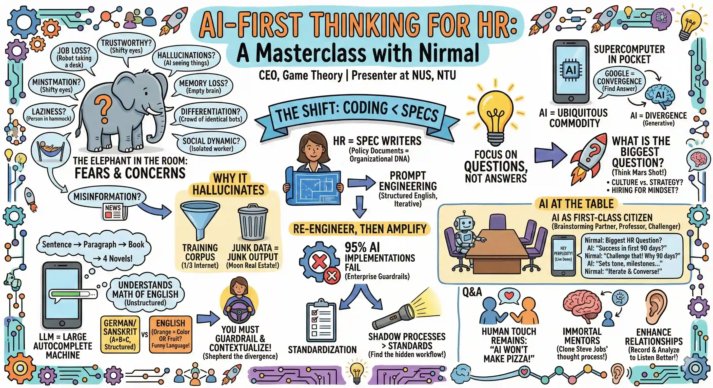

# AI First Thinking for HR Professionals

[Impress AI](https://www.linkedin.com/posts/impress.ai_hiringblueprint2026-savos-aiinhr-activity-7397135743879413760-QCDt/) · 13 Nov 2025 · [AWS Singapore](https://maps.app.goo.gl/LB3mQPU1Fo3SQAjL9)
[Nirmal Palaparthi](https://www.linkedin.com/in/aprilsystems) · [gameTheory](http://https://gametheory.school/)
[Transcript](https://github.com/sanand0/talks/blob/main/2025-11-13-nirmal-impress-ai-hr/README.md)

---

---

# Address your fears about AI before you can use it well

- Before diving into AI capabilities, it helps to acknowledge the concerns people actually have about this technology.
- Common fears include **laziness, memory loss, difficulty differentiating yourself**, and worries about misinformation.
- The workplace social dynamic changing is a real concern. People wonder if AI will remove human connection from collaboration.
- Misinformation and bias rank high because AI can feed you incorrect or skewed information without you realizing it.
- **Understanding these fears helps you approach AI more thoughtfully** rather than either blindly adopting or reflexively avoiding it.

<transcript>

Every one of you has heard a lot about AI and it's all over the media. There are enough and more buzzwords that you've got, and you can't get enough. And like we just got to know, things are changing by the day. You want to appear intelligent? Just read the newspaper and say, "This is the latest change."

So let's leave all of that aside. Let's tackle the elephant in the room. What I thought we’ll do is let's understand: **What are your concerns? What are your fears about AI?** Let's see if we can talk through those.

What I usually do in class is I say: Okay, 60 seconds, your time starts now. Why don't you take a little bit of time? There must be things going on in your mind in terms of what's going on in this space? Where is this going? What is in store for us? What are the kind of issues that AI is surfacing? Some of the things I hear are things like: Is it going to take away our jobs? Is it trustworthy? Does it hallucinate? And so on. So with those cues, over to you.

**Question**: So concerns around AI... one is laziness.

**Nirmal**: Okay, AI will make us lazy.

**Question**: A brain... what is the new age word for it?

**Nirmal**: Yeah, yeah, that's a good one.

**Question**: Memory loss.

**Nirmal**: Memory loss. Okay. Keep going, keep going.

**Question**: If everyone is using AI, how do we differentiate ourselves?

**Nirmal**: Okay.

**Question**: It will remove the social dynamic of the workplace.

**Nirmal**: How to process things quickly?

**Question**: Well, when I think of AI, I think, okay, how do I shortcut the system so I don't have to spend so much time going through a report...

**Nirmal**: So that's an opportunity. And the fear is?

**Question**: Oh, the fear? Oh, this is just fear?

**Question**: Misinformation.

**Nirmal**: Misinformation. Okay. Let's tackle that quickly. Why are you afraid of misinformation?

</transcript>

---

# AI hallucinates because it learned from junk data on the internet

- Large language models train on roughly one-third of the internet, which includes a lot of unreliable content.
- **If you have junk data, you have junk output.** The training data includes people selling real estate on the moon.
- There is no US law preventing absurd claims online, so misinformation gets baked into the model during training.
- The quality of AI output reflects the quality of what it learned from. Garbage in means garbage out.
- This explains why AI sometimes produces confident-sounding nonsense. It learned from confident-sounding nonsense.

<transcript>

**Question**: You're being fed with information that is not correct or that is biased.

**Nirmal**: That is biased and so on. So why does that happen really? Let's try and understand and peek beneath the layers to understand why AI hallucinates.

First of all, it's trained on a corpus which some say is as big as one-third of the internet. And so there are jokers on the internet who sell real estate on the moon—I kid you not. There is no law in the US which prevents you from doing so. **And hence, if you've got junk data, you have junk output.**

</transcript>

---

# An LLM is just a large autocomplete machine

- You already know autocomplete from your phone. **An LLM is a large autocomplete machine** that predicts the next word.
- Instead of completing a few words, it can autocomplete sentences, paragraphs, books, and even four full-length novels.
- LLMs have cracked the mathematics of English, which is one of the most unstructured languages with many ambiguities.
- Words like "orange" can mean a color or a fruit. "Apple" today might not mean a fruit at all.
- The model handles grammatical and semantic variations, keeping multiple potential meanings in mind simultaneously.

<transcript>

But it's not just that. If you want to understand an LLM [Large Language Model], you want to think of it like... all of you have done an autocomplete on your phone? You know what an autocomplete is. Now that autocomplete handles a couple of words. Imagine I can handle a sentence. I can autocomplete a paragraph. I can autocomplete a book. I can autocomplete four full-length novels. That's what an LLM is. **An LLM is a large autocomplete machine.** That's all it is.

How does it do that? It does that because it has fundamentally cracked or understood the mathematics of English. English is a funny language. English is one of the most unstructured languages that you can ever find. The two most structured languages on Earth are German and Sanskrit. A plus B is always equal to C. But English is a funny language. So when you say "orange," do you mean a color? And when you say "apple," do you mean a fruit? Definitely not in these days.

</transcript>

---

# You must guide AI to the right answer through context

- Since LLMs consider multiple meanings, **you must guardrail it, contextualize it, and shepherd it** to useful outputs.
- Think of it as controlling divergence. Without guidance, AI can go haywire with grammar, semantics, and context.
- Industry-specific terminology adds another layer. "Sales" means different things to collections versus revenue teams.
- Even within one organization, the same word carries different definitions depending on which department uses it.
- You need to specify constraints clearly so the AI understands exactly what you mean in your particular context.

<transcript>

And so you have not just grammatical issues, you also have semantic variations. And those are the mathematics that is embedded into the neural network. And so fundamentally, an LLM gives you all of those potential meanings keeping in mind that "orange" could be a color or a fruit. And **it is up to you to guardrail it, to contextualize it, to be able to shepherd it to give you the right answer.** So think of it as a divergence that you are controlling. And it can go haywire because not just grammar, semantic meanings, and context as well.

In each particular industry, there could be a different meaning for the same terminology. The word "sales" itself has different meanings in one organization. Collections think of it as sales minus collected, whereas the sales guys think of it as the revenue booked. And so you can start getting into nuances of what are the constraints you want to put in.

</transcript>

---

# Handling misinformation requires effort, not laziness

- To handle misinformation, **we actually need to be not lazy.** Clear instructions take time and thought.
- The days of cheap labor arbitrage through coding are ending. The only programming language you need now is English.
- But "Structured English" is harder than it sounds. Prompt engineering means learning to ask the right questions.
- You can work iteratively. You do not have to get it right on the first try. Get one answer and improve from there.
- The skill of prompting well will separate effective AI users from those who get unreliable results.

<transcript>

So which means that to handle misinformation, **we actually need to be not lazy.** We need to spend time to be able to give clear instructions.

Here's one thing that's going to happen. One whole country, India, which used to survive on labor arbitrage because they could code very well, is going to completely die. That whole concept of being able to program is going to die because there's only one programming language that you need to know: English. A variation of English called "Structured English." Turns out that Structured English ain't so easy to learn. You need to be able to prompt carefully. You need to be able to write nice prompts. So this whole thing about prompt engineering is about learning how do you ask the right questions, and you could do that iteratively. You don't have to do that on the first go. You have to kind of get one answer and see how you iterate on that answer.

</transcript>

---

# Specifications matter more than code now

- **Coding has been superseded by specs. Specifications are bigger than code.** This changes who holds power.
- HR professionals write policy documents. Policy is essentially the specification or blueprint of an organization.
- If you can write the specs in a structured way, then policy implementation becomes straightforward. Code follows naturally.
- **HR suddenly becomes super powerful** because you write the DNA of how the organization operates.
- This shift means domain experts who understand the "what" and "why" become more valuable than pure coders.

<transcript>

So the first point I feel that I want to leave you with when you say "AI first thinking" is suddenly **coding has been superseded by specs. Specifications are bigger than code.**

Who writes specs? In this room, HR professionals are good at policy documents. That's the specification or the blueprint of an organization. And so, you suddenly are super powerful. You are the folks who are able to write the DNA. And so if you can do the specs in a structured way, then you can have policy implementation, and code is but an easy byproduct. There's enough and more things that can come. That's one.

</transcript>

---

# 95% of enterprise AI implementations fail without re-engineering

- **95% of AI implementations in the enterprises fail.** Enterprises are not getting AI adoption right.
- You can take an inefficient process and amplify the inefficiency with AI. That is the wrong approach.
- First identify which inefficiencies can be removed, re-engineer your process, and then amplify what actually works.
- AI implementation requires a precursor of business re-engineering. Without that, do not even start the journey.
- The innovation happens in B2C space. Enterprises have guardrails like data residency requirements that add complexity.

<transcript>

How do we differentiate ourselves? I think there's a whole lot of processes that are there today. And if you want to look at AI first thinking, you can take an inefficient process and you can amplify the inefficiency. Or, just like we were having a conversation a little while back, you could first go down to figure out what are the inefficiencies that can be removed by AI, and re-engineer your process, and _then_ amplify what is efficient.

So AI implementation necessarily means that you need to have a precursor of business re-engineering. Without that, don't even embark on a journey. **95% of AI implementations in the enterprises fail.** Enterprises are not getting it. The innovation is in the B2C space. And so you've got to copy what's happening from the B2C space because you've got a huge amount of enterprise guardrails put in. I mean, we work with GovTech as part of a program I run with Cognizant... so we work inside GovTech space where the data can't leave Singapore, for example. And so I have to search for a server that is based in Singapore. So there are so many guardrails that enterprises put in that you need to be careful about that.

</transcript>

---

# Shadows reveal more than standards about how work happens

- No two organizations have identical processes, even for something as common as hiring. Real workflows diverge from official ones.
- That HR manager who sits on approvals for three days? Nobody tracks that in the system, but **AI can read all your emails.**
- If you connect email trails to hiring processes, you can see how many people touched each decision and where delays occurred.
- **Shadows are more important than standards.** Every standard process has a shadow process that shows what really happens.
- Fine-tune the shadows to improve actual performance, not just documented procedures that nobody follows exactly.

<transcript>

So I'd say that you want to start looking at standardization over efficiency. But I want to take this one level higher and say that beyond standards, you want to start looking at: No two organizations have the same processes. Even if you have the hiring process, the hiring process in one organization is totally different from the hiring process in another organization just because that hire has to be approved by one senior HR manager, because that's the way it is. And that HR manager has that email on their desk for three days. Nobody's tracking that in the system. But hey, hang on, AI can read all your emails.

So if I can connect the emails and I have a whole trace of every single email that's gone with _that_ particular hiring process, I could see how many people has it touched, where has the delay and the latency been? And if I want to improve it, what can improve? So for every standard process, there is a shadow process which is there in the organization, and tap into that shadow and figure out what exactly is happening in your organization. And so what you want to do is you want to be able to fine-tune the shadows. So I would say **shadows are more important than standards.**

</transcript>

---

# AI will become a commodity, so answers become cheap

- Your phone is a supercomputer more powerful than what put humans on the moon. Everyone carries one now.
- **AI is going to turn ubiquitous, and everyone is going to use it, so it becomes a commodity.**
- When something becomes ubiquitous, it stops being a differentiator. Answers become cheap and easy to obtain.
- **If you are using AI as Google, you are using it wrong.** Google finds answers through convergence.
- AI is generative. It creates through divergence. The value shifts from finding answers to asking better questions.

<transcript>

The next point I want to talk about is... we're talking about efficiency, we were just talking about the whole speed at which you want answers. How do we differentiate ourselves?

There was a point in time when... I mean, this phone in my pocket is a supercomputer which is more powerful than the computer that put man on the moon. Just think about that. So we are carrying supercomputers with us. Some of us are carrying two of them. Name a person that you know who does not have one of these. And so it's become ubiquitous. That is exactly what's going to happen to AI. **AI is going to turn ubiquitous, and everyone of you is going to use it, so it's going to become a commodity.**

</transcript>

---

# Ask the biggest question you can think of

- **Look to the questions. What is the biggest question you can ask?** That is where differentiation lives now.
- AlphaFold tackled protein folding, a three-dimensional structure problem that determines how chemicals bind to DNA.
- A video game called Foldit helped figure out the protein folding structure of HIV, contributing to AIDS research.
- The cure for AIDS owes part of its origins to a video game. So maybe your child playing games is solving important problems.
- **What is the biggest question in your ambit?** You can ask AI to help you enhance and expand your questions iteratively.

<transcript>

How do you differentiate yourself? If it's a commodity, the answers are cheap. **Essentially if you're using AI as Google, you're using it wrong.**

Google is about finding the answer. The answers are convergence. AI is generative. It's about divergence. **Look to the questions. What is the biggest question you can ask?**

What is the question that can make impact? Today we are... a few years ago, there was one small virus which held all of us to ransom for three years, and the best of pharma companies didn't do anything about it. It's incumbent on us to figure out the answer to that solution. AI _is_ talking about protein unfolding. AlphaFold can do that. They created a video game called _Foldit_ which figured out the protein folding structure of the human... of any protein folding structure is a three-dimensional structure. And that three-dimensional structure, the way they bind is very important because that will tell you what chemicals bind to what strands of DNA. And so that is a difficult problem to solve. They created a video game for it, gave it out, and that video game was responsible for finding out the DNA structure of the HIV virus which causes AIDS. So the cure of AIDS owes itself in origins to a video game. So which means that next time you're scolding your child, maybe your child is curing cancer!

So you have to get into play and you have to start looking at: How do you look at these kind of questions? **What is the biggest question that you can think of which is in your ambit?** And that you don't have to do on day one. It's not like you have to say, "Here is my biggest question." You could ask AI to help you with enhancing your questions. You can iteratively say, "Is this big enough? Can we go bigger than this?"

We have to think much, much bigger. Before I die, a human is going to set foot on Mars. We have to go to Mars. We have to become a multi-planetary species. _That's_ the kind of bigness of questions I'm talking about. How do we get there? And so if we have to get there, what is the biggest question that _you_ can think of which is in your ambit?

</transcript>

---

# Focus on culture questions, not just strategy

- **Culture eats strategy for breakfast.** So is it about HR strategy or HR culture? Culture matters more.
- Netflix has what some call the best leave policy: no policy at all. Take as much leave as you want.
- After implementing unlimited leave, the number of leaves people took actually decreased.
- How do you hire for mindset rather than just skills? What factors indicate ability to succeed versus current competence?
- These culture and hiring philosophy questions matter more than tactical process improvements.

<transcript>

So if I was to contextualize that into HR, I'm sure all of you have heard this: "Culture eats strategy for breakfast." So is it about HR strategy or is it about HR culture? How do you start... What is culture? I don't know. But you know, or you have an intuitive sense of it. You should be able to articulate that in some way, or at least take a stab at it and see if you can start structuring that.

What does that mean in terms of driving policy? Netflix is apparently got the best leave policy. I'm sure you know what's the leave policy of Netflix: The best policy is _no policy_. Take as much leave as you can. And guess what? Apparently, the number of leaves that people took reduced after this change.

How do you start thinking about culture of hiring? How do you start hiring for softer factors? Is it about skills or is it about the ability to succeed? Is it about skills or is it about mindset? How do you hire for mindset? And what are the factors you want to look at for mindset? Those are the questions I leave you with.

</transcript>

---

# Think of an LLM as a professor who has read everything

- **Think of an LLM as a professor who has read every single book under the sun**, including pirated material.
- You like Marshall Goldsmith? Tell AI to behave like Marshall Goldsmith and challenge you with questions.
- Ask AI to challenge you with Six Thinking Hats, Five Whys, or whatever framework you prefer.
- You now have brainstorming support available at any hour. Have a brainwave at midnight? Your thinking partner is ready.
- Use the LLM to question your assumptions and push your thinking further than you would go alone.

<transcript>

What you want to start doing is think as big as you can. And guess what? There is brainstorming support for you. Now how do you use that brainstorming support? Because, again, let's get back to "What is an LLM?" **Think of an LLM as a professor who's read every single book under the sun.** Every single book because even if that is not available, it's pirated. So copyright is a separate issue; it's _there_ inside the LLM.

So which means you like Marshall Goldsmith? You can tell AI: "Please behave like Marshall Goldsmith and then ask me questions. Challenge me." You can say, "Challenge me with Six Thinking Hats. Challenge me with Five Whys." Whatever is your favorite tool. And then use that to get AI to question you.

</transcript>

---

# Give AI a seat at the table as a first-class citizen

- **AI has to have a seat at the table. AI has to be a first-class citizen** in your decision-making.
- Put AI at the table in your boardroom. Have real conversations with it about strategic questions.
- You can use voice interfaces like Perplexity to ask questions and get immediate, substantive responses.
- The example question about 90-day success metrics shows how you can push back on AI and have genuine dialogue.
- You can cut AI short and it will not get cross with you. It does not tire. It stays polite and available.

<transcript>

**AI has to have a seat at the table. AI has to be a first-class citizen.** Put AI at the table in your boardroom. Have a conversation with AI.

Questions?

**Question**: We're all thinking about the best question now, right? Because you told us to come up with a question.

**Question**: We can get Perplexity out to see what the best question is.

**Nirmal**: Oh, that's my favorite! So...

</transcript>

---

# You can have real conversations with AI tools

- Voice AI like Perplexity lets you ask follow-up questions, disagree, and drill down into topics naturally.
- When told that 90 days was important for new hires, the speaker pushed back. "I think it is just a cliché."
- AI responded with reasoning: it is a strategic checkpoint for alignment, milestones, and relationship building.
- You can evaluate whether a new CEO fits by assessing communication style, strategic vision, and how they handle challenges.
- **You have a brainstorming partner that works at 2 AM** without complaints or fatigue.

<transcript>

[Nirmal interacts with his phone]

**Nirmal**: Hey Perplexity. I'm giving a talk right now on AI-first thinking for HR and I challenged the room to find out what is the biggest question they can ask. Can you help me with identifying the biggest questions that HR professionals can ask?

**AI Voice**: I searched for key questions HR professionals can ask. Here are some of the most impactful ones.

1. What does success look like in this job during the first 90 days?
2. Can you tell me about the team and company culture?

**Nirmal**: Hang on. Let's take the first question. Can you double click into that? I want to understand this success for 90 days. I think it's just a cliché. I don't agree with you that 90 days is important. Why do you think 90 days is important?

**AI Voice**: The first 90 days often set the tone for success in a new role. It's when key milestones, expectations, and relationship building happen. It helps align both you and the organization on goals and performance metrics early on. It's not just a cliché, it's a strategic checkpoint to ensure smooth transitions and early wins.

**Nirmal**: But then I need 90 days to evaluate whether my new CEO is really the candidate that I want to put in. So how do I do that? Am I not wasting 90 days?

**AI Voice**: You can gauge a new CEO's fit by assessing their communication style, strategic vision, and how they handle challenges. Set clear criteria, like leadership qualities, decision making...

**Nirmal**: And so on. Right? So you _can_ have a conversation. And the best part is I could cut Perplexity short and she is not going to go cross with me because she's polite. And she doesn't get angry. And she doesn't tire. I've got a brainstorming partner. I have a brainwave in the middle of the night, I could talk to her. First class citizen.

</transcript>

---

# Constraints make you more creative, not less

- Will AI kill creativity in the next generation? There is a method and structure to creativity itself.
- **The more you constrain something, the more creative you can get.** Constraints force innovation.
- Limitations push you to find novel solutions you would never discover with unlimited options.
- AI will actually amplify creativity by providing structure and constraints for creative exploration.
- The fear that AI replaces creativity misunderstands how creativity actually works in practice.

<transcript>

**Question**: But does it ever concern you that it could kill the creativity of the next generation?

**Nirmal**: There is a method and a madness to creativity. There is a structure to creativity. **The more you constrain something, the more creative you can get.** So it will actually amplify creativity.

**Question**: So it comes back to my point about your social connections become your phone. And AI on your phone, not people on your phone or people in your organization. That I think could damage the way that you younger people at the workplace evolve.

</transcript>

---

# AI will not replace relationships or tangible things

- **AI is not going to make pizza.** You still need to eat, wear clothes, and buy tangible things.
- Relationships will always stay. Humans will always love other humans. Use AI to help enhance those connections.
- If you want to enhance relationships, AI can help you figure out what your relationships actually need.
- Worried about losing mentors? Clone Steve Jobs's thought process into an AI and ask him about Design Thinking.
- People become immortal through AI. Your mentor's wisdom can persist and remain accessible indefinitely.

<transcript>

**Nirmal**: How can you enhance relationships? If you want to enhance relationships, how can you figure out what is it that your relationship needs? So we're all getting caught up in the hype and AI is going to replace a lot of things. **AI is not going to make pizza.** You have to eat, you have to wear clothes, you have to go buy whatever other tangible things. So _that_ will always stay. Relationships will always stay. Humans will always be loving other humans. So how do you use AI to help that?

**Question**: We won't have a debate here! [Laughs]

**Nirmal**: Yeah, yeah, yeah, and that's important!

**Question**: Those sort of wonderful mentor relationships that we had as our careers started... they might become irrelevant.

**Nirmal**: Or, you could take a Steve Jobs, who I respect for a few things in life, and Steve Jobs' thought process, put it into an AI, clone it, and then I speak to Steve Jobs. And I'll ask Steve Jobs: "What do I need to do in a Design Thinking problem?" And so people get immortal. Your mentor is immortal now.

</transcript>

---

# AI helps you understand perspectives you might miss

- In conversations, we sometimes do not fully get the other person's perspective. That takes time to unpack.
- You can use AI systems to help understand and unpack different perspectives in complex situations.
- **We do not listen** well enough. Record conversations and analyze them later to catch what you missed.
- AI helps with social interactions by revealing viewpoints and reasoning you might overlook in real-time conversation.
- This makes AI a tool for empathy and understanding, not just productivity and automation.

<transcript>

**Question**: Another way in which for me, I mean just to add on for that, like in conversations with people sometimes I don't fully get their perspective. Then that is where it takes a while to get to that. And what this kind of thinking... is that I use systems to help understand or unpack that thinking a bit as well. To get... understand different perspectives in it. So in that way, it helps in social interactions as well in some contexts.

**Nirmal**: That's so true. That's so true. **We don't listen.** So record the conversation and then analyze it later! And we missed that out. But I am taking more than the time. Let's continue the conversation offline. Over to Nadia.

</transcript>

---

# AI First Thinking for HR Professionals

[Impress AI](https://www.linkedin.com/posts/impress.ai_hiringblueprint2026-savos-aiinhr-activity-7397135743879413760-QCDt/) · 13 Nov 2025 · [AWS Singapore](https://maps.app.goo.gl/LB3mQPU1Fo3SQAjL9)
[Nirmal Palaparthi](https://www.linkedin.com/in/aprilsystems) · [gameTheory](http://https://gametheory.school/)
[Transcript](https://github.com/sanand0/talks/blob/main/2025-11-13-nirmal-impress-ai-hr/README.md)

---

# Quiz

1. According to the speaker, what proportion of enterprise AI implementations fail?
2. Why does the speaker say "shadows are more important than standards" in organizational processes?
3. What video game contributed to discovering the protein folding structure of the HIV virus?
4. Why does the speaker argue that HR professionals have become "super powerful" in the age of AI?
5. What is the speaker's response to the concern that AI will kill creativity?

---

# Errata

<small>

- **95% failure rate claim**: The specific statistic of "95% of AI implementations fail" is commonly cited but sources vary. McKinsey (2022) reported that only 11% of companies see significant financial returns from AI, which supports high failure rates but uses different methodology.
- **Netflix leave policy**: Netflix's unlimited PTO policy results are debated. Some reports suggest employees take similar or slightly more vacation, not less. The claim that "leaves decreased" lacks definitive public data.
- **AlphaFold and Foldit distinction**: Foldit (2008) and AlphaFold (2018-2020) are different projects. Foldit is a citizen science game, while AlphaFold is DeepMind's neural network. Both address protein folding but are not directly connected.
- **HIV protein structure discovery**: Foldit players helped determine the structure of a retroviral protease (Mason-Pfizer monkey virus, related to AIDS research) in 2011, not the HIV virus directly. The claim simplifies the actual scientific contribution.
- **Phone versus Apollo computer**: This comparison is accurate. An iPhone has millions of times more computing power than the Apollo 11 guidance computer (32KB RAM versus modern gigabytes).

</small>

---

# Counterpoints

<small>

- **On coding becoming obsolete**: Stack Overflow's 2024 Developer Survey shows strong demand for programming skills. Many argue prompt engineering complements rather than replaces traditional coding, especially for complex systems.
- **On AI as commodity**: Harvard Business Review (2023) argues that AI implementation capability, not AI access, will differentiate companies. The "commodity" framing may underestimate the difficulty of effective deployment.
- **On constraints and creativity**: Some creativity research (Amabile, 1996) suggests excessive constraints can inhibit creativity. The relationship between constraints and creative output follows an inverted-U curve, not a linear one.
- **On AI replacing human mentorship**: Research on mentorship (Kram, 1985) emphasizes psychosocial functions that require genuine human relationship, empathy, and shared vulnerability that AI cannot authentically provide.
- **On unlimited PTO policies**: SHRM research suggests unlimited PTO can create ambiguity and guilt that reduces actual vacation time, potentially harming employee wellbeing rather than improving culture.

</small>

---

# Feedback

1. **Add data sources**: When citing statistics like "95% failure rate," provide the specific study or source to increase credibility and let audiences verify claims.
2. **Structure the audience interaction**: The Q&A portions feel spontaneous but could be more focused. Consider collecting questions and addressing them in themed batches.
3. **Clarify the AlphaFold example**: The jump from protein folding to video games to AIDS cure is confusing. Walk through the logical connection more carefully.
4. **Provide concrete HR examples**: The talk mentions HR frequently but stays abstract. Show a specific workflow transformation, like how AI changed a particular hiring process.
5. **Address the "questions not answers" paradox**: The advice to focus on questions is compelling but needs practical guidance. What makes a question "big"? How do you evaluate question quality?
