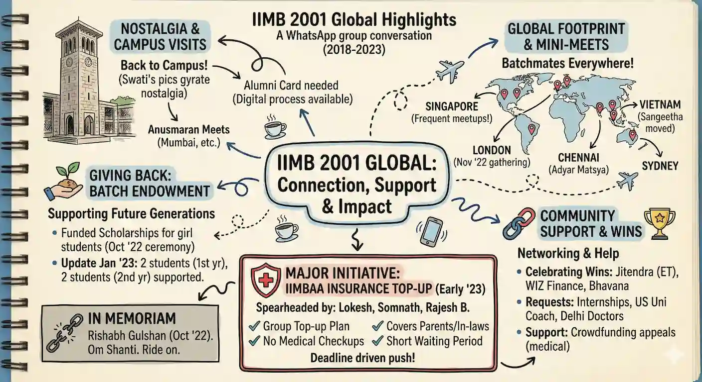

<!-- _class: title -->

# Vibe Analytics

[IIM Alumni SG](https://iimalumni.sg/) · 3 Dec 2025, 6:00 pm SGT · Remote
[Anand S](https://s-anand.net/) · [LLM Psychologist](https://www.linkedin.com/in/sanand0/) · [Straive](https://straive.com/)
[Transcript](https://github.com/sanand0/talks/blob/main/2025-12-03-vibe-analytics-iim-alumni-sg/transcript.md) · [Audio](https://github.com/sanand0/talks/releases/download/talks/2025-12-03-Vibe-Analytics.opus) · [WhatsApp Group](https://chat.whatsapp.com/DUxeM59JBNH47Wmm1i5qRa)
[CC0 - Public Domain](https://creativecommons.org/publicdomain/zero/1.0/)

---

## You need some software before we start

- A modern browser (Edge, Chrome, Firefox...)
- A $20 ChatGPT Plus account / Gemini Pro account / Claude Pro account (or better)

For the braver souls, _time permitting_:

- Sign into [github.com](https://github.com), [chatgpt.com/codex](https://chatgpt.com/codex), [jules.google.com](https://jules.google.com/), ...
- Install [VS Code and Codex](https://sanand0.github.io/tutorials/codex-vscode/).
  Or Install [VS Code](https://code.visualstudio.com/) + [GitHub Copilot](https://github.com/copilot) / [Cursor](https://cursor.com/) / [Windsurf](https://windsurf.com/) / ...

---

## We will share prompts & links on WhatsApp

[WhatsApp Invite](https://chat.whatsapp.com/DUxeM59JBNH47Wmm1i5qRa)

**Post your questions on WhatsApp at any time**

---

## Vibe Coding: code like code doesn't exist

> ... where you fully give in to the vibes, embrace exponentials, and forget that the code even exists.

> I "Accept All" always, I don't read the diffs anymore. When I get error messages I just copy paste them in with no comment

> Sometimes the LLMs can't fix a bug so I just work around it or ask for random changes until it goes away.

[Andrej Karpathy](https://x.com/karpathy/status/1886192184808149383)

---

## Vibe Analysis: analyze, but ignore the code

Here's the vibe analysis mindset:

- You're **pragmatic**. You care about insights, not how they're coded.
- You're **sceptical**. You cross-question and find errors.
- You're **playful**. You try weird "what ifs" just to see what breaks.

Let's analyze some datasets with this mindset.

---

## We'll explore personal and synthetic data

- **Not corporate data**. You need NDAs, approvals, etc. for that.
- We'll start with **personal data**. Download any of these:
  - Your Google, WhatsApp, Fitbit, Strava, etc. data.
  - Your bank statements, medical reports, utility bills, etc.
  - Your Netflix, Spotify, YouTube, Kindle, etc. usage data.
  - Your contracts, resumes, reports, emails, chat logs, etc.
  - ... and lots more!
- **Synthetic data**: Mimics real data, but has no PII.

---

## Google Activity is a good starting point

Visit [**Google Takeout**](https://takeout.google.com/) and export data from apps you use.

This can take an hour or more!

**My Activity** is most extensive, followed by Google Fit and Maps.

Google Pay, Google Finance, Google Play Store, Google Contacts, Google Chat, etc. may contain useful information.

---

## WhatsApp is a good starting point

To export a WhatsApp chat:

- Open a chat on your phone (not WhatsApp Web)
- Tap on the three dots (menu) on the top right
- Select "More" > "Export Chat"
- Don't include media
- Choose how to send the exported chat (Dropbox, Google Drive, email,etc.)

---

## What data have you downloaded?

Share your choices on WhatsApp.

[WhatsApp Invite](https://chat.whatsapp.com/DUxeM59JBNH47Wmm1i5qRa)

**Post your questions on WhatsApp at any time**

---

## There are several analysis approaches

- Succinct: "Analyze"
- Conversational (voice prompt): "Analyze (... share lots of details ...)"
- [Narrative](https://github.com/sanand0/prompts/blob/main/styles.md#non-fiction-authors): "... style of a Malcolm Gladwell New Yorker Article."
- [Analytical](https://github.com/sanand0/scripts/blob/main/agents/custom-prompts/analyze-insights.md): "Analyze data like an investigative journalist ..."
- [Visual](https://github.com/sanand0/scripts/blob/main/agents/custom-prompts/analyze-insights.md): "... like a NYT data story". [Visual Story example](story.html)
- Podcast via [NotebookLM](https://notebooklm.google.com/)
- Sketchnote / Infographic via [Nano Banana Pro](https://gemini.google.com/)
- ... slide decks, dashboards, reports, simulations, and more!

---

---

## There are several more analysis approaches

- **Grounded**: Search online, fact-check, cite sources
- **Interactive**: Conversational Q&A, drill-down
- **What if**: What-if this happens? What if that _had_ happened?
- **Tutorial**: Teach me what you did.
- **Systems thinking**: What are the causal loops? Leverage points?
- **Sensitivity**: Which inputs affect outputs the most?
- **Anomaly detection**: What are the outliers? Why?
- ... and more!

---

## What surprising thing did you learn?

Keep sharing your discoveries on WhatsApp.

[WhatsApp Invite](https://chat.whatsapp.com/DUxeM59JBNH47Wmm1i5qRa)

**Post your questions on WhatsApp at any time**

---

## Analysis is just the starting point

- **Verification**. Any errors? Biases? Incompleteness? Fallacies?
- **Post-mortem**. What could we do differently to improve?
- **Feedback**: Share / apply results, get feedback, iterate.
- **Audit / Red Team**: Reproducible? Transparent? Ethical?
- **Automate**: Write a program to do this repeatedly.
- **Metrics**: What should we monitor? Calculate them.
- **Diversification**: What else can we try that's different?
- **Analogy**: What similar problems can we solve this way?

---

## Synthetic data is good for practice

[Generate **realistic** fake data](https://raw.githubusercontent.com/sanand0/prompts/refs/heads/main/fake-data.md):

<small>

Generate realistic fake data for ...

STEP 1. List columns that would be present in such data, briefly describing how the data might be distributed.
STEP 2. Given such data, think about an objective and generate 5 hypotheses that an organization might want to test on how to achieve this objective.
STEP 3. Write and run a Python program that generates 2,000 rows of realistic fake data where these hypotheses are true in a statistically significant way. Let me download the output as a CSV file.
STEP 4. Test each hypothesis and show the results.

</small>

---

## Let's generate synthetic data

- Customer segmentation
- Sales performance
- Employee satisfaction
- Marketing campaign effectiveness
- Website traffic analysis
- Product reviews and ratings
- Financial transactions, and more!

... and analyze it with the steps above.

---

## Where can this be helpful for you?

Sharing reinforces learning, builds commitment. Share ideas / plans:

[WhatsApp Invite](https://chat.whatsapp.com/DUxeM59JBNH47Wmm1i5qRa)

**Post your questions on WhatsApp at any time**

---

# Vibe Analytics

[IIM Alumni SG](https://iimalumni.sg/) · 3 Dec 2025, 6:00 pm SGT · Remote
[Anand S](https://s-anand.net/) · [LLM Psychologist](https://www.linkedin.com/in/sanand0/) · [Straive](https://straive.com/)
[Transcript](https://github.com/sanand0/talks/blob/main/2025-12-03-vibe-analytics-iim-alumni-sg/transcript.md) · [Audio](https://github.com/sanand0/talks/releases/download/talks/2025-12-03-Vibe-Analytics.opus) · [WhatsApp Group](https://chat.whatsapp.com/DUxeM59JBNH47Wmm1i5qRa)
[CC0 - Public Domain](https://creativecommons.org/publicdomain/zero/1.0/)

