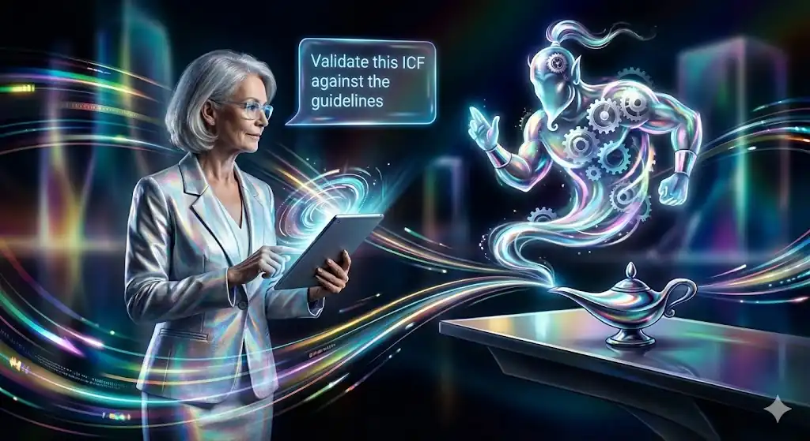
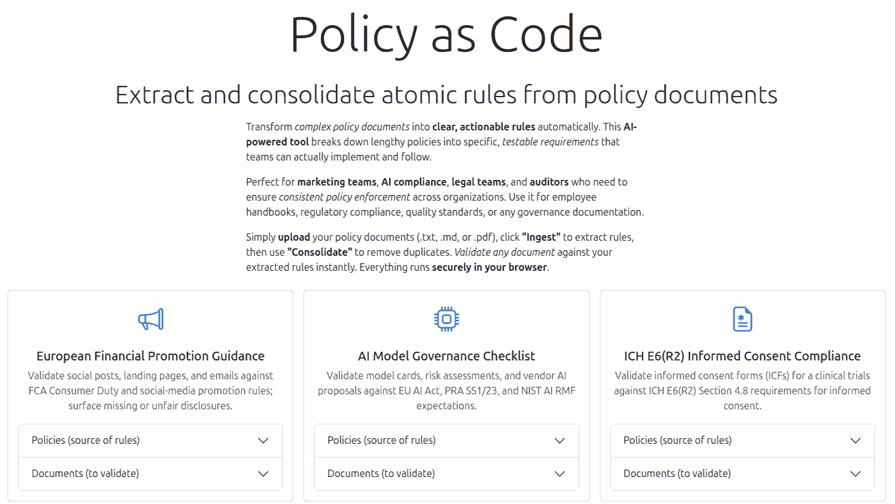

<!--

npx -y @marp-team/marp-cli@latest --theme-set ~/code/marpessa/marpessa.css --html README.md -o index.html

-->

<!-- _class: theme-burgundy title -->

# Data to Decisions (with AI)

#### Shaping the future of clinical trials

[SCDM Keynote]() · 05 Dec 2025, 9:30 am IST · Hyderabad
[Anand S](https://s-anand.net/) · [LLM Psychologist](https://www.linkedin.com/in/sanand0/) · [Straive](https://straive.com/)
[Q&A](https://github.com/sanand0/talks/blob/main/2025-12-05-scdm-keynote/qa.md) · [Transcript](https://github.com/sanand0/talks/blob/main/2025-12-05-scdm-keynote/transcript.md) · [Audio](https://github.com/sanand0/talks/releases/download/talks/2025-12-05-SCDM-Talk.opus) · [CC0 - Public Domain](https://creativecommons.org/publicdomain/zero/1.0/)

##  Q&A at slido.com 1734926. [Answers](qa.md)

---

# Gen AI is fundamental shift

| It's a shift in:          | So far, computers could only:                          | But now, with Gen AI, they can:                               |
| ------------------------- | ------------------------------------------------------ | ------------------------------------------------------------- |
| **What they can process** | process **structured** data (like Excel, SQL)          | process **anything** (protocols, physician notes, lab images) |
| **How we instruct them**  | understand **specialized** languages (FORTRAN, Python) | understand **natural language** - anyone can use it           |

> This isn't just "easier AI".
> It fundamentally changes **what** AI can do and **who** can do AI.

---

## Validating ICFs is a $500K-$2M annual cost

Let's take a pharma firm that runs:

- **50-100 clinical trials** at a time
- **20-50 sites** per trial
- each submitting informed consent forms (ICFs) in local languages
- with senior clinical ops verifying each against [the 68-page ICH E6 guideline](https://database.ich.org/sites/default/files/E6_R2_Addendum.pdf)
- **2-4 hours** per review
- **$500K-2M** annual cost in personnel time alone

> Same with compliance docs - every country, every site, every amendment

---

## What if LLMs could do this?

Let's upload [the ICH E6 guideline](https://database.ich.org/sites/default/files/E6_R2_Addendum.pdf) into [ChatGPT](https://chatgpt.com/)
and ask it to validate the following five informed consent forms:
[ICF 1](https://raw.githubusercontent.com/sanand0/policyascode/refs/heads/main/docs/icf1.txt) | [ICF 2](https://raw.githubusercontent.com/sanand0/policyascode/refs/heads/main/docs/icf2.txt) | [ICF 3](https://raw.githubusercontent.com/sanand0/policyascode/refs/heads/main/docs/icf3.txt) | [ICF 4](https://raw.githubusercontent.com/sanand0/policyascode/refs/heads/main/docs/icf4.txt) | [ICF 5](https://raw.githubusercontent.com/sanand0/policyascode/refs/heads/main/docs/icf5.txt)

The prompt is simple:

> Validate the following ICF against the guidelines at https://database.ich.org/sites/default/files/E6_R2_Addendum.pdf and list all non-compliances.

After 2 min 41 seconds of thinking, [it found **15 errors**](https://chatgpt.com/share/6931ba2b-a7e4-800c-918b-76b2961a11e0).

---

Below are the places your ICF **does not meet ICH E6(R2) Addendum** expectations for informed consent content (primarily **4.8.10**, plus a couple of related clauses).

- **4.8.10(a) – “Trial involves research” not stated clearly.** Your ICF describes a study, but never explicitly tells the subject this is _research_.
- **4.8.10(e) – Subject responsibilities not described.** Beyond contraception and “training,” it doesn’t clearly list what the participant must do (e.g., dosing compliance, visit attendance expectations, AE reporting expectations, glucose diary requirements, restrictions).
- **4.8.10(f) – Experimental aspects not explained.** It doesn’t clearly state what is investigational/experimental.
- ... and a dozen more.

---

# It's like a genie. Free wishes (but careful)

---

## But what if it makes a mistake?

Well, **what do we do when _our teams_ make mistakes**?

We have protocols for that.

- Checklists
- SOPs
- Peer reviews
- Audits

> These are designed to catch human errors. They catch AI errors too!

---

## Use AI to generate checklists. Checklists are robust

---

## Use AI to run peer reviews. Validation is harmless

---

## It's stunningly cheap, and growing cheaper by the day

---

<!-- _class: theme-burgundy title -->

## Let's look at practical applications

1. Extract Schedule of Assessments from a protocol PDF
2. Find anomalies in lab data results
3. Filter patient list for eligible candidates
4. Find patterns predict enrollment failures (if time permits)

---

## Extract Schedule of Assessments from a protocol PDF

<!-- Generation: https://chatgpt.com/share/69322cad-ffa8-800c-9690-906eeb97b26c -->

Say you have a [medical trial protocol](https://docs.google.com/document/d/1i_v0HAb1exK3bBfFJL01KAxWedhJClJF/edit) for testing a new diabetes medication called "Glucofix" vs placebo.

> Extract the "Schedule of Assessments" tableinto a tabular format suitable for direct upload using the **REDCap Instrument-Event Mapping CSV format**.

A single missed assessment costs **$50K-200K** in rework/lost data.
LLMs for _validation_ reduces errors dramatically.
Error rate: ~5% manual → ~0.5% with LLM + human QC. **Cost: $50**

> [Find all errors and correct them. List your corrections.](https://chatgpt.com/share/693231de-b378-800c-b7b8-988a7bf0f6fb)

---

## Find anomalies in lab data results

<!-- Generation: https://chatgpt.com/share/6931a3d1-d914-800c-8bb2-e34982c91bf8 -->
<!-- Analysis: https://chatgpt.com/share/693248fe-8c98-800c-8832-8e171175bf3d -->
<!-- Data story: https://claude.ai/chat/961c1591-4693-4e3c-8e8f-51b04c5da535 -->

You have 50 pages of [lab listings data for a diabetes clinical trial](https://docs.google.com/spreadsheets/d/1If1GHnmhXA_l26qAC3VNOlEdkeIKUUNFTvKnmR-h1kc/edit?usp=sharing).
200 patients × 8 visits × 8 lab tests = **~12K data points**

- **Edit checks**, e.g. "ALT > 500 = flag", works only for extreme values.
- **Listings review**, on pages of numbers, humans miss subtle patterns
- **Statistical outlier detection**: "2 SD", misses systematic bias

> [Analyze this clinical trial lab data. Find data quality issues. Look for: temporal patterns, site-specific anomalies, impossible correlations, gradual drift, etc.](lab-listings/index.html)

10,000 patients in 5 minutes. Daily surveillance. Flag within 24 hours.

---

## Filter patient list for eligible candidates

<!-- Analysis: https://chatgpt.com/share/69324855-280c-800c-9c6d-0e76dca417f0 -->
<!-- Data story: https://claude.ai/chat/4cfc2741-a9d6-4c36-a0e5-4e883d7f135a -->

A day's delay in [clinical trial enrollment](https://docs.google.com/document/d/1yMHVq-41Xe9PXtSbrzaSjoz3ImD6fK8djN02iWyl76Q/edit) from [patient data](https://docs.google.com/spreadsheets/d/1_PVrcLn0_H5DVck9phfr5PfT529oTE5b/edit) costs $40K-$8M.
Not enough matching patients, high screen failure rate (40% average), ...

_"Let me check if Mrs. Johnson's HbA1c is 7.5-10.5%... and her creatinine... and her medication history..."_ takes 30-45 minutes per patient chart. With errors.

<small>

> [Given these inclusion/exclusion criteria and this patient database](ehr/index.html):
>
> 1. Identify which patients meet ALL inclusion criteria
> 2. For patients who don't qualify, state which criteria they fail
> 3. Rank by likelihood of successful enrollment
> 4. Share code to run and verify locally.

</small>

---

## Find patterns predict enrollment failures <small>[TIME CHECK]</small>

Based on [enrollment history](https://docs.google.com/spreadsheets/d/1O0j20bjYK6rIn8QzuuHFpLYc-6FxG6cE71_6llXYEys/edit?usp=sharing):

> [Analyze which inclusion/exclusion criteria predict enrollment failure. Quantify impact of each criterion](https://chatgpt.com/share/69325c46-2160-800c-9489-7cc71ed8859f)

Instead of a therapeutic lead saying _"I think we should use 7.5-9.5% HbA1c range"_ and clinical ops saying _"That seems reasonable"_, LLM says _"Historical data shows HbA1c ranges <2.0% have 23% higher screen failure rates"_

Data-driven decision lead to better site selection.

---

## AI is already better than humans in many areas

---

<!-- _class: title big-list -->

## We may as well learn. Use it more. And better

1. **Practice**. Have 50 conversations a day
2. **Prompt for Prompts**. Ask it what to ask for and how
3. **Post-Mortem**. Ask it what went wrong and why

---

<!-- _class: theme-burgundy title -->

# Data to Decisions (with AI)

#### Shaping the future of clinical trials

[SCDM Keynote]() · 05 Dec 2025, 9:30 am IST · Hyderabad
[Anand S](https://s-anand.net/) · [LLM Psychologist](https://www.linkedin.com/in/sanand0/) · [Straive](https://straive.com/)
[Q&A](https://github.com/sanand0/talks/blob/main/2025-12-05-scdm-keynote/qa.md) · [Transcript](https://github.com/sanand0/talks/blob/main/2025-12-05-scdm-keynote/transcript.md) · [Audio](https://github.com/sanand0/talks/releases/download/talks/2025-12-05-SCDM-Talk.opus) · [CC0 - Public Domain](https://creativecommons.org/publicdomain/zero/1.0/)

##  Slides + My contact details

---

<!-- _class: theme-bootstrap title -->

# Panel Discussion

[Transcript](https://github.com/sanand0/talks/blob/main/2025-12-05-scdm-keynote/panel.md)· [Audio](https://github.com/sanand0/talks/releases/download/talks/2025-12-05-SCDM-Panel.opus)

[CC0 - Public Domain](https://creativecommons.org/publicdomain/zero/1.0/)
