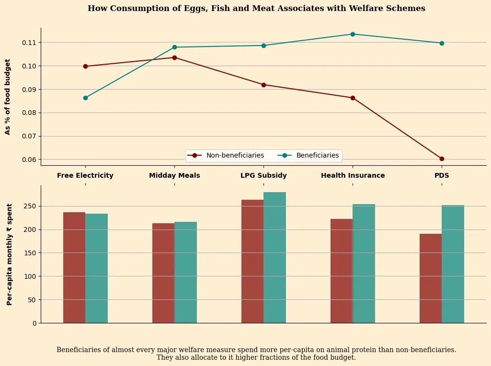

# Transcript

**Host**: Our next speaker is here to show us that as we design the future of AI, we need to stop being just programmers and start being philosophers. I now welcome Mr. Anand S, LLM psychologist, Straive.

  <h1 style="font-size: 4rem; color: rgb(255, 255, 255);">Design in the Age of Infinite Generativity</h1>
  <h2 style="font-size: 3rem; color: rgb(255, 255, 255);">S Anand. LLM Psychologist</h2>

**Anand**: Before AI, execution was what took the bulk of the time. **Now AI is collapsing the amount of time that it takes for execution, which means that what's left is figuring out what to build and how do you evaluate it.**

<video controls autoplay loop muted playsinline preload="metadata" width="1170" height="972" style="max-width: 100%; height: auto;">
  <source src="ai-execution.webm" type="video/webm">
  <a href="https://claude.ai/public/artifacts/ac9cc611-dec8-468f-a72d-981c5afbd8fb">Interactive visualization created by Claude using the prompt: Create a visualization that showcases how the incredible execution ability of AI transforms the design process, transferring the bulk of the effort to the ideation and evaluation stages.
Show a smooth bell-curve like shape with three dots: ideation, execution, evaluation. Ideation takes 10% of effort, execution 80%, evaluation 10%. That represents the height of the curve at each stage (with 80% as the highest value). Then show how with AI, the execution effort smoothly comes down to 5% (numbers counting down) with ideation and evaluation still at 10% each. The curve smoothly animates so that at the end, the two 10% dots are at the top (same Y-position as the 80% execution dot was before) while the 5% execution dot has a Y-position at the middle - it's at half the height of the 10% dots.
Loop the animation back and forth in an infinite loop, pausing at the ends for about 2 seconds to allow viewers to take in the information. Use different colors for the three stages to make them easily distinguishable, and include large labels for each stage along with the large percentage values.
Design this for a 16:9 screen. This will be used in a live presentation, so use large fonts.</a>
  <!-- https://claude.ai/chat/d4ba6411-41aa-4922-a8c1-9ccd01c3ed9b -->
</video>

So I'll share a little bit of how I am exploring this space. For instance, in the ideation space, how can we discover new art?

  <h1 style="font-size: 4rem; color: rgb(255, 255, 255);">Discover new art</h1>
  <h2 style="font-size: 3rem; color: rgb(255, 255, 255);"><strong>IDEATION</strong>: Explore the opportunity space of design</h2>

Now, I am someone who knows no art. So I have to just ask LLMs. And what I did was, give me some new designs. Tell me what are the different kinds of styles, art techniques that I can use, and what are the different prompts that I can use for this.

And it discovered a whole bunch of these things. I had never heard of, for instance, Decalcomania, or Grattage, or Sgraffito, or Stippling Mixed Media. One of the things that I found particularly interesting was this Xerox style, which I hope I will find, but it's effectively a style of art which is simply based on photocopies of photocopies of photocopies, and it has a very gritty and interesting effect.

<!--
Decalcomania Thumbnail: https://sanand0.github.io/llmartstyle/images/cafe.decalcomania.nano-banana-2.webp
Decalcomania Large pic: https://github.com/sanand0/llmartstyle/releases/download/images/cafe.decalcomania.nano-banana-2.png
Grattage Thumbnail: https://sanand0.github.io/llmartstyle/images/cafe.grattage.nano-banana-2.webp
Grattage Large pic: https://github.com/sanand0/llmartstyle/releases/download/images/cafe.grattage.nano-banana-2.png
Sgraffito Thumbnail: https://sanand0.github.io/llmartstyle/images/cafe.sgraffito.nano-banana-2.webp
Sgraffito Large pic: https://github.com/sanand0/llmartstyle/releases/download/images/cafe.sgraffito.nano-banana-2.png
Stippling Mixed Media Thumbnail: https://sanand0.github.io/llmartstyle/images/cafe.stippling-mixed-media.nano-banana-2.webp
Stippling Mixed Media Large pic: https://github.com/sanand0/llmartstyle/releases/download/images/cafe.stippling-mixed-media.nano-banana-2.png
-->

Now, if I have the prompt for that, I will just pass that to Gemini Nano Banana Pro 2, and say, "Give me the image based on this particular style". And now everybody's saying, "Oh, okay, that's a very interesting style." Knowing the names, building a vocabulary, seems to be a pretty useful thing. And in order to build a vocabulary, sometimes all you have to do is ask it to build a gallery.

Not just that, we can start looking at how other people are doing it. For instance, see, one of the things that our team did was looked at various publications like the South China Morning Post. What are the kinds of charts they are using? What are the kinds of charts that, let's say, the New York Times is using, or the Wall Street Journal is using?

<video controls autoplay loop muted playsinline preload="metadata" width="1882" height="946" style="max-width: 100%; height: auto;">
  <source src="data-journalism-chart-map.webm" type="video/webm">
  <a href="https://ritesh17rb.github.io/chart-map/">Interactive visualization of ~200 charts from across 10 publications like The New York Times, The Pudding, South China Morning Post, The Wall Street Journal, Reuters, Bloomberg, The Economist, The Guardian, etc. plotting as a UMAP of the chart image embeddings - showing the distinctive clusters of the South China Morning Post on on end vs The Washington Post on the other</a>
</video>

The Wall Street Journal seems to have a very different graphic style from The New York Times. And what this does is clusters which are the similar ones, which are the dissimilar ones. So you get a sense of, "Oh, okay, fine, the red ones, which happens to be The Economist, it's kind of somewhere in the middle, but the South China Morning Post almost has a distinctive cluster very different from the others."

Now, what this means is that part of my problem is, I don't know where to get the vocabulary from, but that is solvable by the LLMs. But that LLM needs inspiration. Where do I get that inspiration from? If I can find some of these weird outliers, people who think very differently, very creatively, I can give examples of those and ask it to generate stuff. Which I did a short while ago.

I took, for instance, what [Senthil](https://www.linkedin.com/in/senthil-gopalan-05935719) had created. I just noted down saying, "Look, they've converted a calendar into a bag for reuse, which is ultra cool. Now, give me half a dozen ideas like this."

So it said, what if we built a Kolam mat? And what children can do is learn how to create Kolams. You can of course obviously put it outside for Kolams. You can also use it for wiping stuff, it becomes a coaster, and it can also be converted to a bag.

Second idea. What if we have a growth chart kurta? Take a kurta, as the child grows, embroider the age for that child, and then when the child's younger sibling grows up and starts reusing that kurta, now you have a comparison. It almost gamifies the whole thing.

Or what if we had, in the villages, the sari border becoming a pouch, and in that pouch you store seeds. So that when the villagers go and trade, they can use that pouch for also a commercial purpose, and later on when it gets worn out, or it tears, then they can start using it as a belt as well. Interesting idea.

Or recipe towel. What if we wrote the recipes on towels, which we used as part of the preparation process? And as you use it more and more, it gets worn out. So your recipe towel's hanger will effectively be a history of what are the recipes you have been using more, what are the recipes you've been using less. And of course, because the original idea was about a bag, all of these it converts into a bag also. So we have to be a little wary of these sorts of things.

Now, so now that is one inspiration, right? But why stop there? So I took [Narendra](https://in.linkedin.com/in/narendraghate)'s idea and a whole series of ideas, in fact, very good ones, and said, now give me a whole bunch of ideas like this. So here's one. It said, what if the strips of the tablets were color coded, or as they age, beyond a point, the strips themselves turn reddish or orangish. We've seen that kind of a thing. So that gives us a visual indicator for the expiry.

Or what if we had the coasters for the tea, something that you can turn up or down, or put it like a triangle like this when you're ready to order? So that the restaurant servers' job becomes much easier. They just look around, "Oh, okay, red coaster, I'll go over there and wait for that restaurant's order."

Or the amount of charge that is going through a USB cable, that flows, that gives you on the cable itself a visual indicator based on the amount of light that is coming through.

Now, these are the kinds of things that you can generate with generative AI. **That is the whole point of generative AI.**

See, the mock-up of the idea, the execution part of it at one level, which is conceptualizing, that was easy. I was sitting there and doing it. Or, I was sitting there and _it_ was doing it. I wasn't doing it. But these ideas, where we get them from, is what we need to build. So finding those interesting people, building that community that we need to connect to, figuring out who the outliers are, that's where our job is. And generative AI is making that easier as well. We just need to do it a whole lot more, I think.

  <h1 style="font-size: 4rem; color: rgb(255, 255, 255);">Discover tool capability</h1>
  <h2 style="font-size: 3rem; color: rgb(255, 255, 255);"><strong>EXECUTION</strong>: Create a gallery of tool capabilities</h2>

The other thing that it allows us to do, and I think we need to do more of this, is even on the execution side, where we are doing that 5% of execution, **we don't really understand our tools anywhere near as well as it understands our tools.**

So for instance, I've been using ImageMagick as a tool for the last what, 30 years or something like that, ever since it was invented probably. But I didn't know that you could create all kinds of ImageMagick filters like these, and this was generated by the following prompt: "Go crazy, create all kinds of ImageMagick filters and give me the code for each one of these." So this is the actual program that will create that output from this original image.

It is cataloging the possibilities, generating the outputs. So now I have a gallery of how to use it. Obviously, I'm not going to use it. I'm going to give this to another agent and tell it to use it. But it is still a good gallery for it because I need to know how to steer it. You know, go towards the bottom half of this, go towards something that's unusual, esoterica, and here are half a dozen things that you might not have thought of, making its life a little bit easier for the next two or three years when it needs life to be made easier. After a point, it's not even going to need that.

<video controls autoplay loop muted playsinline preload="metadata" width="802" height="896" style="max-width: 100%; height: auto;">
  <source src="https://pavankumart18.github.io/ai-blender-design-journey/05a-four-placement.webm" type="video/webm">
  <a href="https://pavankumart18.github.io/ai-blender-design-journey/">Generating 3D Architecture Through Conversation. What happens when you ask an AI to build, inspect, break, and repair a 14-story office building inside Blender using the Blender MCP with Claude, then replicate it into a four-building tech campus? This is that story.</a>
</video>

Or for instance, using a tool like Blender. I have absolutely no experience on a 3D tool like Blender, but what it was able to do is take a building, a single building, and by itself with just one prompt, which was, "Take this building, create a campus out of it." It looked at the building, it inspected it, it created a copy out of it, it looked at it from different angles, it said, "Okay, now let me create two more buildings. Now we have four sites," all by itself. Zooming out, zooming in, and finally ends up with a campus roughly along these lines with four or five prompts.

Incidentally, I didn't do this. I just delegated it to an intern and said, "Look, I need this done in the next couple of hours or so." He has never installed Blender. He spent one hour installing Blender, one hour prompting it, and the whole job got done.

But the important thing here is that you can use AI to control your tools. And therefore, today, **there is no excuse not to use the best tools**. You not knowing it doesn't make a difference. No excuse not to use AI for even the tools that you know well because there is a good chance that it will know how to do it better and you can always guide it further. See, **no excuse not to do 10x more with that tool because you can run it in parallel across 10 different windows, have it do 10 different things.**

So scale is something that has become explosively possible. Again, like [Kaushik](https://www.linkedin.com/in/kausik-bhattacharya/) mentioned, the opportunity space is what we talked about earlier, and here we're talking about the explosion of the design space and what becomes possible.

  <h1 style="font-size: 4rem; color: rgb(255, 255, 255);">Review our designs</h1>
  <h2 style="font-size: 3rem; color: rgb(255, 255, 255);"><strong>EVALUATION</strong>: Find errors and suggest improvements</h2>

I think there is a third space that we have the opportunity to explore, which is the review space. One of my ex-colleagues sent an image and said, "Give me a critique of this particular chart." I uploaded it to [Claude](https://claude.ai/share/fd6796dc-e1da-436a-81d1-36dbdf8c989b) and said, "Look," so this was his question, "Can you give me some comments?" And I gave it my input saying, "Look, just give me feedback in some shape or form," and had it create this presentation.

<!-- https://claude.ai/chat/d279f3e8-d679-43de-b9f9-7f7ad0db618f -->

[And here's the critique](critique.html).

It says, "Out here, we have a dual-axis split. Top chart and the bottom chart both share an axis, but putting the labels here means that it doesn't flow, which is not great. The y-axis is truncated, it's not going to zero, that can be misleading. 0.11, 0.10 and all is difficult to read, instead why don't you say 10%, 11%? The x-axis is not ordered. If you put it in some logical order, that will help." And so I mean, it went on to a series of review suggestions which I, who have several years, in fact, decades of experience in data visualization, am not able to beat.

Of course, I'm lazy, that's another point. But it is actually better than me. So why would I hang on to my experience, my skills, whatever? Let me learn from it. What is the harm? Some humility always helps.

With that, what I'm going to just end with is say that look, **the execution effort has come down dramatically. What this means is that you can scale execution like crazy. Ideation has become important, but that allows you to use AI for ideation as well. Evaluation is what you need to build muscle on. AI can help you with that as well.**

But if AI is going to be doing all of this, what are we going to do? There's only one person in my mind who has the answer to this. **Given the pace of technology, I propose we leave the math to the machines and go play outside.**

<!-- https://gemini.google.com/u/2/app/4d1dad8c125f943e -->

Go have fun, everyone.
