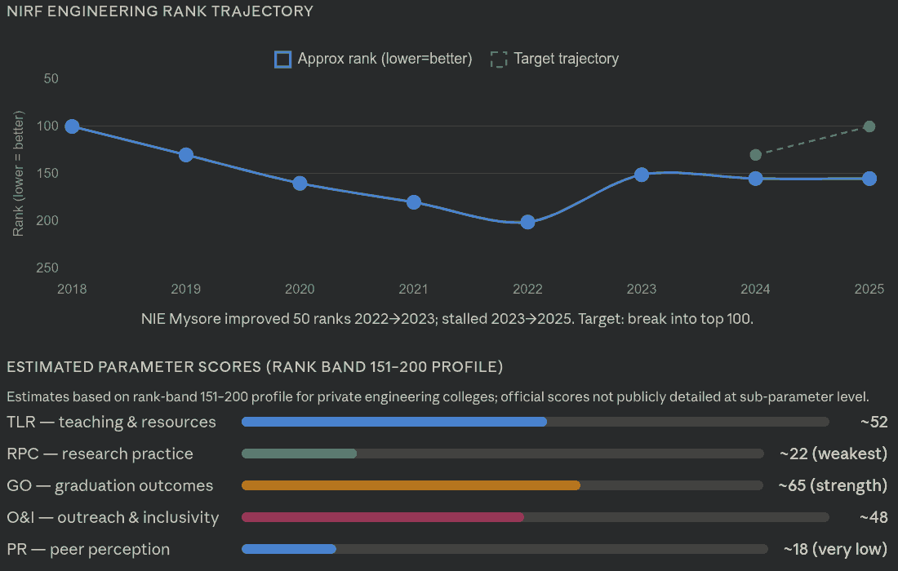
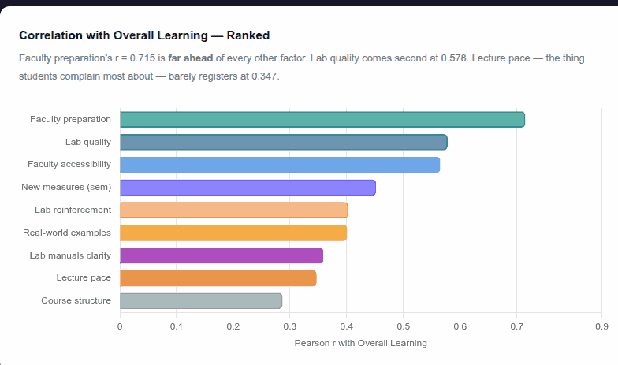
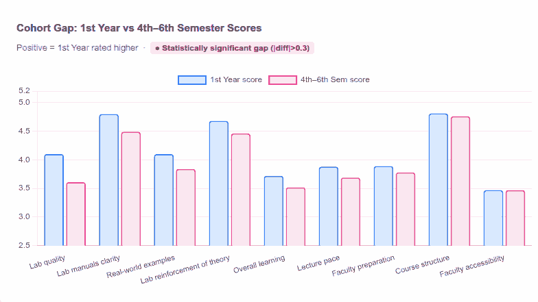

## Prompt, 21 Mar 2026

<!-- Claude Code - Claude Sonnet 4.6 high -->

Generate a beautiful narrative story about the talk [Srikanth](https://www.linkedin.com/in/srikanthnadhamuni/), Co-founder of Trustt and [Anand](https://www.s-anand.net/), LLM Psychologist at Straive, delivered to the [NIE, Mysore](https://nie.ac.in/) faculty on 21 Mar 2026.

Create this as 2026-03-21-faculty-ai-transformation-nie/index.html

Write in the engaging style of Malcolm Gladwell, weaving in anecdotes, insights, and a compelling narrative arc.
Use 2026-02-11-amat-dt-day/index.html, 2025-12-06-mining-digital-exhaust/index.html and 2026-01-11-nptel-vibe-coding-workshop/index.html as examples - to follow LOOSELY, not strictly.

Use 2026-03-21-faculty-ai-transformation-nie/transcript.md - that's the talk transcript.

- Weave in plenty of memorable, funny, or insightful quotes from the transcript. Make these blockquotes stand out.
- Highlight what was insightful or funny.
- Include slide images inline where appropriate. The slide deck is in 2026-03-12-nie-ai-roadmap/roadmap.pdf (but do NOT include it - just read it for context) and relevant slides have been extracted into slide-$N.avif files. Refer to the PDF for context but use the extracted images in the article for better performance and aesthetics.
  - You don't need to include all slide images. Only what's relevant.
  - It's OK to include slides as thumbnails, as cards in grids, etc - in which case clicking on them should open the full-size image in a popup.

Make sure the design is engaging. Allow some elements to expand beyond the width of the main content column, and use a different background color for these elements to make them pop, etc. The sketchnote could be one such.

Add the top takeways from the NIE talk at the end.

Here are some links to and images of the analysis Anand shared. Weave these in as links and images where appropriate. (Links are not embeddable, so just link to them as cards.)

- [LLM Pricing](https://sanand0.github.io/llmpricing/)
  - [Video](https://files.s-anand.net/images/2026-02-20-llm-pricing.webm) - embed muted with autoplay and loop
- [Claude chat](https://claude.ai/share/bf51a1c5-40cf-4d1e-a91d-a78468fac787) covering:
  - How to improve NIRF scores
    - 
  - What NIE's publications tell us about how to improve
  - How other data shared by NIE can be analyzed
- Feedback analysis
  - 
  - 

Prominently include these near the top:

- include the sketchnote at 2026-03-21-faculty-ai-transformation-nie/sketchnote.avif - clicking on it should open the full-size image in a new tab
- link to the transcript

Search online and liberally link to any other relevant material.

Feel free to add tooltips, popups, or animated SVGs as informative and engaging aids.

**Tooltips** are for:

- Context about non-obvious terms or phrases (only if relevant and useful)
- Additional context about references (where possible)

**Popups** are for:

- Citations. Search for and include references. Cite the key point from the reference and link to it.
- Supporting material. Provide extensive context, quotes, extracts from slides, external references, etc.

This will be deployed at https://sanand0.github.io/talks/2026-03-21-faculty-ai-transformation-nie/

Update README.md to include this talk in the list of talks.

<!-- claude --resume 061f35ab-1011-4a6b-8e9f-d5de0d4ff1fe -->

## Sketchnote

<!--
Gemini Pro - https://gemini.google.com/u/2/app/5b69493deaebe8d5
-->

Summarize this talk transcript as a visually rich, intricately detailed, colorful, and funny, sketchnote. Think about the most important points, structure it logically so that the sketchnote is easy to follow, then draw it.

<!-- Video: https://youtu.be/QdZp6j1S2KM -->
