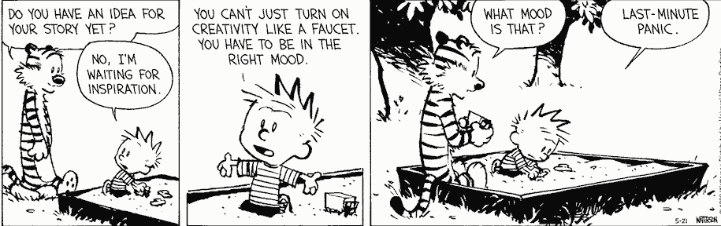
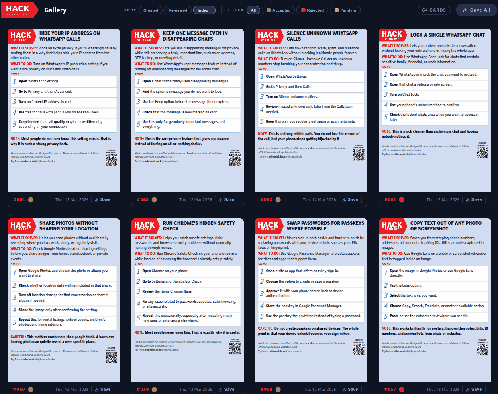

# Transcript

[00:00] **El**: Good day everyone and welcome to the ACE Fireside Chat series where we trade polished slides for powerful stories and lean into the kind of conversations that shape real leadership. The fireside chat is designed to allow informal dialogues to happen grounded in experiences, to provide a space where senior leaders pull back the curtain on the decisions, challenges, and turning points of leadership. As always, your voice is part of this, so don't hesitate to jump in with your questions and reflections, whether live or through the chat. Some of the best sparks come from what you're curious about. Today we'll be diving into the topic of innovation as a frontier. Together let's learn how **innovation is not just an idea but a frontier waiting to be conquered**. Let's get into it. This is real talk, real strategy, real leadership. Let's light the fire. Our speaker for today's fireside chat will share his own inspiring stories of breakthrough ideas, transformative solutions, and how to have the right mindset that makes innovation possible. Help me welcome Anand S, the CEO and co-founder of Straive. Anand, thank you for joining us today. We've all heard the word innovation and we've come across countless definitions, interpretations, and frameworks. But today we'd love to hear it from your lens as a transformative leader. What does innovation truly mean to you, and how does innovation as a frontier apply to Straive?

[01:44] **Anand**: Thanks, El. I have no idea. Generally, when I'm faced with situations like this, I usually turn to one of two inspirations. Meaning, if I have to answer a question like this, I would, to begin with, ask Calvin. For those of you who read Calvin and Hobbes, you may be familiar with this strip. Let's blow that up a bit. The answer to the question "what do I think of or how do I think of innovation" is something that, like the answer to most questions, I craft in the perfect mode, which is last-minute panic.

 <!-- https://gemini.google.com/u/2/app/c1d7332802fc2784 -->

How exactly did I do that? I turned to AI, in this particular case Claude, and I passed it El's question, which she had shared with me beforehand, and said:

> Based on what you know about me, and what you can find out from past chat conversations as well as my blog and public GitHub repo - especially talks  and data stories  -- what is the most insightful answer you can provide to this question?

[Link to chat](https://claude.ai/share/f74cce84-9050-4af5-bfe6-66b5b82a8650) <!-- https://claude.ai/chat/67fb2cdf-55b2-4b51-9941-340bdbcf1227 -->

And that's what I'm going to be talking through. The reason I mention this upfront is because I'm not sure if this is in fact my framework, what I'm about to say. This is what seems to be my framework and how we are innovating at Straive. But it's really just a guess. So let the conversation flow. I'll share what I'm finding, and let's discuss to see how much of this is actually happening and what you would be curious about and explore that.

[03:40] One thing I am very clear about is that **innovation at the frontier is very apt. Innovation happens at the edge of things, and the frontier keeps changing.**

[Slide](https://tools.s-anand.net/slide/#title=%23+Frontiers+Are+Ever-Changing&subtitle=Every+problem+you+solve+reveals+the+next&font=Montserrat&titleScale=-3&subtitleScale=0&fgColor=%23ffffff&bgColor=%231a1a2e&bgSearch=https%3A%2F%2Fimages.pexels.com%2Fphotos%2F12508155%2Fpexels-photo-12508155.jpeg)

The frontier for AI has been constantly changing. If we look at the world as it was in, let's say, March 2023, there were three major models—two versions of Claude and one version of GPT-3.5 Turbo—and then there were other minor models, but they weren't really good enough to even feature on most lists.

<video autoplay muted loop playsinline>
  <source src="https://files.s-anand.net/images/2026-02-20-llm-pricing.webm" type="video/webm">
</video>

On the x-axis is the cost. On the right side are the more expensive models, on the left are the less expensive models. The vertical axis is the capability. At the bottom is roughly a high school freshman, someone with about 12 years of experience or 12 years of age. Or a high school graduate, about 15 years old. A college junior, 18 years old. And then we have higher levels of intelligence going all the way up to a tenured professor. And that frontier has been steadily improving. As of November 2023, we had GPT-4, which was about as smart as a college junior. A few months down the line, and it was just a few months, September 2024, we had o1-preview, which is about as smart as a master's student. And a few months down the line, just February 2025, we have GPT-4.5, which was about as smart as a postgraduate. And as early as June 2025, we have Gemini 2.5 Pro, which is about as smart as a tenured professor.

[05:21] Now here's the thing. **The cost of these models is also improving**, meaning it's coming down. So today you can get someone smarter than a tenured professor at $5 per million tokens. Meaning if you gave them the entire Harry Potter series or the entire King James Bible and asked them to read it, they would charge just $5 to read the entire thing. And **this cost has been falling roughly at the rate of 10 times every year. 10 times, not 10 percent!** Which means that the cost of a tenured professor a year down the line is going to be 50 cents. Two years down the line, 5 cents. If that trend continues, and so far it seems to be. So if that is the case, the one thing that we can say for sure is that **it's ever-changing, and therefore whatever we mean by innovation also keeps changing.**

[06:14] In my mind—or rather, in Claude's mind, which I kind of agree with—there are three things that we seem to be doing in the space of innovation.

[Slide](https://tools.s-anand.net/slide/#title=%23+Frontiers+Are+Ever-Changing&subtitle=Find+New+Constraints%5C%0ADo+What%27s+Irrational%5C%0ASurface+What%27s+Invisible&font=Montserrat&titleScale=-3&subtitleScale=8.7&fgColor=%23ffffff&bgColor=%231a1a2e&bgSearch=https%3A%2F%2Fimages.pexels.com%2Fphotos%2F12508155%2Fpexels-photo-12508155.jpeg)

**One, finding what are the new constraints. What used to be a problem earlier, we solve. Now that is no longer a problem, let's go beyond that.** **Which means that we also have to constantly do what's irrational, what earlier made no sense.** It was impractical before to, let's say, have code that runs without documentation. Today, you have AI that would generate the documentation automatically and better than most people. So it may actually make more sense to not write documentation, which needs maintenance. **Thirdly, surfacing what is invisible.** A lot of things that we couldn't see earlier, at least AI seems to make possible, make us understand, make us dig deeper. And that's the third lens with which we're looking at things. So what I'm going to do is share some examples of how the innovation team is playing around with this and how this is being used in Straive. But here's a request. Please just toss in any questions that you have in the chat window. I'll keep monologuing because if you don't talk and I don't talk, then it's going to be a very boring session. But the really interesting part is when you put in something in the chat window and we say, "Ah, let's talk about that" because it's interesting to at least one person and therefore hopefully more interesting to other people. And who knows, I might get more innovative ideas from your questions. Questions are in fact the biggest skill. So please ask random questions, and we'll see where we go from there.

[08:12] I'm going to keep monologuing until we find a question in the chat. Finding new constraints—in other words, what was a constraint earlier that is no longer a constraint now. The Times of India reached out to me a couple of months ago and said, "Anand, one of the constraints that we have is we publish this thing called Hack of the Day." They are cards like these that they publish in the Times of India.

It's just a little technical tip that you share explaining what people can do about a variety of things, usually India-focused. They said, "We have two problems. One, finding content like this takes our journalists a lot of time. Second, creating this in this format takes a lot of effort. What can we do?" I said, "Well, hold on, this is exactly the kind of thing that AI can do." And honestly, there wasn't much that we needed to do. It was effectively saying, give it one chat, have one coding agent search online for all kinds of hacks, give it the list of past hacks. Let me share with you what happened... [So this is the conversation that I had with ChatGPT](https://chatgpt.com/share/69c6231b-b89c-83a1-bf0b-41b03d8ccc3e). It will open at its own pace, and also render at its own pace, so we will wait for it. Let's go right to the top.

[10:00] I told it to analyze the previous Hack of the Day images and asked it, "Look, if I had to ask an intern or an AI agent to create several of these, what prompt should I give?"

> Analyze these 10 "Hack of the Day" images carried in The Times of India.
>
> If I had to ask an intern (or an AI agent) to create several such, then what prompt will give me this kind of content in exactly this format?

I didn't even know what to ask for. So **when I don't know what to ask for, what do I do? I just ask it, because its knowledge is as good as anyone else's.** This incidentally is a theme that I am constantly adopting. There are a few areas where I am better than AI. The majority of the areas where I am not an expert, I am not better than AI. And I use OpenAI's GDP Val as a benchmark for this.

These are various professions across the world: software developers, lawyers, accountants, financial managers, shipping, receiving, and inventory clerks, and so on. The size of these boxes represents how much salary they are making in the US. So registered nurses are making more salary than medical and health services managers. The color represents whether they are better than AI, or AI is better than them on average. The way this was done was OpenAI asked researchers a whole series of questions. Like for financial managers, they gave them a task like, "You are head of strategy for some company in Korea, a new CEO has been appointed, blah, blah, blah, and you have to create a deep dive strategy presentation with five to six content slides." And these are very realistic requirements crafted by experts, solved by experts and by AI. And the experts evaluated who was better: the human experts or AI. And as of several months ago, August last year, so almost two-thirds of a year ago, what we find is that in the green areas, the humans are doing better. No, sorry, AI is doing better! So software engineers, AI beats humans 70% of the time. Clearly, they've been trumped. Sales managers, AI is doing much better than sales managers. But if you take accountants and auditors, AI is not doing better, or wasn't doing better than them. It wasn't doing better than industrial engineers on a variety of tasks.

[12:30] So there are many areas where AI is already better than experts, many areas where AI is not better than experts, and I just take a quick look at this and keep updating it to see if I should actually be treating my knowledge as a layman as the benchmark, or its knowledge. And I find that in most areas, its knowledge is better. So I asked it for prompts, in other words, meta-prompting. I said, "Give me past hacks. Take a look at what has already been published as a reference. And then, find and list 10 high-impact, non-obvious, very useful hacks similar to these."

> List all past hacks from https://timesofindia.indiatimes.com/technology/hack-of-day - it has 2 pages, read from both

> Find and list 10 high impact non obvious widely useful hacks similar to these

That created a nice list. And then I had it render it as SVGs and so on. And the result is that it created about 60 to 80 cards all focused on the same kind of tech tips that the Times of India publishes.

And these, starting from late last month, have actually gotten published in the newspaper. So **at least one mainstream journalist publication has started using AI as part of its workflow directly.**

Now, what is the bottleneck? What was the bottleneck? Finding stories and creating the images. That is no longer the bottleneck. So now what is the bottleneck? Weirdly enough, it is review time. Now the task of the journalists has vanished. The task that the editors were doing was, when the journalists come up with two or three, they'd glance through it. Now I've given them 60. They're like, "Oh, oh, oh, we don't have that kind of capacity to be able to review this." The bottleneck has shifted! And maybe AI is going to solve that problem, but as you can see, **when the bottleneck shifts, the problem changes, and we need to keep constantly innovating in different ways to solve that problem.**

[14:48] **Question** (from Vel via chat): I'm inclined to use Gemini AI compared to our Straive LLM. Not sure why, but the look and feel isn't user-friendly.

**Answer** (Anand): By Straive LLM, Vel, you're probably referring to [LLM Foundry](https://llmfoundry.straive.com "This site is accessible only from within the Straive network"). LLM Foundry is an application that was developed starting 2023, and it stopped getting developed in February 2025. That's one year and two months ago. In AI terms, one year and two months is like the Stone Age. This application is no longer meant for anyone to use. If you want API keys, that's a different story; you get free API keys. Makes sense, use it as a developer. But the interface, which is the playground, do not use! And that is exactly the nature of innovation. Things constantly move. We as an organization are not innovating on AI interfaces. [Gemini](https://gemini.google.com/), on the other hand, is actively innovating on the AI interface. The sheer number of applications, the sheer kinds of things that they're putting in is crazy, and we have free access to it. So short comment: please absolutely use Gemini AI. Please do not use LLM Foundry unless you are coding and need an API key.

[16:15] The sort of things that you can do with Gemini is amazing. And what I do—again, when it comes to innovation as a frontier—is to poke at what is it that we couldn't do earlier that is a bottleneck, and we now can do. And that poking around is simply about, okay, clicking on this: what can I do here? What's in here? What's in here? Recently, I saw that it can create music. And some of this music is stunning!

Now, we had music at the beginning of this Zoom call. Why does that need to be something that is unpersonalized? So here's what I'm going to do. I'm going to go to ChatGPT and say:

> Give me a theme music that I can run in a loop for fireside chats. The background music needs to be lively, vibrant, and something that will make people sit up, but with enough contrast... a certain amount of soothing effect as well that won't overload the users. Give me something that's maybe about a minute long. Like I said, it's something that I want to be able to run in a loop."

Now we have a prompt. Now you'll notice that I didn't really type the prompt because it's too boring. The second thing that I'm going to do is go to Gemini and say:

> I want to use this prompt to create music using Gemini's new create music capability. Research best practices and improve this prompt.

This is again meta-prompting. I'm not sure I'm giving a good prompt. I'm sharing what I know, what I feel, and it will then do a better job because it's an expert in many areas and give us a new prompt.

[Link to metaprompt chat](https://gemini.google.com/share/2f4515685796) <!-- https://gemini.google.com/app/aeb39e73bade842a -->

[18:32] Now that prompt I will take and pass it back to Gemini and say, "Now create a music along these lines," and at the end of maybe five minutes—it probably won't even take that long—we will have a new jingle for this show. Not just this show, for every show! And it doesn't have to be background music. It could actually have lyrics mentioning the person who is going to be on the show and mentioning the theme. In fact, let's do that. What I'm going to do is modify this prompt so that it includes the question that we had. Let's open Gemini again.

> The show will feature Anand who leads innovation at Straive, and the question he'll be posed is this thing: think of creative lyrics for this and incorporate it.

Now, I haven't copied the earlier prompt, so let's do that. We'll take this and we'll put it in. And instead of 30 seconds, let's make it a 60-second blah, blah, blah. I should have put the whole thing in the first prompt, but that's okay. Create the music for this and let it run.

[Link to music generation chat](https://gemini.google.com/share/91f4a51472fc) <!-- https://gemini.google.com/app/a4dee882e5a2ad52 -->

Now this came about not because I had a plan in mind, but rather I was trying to poke around to see what were the constraints that I had earlier that I couldn't solve before. One of the constraints was I don't quite know what are all the features of AI. That's a bottleneck. So I'm poking around with these and exploring. And once I discover a new boundary, we try it out, and we learn. That's basically an approach. So yeah, this is generating the track. I suspect that I won't be able to share this as is because I don't know how audio sharing works in Zoom, but I'll share it after the event and let's listen.

[20:46] **Question** (from Preeti via chat): What mindset shift do senior leaders struggle with most when moving from managing execution to enabling exploration?

**Answer** (Anand): Who knows, let's ask. But I'll share my thoughts on top of it. One of the things that I do when people ask such a question is I say,

> I was asked: What mindset shifts do senior leaders struggle with most when moving from managing execution to enabling exploration?
>
> Research my past chats, writings, research & experiments and answer in my voice citing examples from my experience.

[Link to Claude chat about mindset change](https://claude.ai/share/27eda8fe-c0d0-4a00-adb2-4e3e75dec690) <!-- https://claude.ai/chat/afcec649-53d6-4759-9389-8f745e6c9463 -->

The thing is, it has memory. Based on the chats, AI understands us fairly well. So if that is the case, then may as well use that. And in this particular case, I get a set of ideas, it gives me a set of ideas. The synthesis is more powerful than what I can answer by myself. If I did try and answer this without taking a look at the AI, then I might say something along the lines of, what I've seen is managing execution requires reliability. That is, you need to make sure that stuff doesn't go wrong. Enabling exploration requires tolerance for uncertainty. You need to make sure that it's okay if things go wrong. And expand the bounds. One of the guidelines I give to our innovation team is: **failure is an option. We do not have deadlines that are unmissable. We do not have scope that cannot be moved. Give it a shot. If it works, great. If it doesn't work, no big deal. But in exchange, here's what I'm going to ask for. What you normally do in a month, do it in a day. And if you can do it in a day, I'll ask for it in an hour. If you can do it in an hour, I'll ask for ten of these in an hour. In other words, I'm going to keep increasing the threshold until we fail often enough.** Put another way, **failure is not only an option, failure is a necessity**. And this mindset shift, knowing how to manage risk, is difficult. Who does this well? Venture capitalists do this well. Nine out of ten ventures fail. They have a portfolio, and as long as some of them are super hits, that works well. Who does not do this well? Bankers. For them, they need to make sure that every loan they give out, you get the money back. I suspect that those are the main mindset shifts, I think.

Now let's see [what Claude says](https://claude.ai/share/27eda8fe-c0d0-4a00-adb2-4e3e75dec690). It's about identity. That is a fair point, it's existential. So a move from "I know the answer" to "I don't know yet"—that's the point. Yes, that is a very difficult one. People who have risen to senior levels have risen there because they've known the answers. Now it becomes questioning their identity if they need to explore the things they don't know. And unless you explore the things you don't know, you don't have innovation. From "prove it before I invest" to "invest small to find out." Yes, this is the banker approach. If I'm going to give you a budget, if I'm going to give you a loan, if I'm going to give you resources, then I need to know what the ROI is. Give me a proof of concept, test it out, make sure that it works, and then I will invest. The other is the VC portfolio approach, which is: I'm going to spread a little bit of money across a bunch of bets, and then double down where it wins. When you move from that sort of mindset to this sort of mindset, there is more innovation. Planning versus execute first. One of the important things that we've all learned before is when something is difficult, when something is expensive, and when something is risky, you plan very carefully. Create a strategy, what is the workflow, what is the breakdown of tasks, and then you execute. Measure twice, cut once. With innovation, it's the opposite. Close your eyes and cut. Measure, and if it doesn't work, throw it out. Try again. Because the cost of measurement is higher, and the waste is almost negligible compared to what you can have. Loss of control is definitely another feature. What is the judgment? Several possibilities. But as you saw, the answer is not necessarily something that I can give you as much as something that we can easily research, which is not to say don't ask me questions, please ask me questions! You are helping me by giving me ideas that I could apply. But don't trust my answer anymore than what anyone else could say or what AI could say in the first place.

[26:12] **Question** (from Murali via chat): Is there any warning or what should we be alert about when using AI?

**Answer** (Anand): It could be wrong. I would not trust it anymore than any random person, even if they're an expert, even if they're totally dumb. Watch what they say. I may not have expressed myself clearly. It may not know what it's talking about. Usual problems. As long as we have the mental model that AI is more like a weird person whom we don't understand, a foreigner—very different cultural values, very different kinds of mistakes that it makes—then we'll be okay. For example, if I asked AI a question like, "What are some of the most important sentences in this passage?" If the passage is the entire Harry Potter, I will still trust it. It will do a pretty good job. I would not necessarily trust a human for that. On the other hand, if I asked AI, "Here's a picture, here's another picture, which one would fetch more in an auction? Or which is the greater piece of art?" I would absolutely not trust it. It does not have that kind of a sense. Now, with a certain amount of moving with strangers, people from different cultures, we get an intuition of their personality. With AI, we haven't moved around with it enough to get an intuition. I'm using it a lot, so I probably have a little more intuition than people who have used it less. But the warning or the mindset that you should have is: it is not a computer. It is more like a person behind the scenes. I would only trust it that far. Second, unless I've used the same model multiple times, I don't really know what it knows, can do, etc. And third, when models change, it's almost like a different person. With these caveats, you can take AI pretty far.

[28:40] **Question** (from Preeti via chat): Can I share a moment where an innovation initiative failed, not because of the idea, but because the delivery system wasn't ready?

**Answer** (Anand): This happens all the time. Let's take a client example—I won't even bother naming them because this is true of almost every client. The issue with this client was they were all for innovation, but as a financial services organization, they have a lot of regulations that they need to comply with. So somebody said, "Let's build a chatbot that can answer questions from financial statements." We said, "Great, let's do it." One of the innovative ways of doing this is to use AI to write software. For that, AI needs to be enabled to write software within their organization. It was not. And for nine months now, therefore, people have not been able to adopt that innovation. Earlier, retrieval-augmented generation (RAG) was the de facto way of solving things. Which means that you take all the financial statements, take little chunks of it, and store them in a way that you can meaningfully access them. So that it searches for meaning, not just the words, and refer to that. That works well if you're asking a question like, "What was IBM's revenue last year?" Then you're searching for something specific. If you have a question like, "Which company had the highest revenue growth last year?" then there's nothing to search for. There's no table that has all the revenues that you can look for. In such cases, agents are a better idea. What they do is they write their own programs, solve the problem, however, if they fail, they try again in different approaches. Now, the innovation therefore is: let's use agents rather than retrieval-augmented generation. Now, that innovation initiative failed because they couldn't bring in agents into the organization. That needed to go through an architectural council, and it's still stuck there. There are many tools that in Straive we cannot use, because that has a process that it goes through. Very often these processes have value; they have meaning. They are there to make sure that we don't take risky steps. The very nature of innovation is to take risky steps. So I would say that if an innovation initiative is not bottlenecked by the delivery system, then it is not innovative. **Failure is therefore inevitable in the short run. The question is: is the delivery system able to adapt to innovation quickly enough? Does this failure get converted to success soon enough, and what is that velocity? That is the test. Similarly, is the innovation challenging the delivery, and is it challenging in a way that can be absorbed by the delivery system? That's another way of doing it.**

[32:04] **Question** (from El via chat): What's a small innovation that has had a surprisingly big impact?

**Answer** (Anand): Recording all my calls. You may say, "Oh, that's yeah, we have all these transcripts, right?" Yes, true, but here's the thing. I have a recording of practically every single call, transcribed. So here's a list of transcripts of chats, meetings that I've been on. And you can see that it's a long list that I started sometime last October or September. And most of my conversations since then I've been recording. Here's one that I was chatting with Ankor on. What this allows me to do is all kinds of things. I could take this transcript, for instance, and put it into Gemini and paste it and say something along the lines of:

> Summarize this as a visually rich, intricately detailed, colorful, and funny, sketchnote.
Think about the most important points, structure it logically so that the sketchnote is easy to follow, then draw it.

... and then I just pasted this transcript. Sometimes I paste transcripts of my talks, like this talk, which I am recording. I will be pasting a transcript of it and then I can get all kinds of secondary derivative material out of it. This is so powerful. What do I mean by secondary or derivative material? One of the things that I extract from my conversations is: what am I telling people? Second, what are people telling me that I am missing? What are my blind spots? Third, what can I infer about the persona of different people that I should keep in mind when I speak to them next? What are the mistakes that I'm making? What are the mistakes that they're making? What are some interesting experiments that I can try from each of these? Every single one of these is an automated prompt that I am building on top of this. Put another way, it's like gathering a repository of practically everything that I speak and hear and using that as a new knowledge base that only I have. No one else has that information. And that makes it effectively my unique corpus. What was the effort? Clicking one record button. What is the impact? I have no way of even measuring that, and we're nowhere near done. This is taking a long time, so let me give you some examples of other sketch notes that I've put together from earlier talks. Here's a talk that Ankor and I delivered with Prudential, and this is what one of those sketch notes looked like.

It's a summary of the entire talk, and there's also a data story that has a full-fledged summary of what Ankor spoke of at the beginning... This is done all of this from the recording. And then when we share it with the client saying, "Oh, in case you missed, here's what it is," now we have new collateral. Or when we take the next client conversation and ask AI to refer to this past conversation, we have additional rich material. So this for me has been one of the big high-impact things.

[36:28] Let's see if this is done. Ooh, okay, this thing is really, really thinking hard... hopefully it will get the job done in a few minutes and I'll show it to you. But I am also curious to see if... oh okay, it's generated some lyrics. I'm going to hear it. I don't know if you will...

*(Audio snippet plays: upbeat song with lyrics starting 'We've all heard the word innovation...')*

<audio controls preload="metadata">
  <source src="where-the-paths-thrive.opus" type="audio/ogg; codecs=opus">
</audio>

[Link to music generation chat](https://gemini.google.com/share/91f4a51472fc) <!-- https://gemini.google.com/app/a4dee882e5a2ad52 -->

Oh, you're going to love this when I share it with you. You're going to love this. In fact, I *am* going to download it and... let me download both formats. There's an MP3 and there's the video. I wonder if I can just attach a file here... Let's see. If I could, then all of you get the MP3 file which is called 'Where the Paths Thrive', yeah, it's not very big, just 1MB. Yeah, listen to it. It's getting uploaded... Is anyone able to see this thing that I uploaded? If so, maybe a thumbs up... Wonderful. So yeah, listen to it! It's got some lyrics, it's got some music. Obviously you can tailor it to whatever we want.

[38:12] **Question** (Shannon, speaking verbally): I have a question. This is Shannon. I put it in the chat; I wasn't sure if we would get to it. I have the privilege of running the Learning Aid podcast and I'm talking to a lot of AI leaders. And I'm sure this is obvious to people, but it wasn't as obvious to me, I'm surprised. I was talking to the Vice President of AI for SNHU, and he was mentioning that yes, AI is so powerful, I use it every day... but, you know, even a practical example: AI isn't representing everybody, everywhere, in all things, right? And so there is some inequity built into AI. Not all languages are represented, not all cultures are represented. We had a project to do some things around Ayurveda and we weren't able to get Sanskrit, for example, to really do it. So I'm wondering, how do we account for those limitations? And are there guardrails to ensure, especially when we're dealing with educational materials, to ensure that there is representation and that there is the ability for anyone to go into AI and feel like they're able to find information that's resonant with them? Just throwing that out there.

**Anand**: That's a very fair point. Let me reframe that to perhaps a part of what you spoke of. Not everyone is able to get what they want out of AI, partly for lack of access, partly because AI does not yet have what they need. To take an example, I was asking for jokes in Tamil... and I found that not many models even knew the language. Which is a pity. And the few that did ended up not having a great sense of the language. This was about a year ago. One of the most powerful experiences that I am having is when I keep tracking the progress of AI. So to give you an example, let me share my screen.

I was watching a Tamil movie not too long ago. Here's one. And this was something that was written on a frame of the film.

I can understand the language, I can speak it, but I am terrible at reading or writing. And I am lazy. So I could potentially read this, but I just took a screenshot, sent it over to Gemini, and asked it, just... I was eating at that time, so I didn't even want to type too much. I just said, [OCR and translate.](https://gemini.google.com/share/44bef43fad8a) And it did. Here's the English translation and the source for that... That's a very rich detail! I had no idea that in less than a year's time, the models had progressed to the point where a not necessarily particularly mainstream language is so strongly a part of its vocabulary that it's easily able to identify the context.

[42:25] Let's take another example. One of our clients reached out and said, "We're finding that when generating videos, the voice automation is not so good. We find that it's very monotonous. What can you do to help us?" It turned out that they hadn't tested various models. We did it for them, and [created a page in Dutch](https://files.s-anand.net/temp/verdict-to-video/), by the way. Incidentally, none of our team speaks a word of Dutch. They just said, "Create the page in Dutch", and it created the whole copy and everything else in Dutch because we needed to navigate... we had a switch to English that would just change the words. And what that did was tested a whole bunch of different models speaking exactly the same piece of text. And we shared it with them and asked them, "What do you think? ElevenLabs is supposed to be really good. Do you like it?" They went through it and they said, "You know what? We hadn't heard Gemini 2.5 Pro preview TTS, but this particular voice, Algieba, on Gemini 2.5 Pro seems to be getting the nuance, the accent, the way in which that dialect is spoken spot on." And it was a relatively new model again. So one part of the answer that I have for you, Shannon, is maybe a part of it is just a matter of time. That as models improve, the cost of inclusion becomes less.

[44:00] The other piece of the answer is there are several local initiatives. Many countries have their own sovereign AI initiatives where they're trying to put in local content into it. Several organizations are trying to add their content. When it's popular enough, it gets incorporated into mainstream AI. If not, the cost of building niche AI is also falling. And that enables a lot more. What I mean by the latter is just today I downloaded a new app which is [Google Edge Gallery](https://github.com/google-ai-edge/gallery), which works on iPhone, which works on Android, which takes an entire model, puts it on your phone. It's very easy to download. It is reasonably large, 2.5GB, but I was able to download it on a bus trip to work. And the good part about this model is I can run it without the internet. So when I'm going to be on a six-hour flight tomorrow and on a 16-hour flight this weekend, I have a model that works on my phone and it's not a bad model. Not a great model, but it's not a bad model. And it's slow, but it works. And that's today! If the cost of creating these small models has fallen to the point where people are just tossing it on the mobile... People who are working on niche areas are going to be able to take their content, put it in, and we're going to see a lot more of this. So if I had to condense that long answer into a sentence, it would be: maybe we just need to wait and keep exploring at the edges to see what's now possible.

[45:56] No other questions on the chat. Let me share my screen. The sketch note with Ankor failed, by the way. I have no idea why, so I'm trying it again. But let's look at some of the other stuff we've been playing around with on the innovation side. One of the things that I like to explore is just doing what makes no sense whatsoever.

For example, there is this mathematician, [Pólya](https://en.wikipedia.org/wiki/George_P%C3%B3lya), and he came up with a set of heuristics for how to solve mathematical problems. These heuristics are encapsulated in a book called [*How to Solve It*](https://en.wikipedia.org/wiki/How_to_Solve_It). And *How to Solve It* says, for instance, in order to solve a problem, first you have to understand the problem, then make a plan, carry out the plan, look back on your work, and he broke this down into very detailed principles. Now, how do you test if this is working? With people, this kind of an experiment is not practical, it's not even rational. What do you do? But with AI, testing this sort of a thing becomes possible. So our team looked at how we can actually test Pólya heuristics.

[47:33] What we did was took various models and asked them, "Supposing I give you a problem in mathematics... across these different models, you prompt it in a specific way." For example, let's take contradiction. What we did was added one line to the mathematical problem: "Solve using the contradiction heuristic. Assume the opposite of what you want to show is true and reason until you derive an absurdity."

Turns out that if you use contradiction, 5% of the time models actually do worse. 10% of the time they do worse on counting and probability. But for geometry, it's okay. For intermediate algebra, it seems to be helping a little bit. For pre-algebra, it seems to be helping a fair bit. And incidentally, for pre-algebra most of these tips are actually useful. But for number theory, most of these tips are actually hurting! So now we can get experimental evidence on which of these heuristics—what was effectively a philosophy for 60-80 years—is now something that is in practice testable.

[48:50] Let's take something else. [I had one of our teammates search through a school textbook](https://pythonicvarun.github.io/textbook-analysis/). This is a grade 12 history textbook. And ask the question, "Are there any factual errors?" And it went through the text until he ran out of tokens, which happened I think about 30 pages into the book or something. And it found 45 claims which it verified as correct, but found one factual error, two precision issues, and two questionable claims. Let's take a look at the factual error, which is the most interesting one. The textbook said "only broken or useless objects would have been thrown away." And it cited research from Cambridge which showed that actually a lot of archaeological remains are not broken objects, not useless objects, but intact, fully functional objects. These were either left behind because people had to migrate, or they were placed as religious offerings—in the olden equivalents of temples or whatever—and these were actually surprisingly useful and surprisingly common archaeological findings. So this is actually a factual error. And then there were several errors that you could argue... that's an over-generalization, maybe the timeline wasn't exactly right, etc. But if in a few dozen pages we can find an error, it's now becoming practical to start looking for mistakes in government policies, in rule books, in organizational policies for that matter. Where are the contradictions? What are the mistakes in tax laws? Is there a clause in my contract, my rental agreement, whatever, that is actually an error? And you'd be surprised how many of these we find.

[51:00] Not just that. Scott Adams passed away this year. There's a massive archive of Dilbert comic strips. Can we transcribe them so that we can search? If so, which engine should we use? One of our colleagues did this. [He took a whole bunch of Dilbert comic strips, ran it through a bunch of models](https://pavankumart18.github.io/comic-transcriptions/). Like for instance, "what is Gemma saying about this particular strip?"... The transcription for different models, here's how they scored. So here is the strip.

And this is how Qwen solved it. Let's take Gemma 3. The way Gemma 3 wrote it had a few errors. For instance, in panel one, it said... "I decided to develop this precedent, but panels collapsed." Oh, okay, fine. It says there are three panels, but there are actually four panels. So clearly it made a mistake. It also hallucinated the pointy-haired boss in the first panel. There is no pointy-haired boss here. On the other hand, Qwen-VL-32B Instruct did a fantastic job. Perfect match, every single thing is sorted out. So, not only are we able to do the transcription potentially of the entire dataset—and it costs less than $20 to do it fully... but we can also figure out which of these models to use. And the short answer is, as of when we did it, and probably even now, Gemini 1.5 Flash preview was able to do this with 99.3% accuracy against these benchmarks. So this kind of large-scale evaluation now starts becoming not just practical, but almost the norm.

[53:07] So a big part again of what we need to ask ourselves is, what made no sense because it was too expensive earlier, because we wouldn't have even thought of it, and solve it. But I don't get these ideas myself. A big part of how the innovation team functions is to ask AI: "How can we innovate?" And that does not always produce the best answers because one of the things we need to watch out for is AI tends to be conventional. It's taking the average of the world's knowledge. So we have to nudge it: "Give me unusual stuff. Think like someone unusual. Think of an unusual object and apply the principles of that here." In other words, exactly the same kinds of creativity tips, tricks, lateral thinking ideas, whatever, that you would tell a human to be creative, tell an AI to do that. And then get it to give you innovative ideas. And then hopefully you have the ability to tolerate failure enough that you will be able to move that frontier. Give it a shot. Just try some experiments. Do something that you either thought was not possible or is weird or out of the ordinary. Who knows what you'll find. All the best with that. Back to you, El.

[54:25] **El**: Alright, thank you, Sir Anand. Are there any more questions? Alright, so as we near the closing, let me just wrap up the discussion. As we wrap up this conversation, we'd love to hear one final thought from you, Sir Anand. What's one message you'd like to leave with everyone here today? Something they can carry forward as they lead, make decisions, or spark change in their own space?

[54:52] **Anand**: **Talk to AI 50 times a day. Push yourself. 50 times a day.** You'll be surprised how quickly you run out of questions and how quickly you come up with new questions you never thought you could ask.

[55:07] **El**: Thank you, Sir Anand, for sharing your time and knowledge with us for today's fireside chat. Thank you to all our participants for joining us today, and please remember that you're not just here to listen, but to explore the "why" behind the "what", and how insights shared here might connect to your own leadership journey. See you in the next fireside chat session. Ending it from here, thank you so much.
